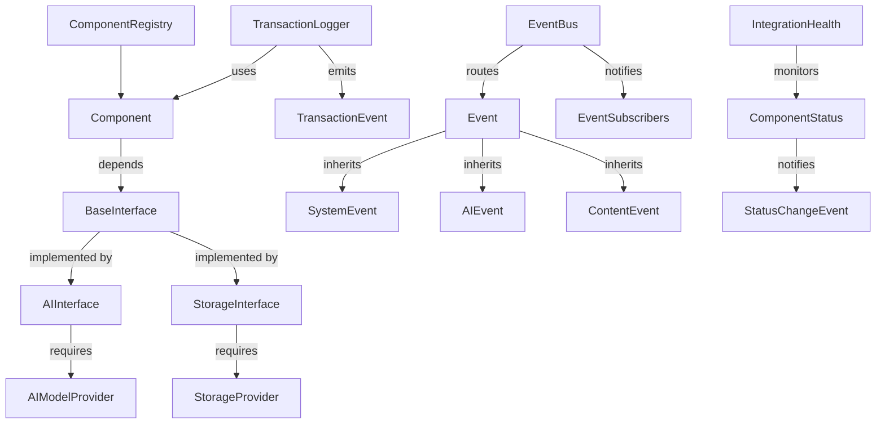

# Project Summary: aerolearn_ai

*Generated on code_summary.md*

Total Python files: 60

## Table of Contents

1. [Project Structure](#project-structure)
2. [Key Files](#key-files)
3. [Dependencies](#dependencies)
4. [Detailed Code Analysis](#detailed-code-analysis)

## Project Structure

```
├── app
│   ├── core
│   │   ├── auth
│   │   │   ├── __init__.py
│   │   │   └── credential_manager.py
│   │   ├── db
│   │   │   └── __init__.py
│   │   ├── drive
│   │   │   └── __init__.py
│   │   └── ai
│   │       └── __init__.py
│   ├── ui
│   │   ├── common
│   │   │   └── __init__.py
│   │   ├── professor
│   │   │   └── __init__.py
│   │   ├── student
│   │   │   └── __init__.py
│   │   └── admin
│   │       └── __init__.py
│   ├── models
│   │   └── __init__.py
│   ├── utils
│   │   ├── __init__.py
│   │   └── crypto.py
│   ├── config
│   │   └── __init__.py
│   ├── __init__.py
│   └── main.py
├── integrations
│   ├── interfaces
│   │   ├── __init__.py
│   │   ├── base_interface.py
│   │   ├── content_interface.py
│   │   ├── storage_interface.py
│   │   └── ai_interface.py
│   ├── registry
│   │   ├── __init__.py
│   │   ├── dependency_tracker.py
│   │   ├── component_registry.py
│   │   └── interface_registry.py
│   ├── events
│   │   ├── __init__.py
│   │   ├── event_types.py
│   │   ├── event_subscribers.py
│   │   └── event_bus.py
│   ├── monitoring
│   │   ├── __init__.py
│   │   ├── integration_health.py
│   │   ├── component_status.py
│   │   └── transaction_logger.py
│   └── __init__.py
├── tests
│   ├── unit
│   │   ├── core
│   │   │   ├── __init__.py
│   │   │   └── test_integration_health.py
│   │   ├── ui
│   │   │   └── __init__.py
│   │   ├── models
│   │   │   └── __init__.py
│   │   ├── test_crypto.py
│   │   └── test_credential_manager.py
│   ├── integration
│   │   ├── interfaces
│   │   │   ├── test_base_interface.py
│   │   │   ├── test_content_interface.py
│   │   │   ├── test_storage_interface.py
│   │   │   └── test_ai_interface.py
│   │   ├── __init__.py
│   │   ├── test_event_bus.py
│   │   ├── test_component_registry.py
│   │   ├── test_component_registry_async.py
│   │   ├── test_component_registry_Simple.py
│   │   └── test_monitoring.py
│   ├── ui
│   │   └── __init__.py
│   ├── fixtures
│   │   └── __init__.py
│   ├── examples
│   │   └── event_bus_example.py
│   └── __init__.py
├── docs
│   ├── architecture

│   ├── api

│   ├── user_guides

│   └── development

├── tools
│   ├── integration_monitor
│   │   └── __init__.py
│   └── project_management
│       └── __init__.py
├── resources
│   ├── styles

│   ├── templates
│   │   ├── ai_prompts

│   │   └── report_templates

│   └── sample_data
│       ├── courses

│       ├── users

│       └── content

├── scripts
│   ├── __init__.py
│   └── setup.py
├── .spyproject
│   └── config
│       ├── backups

│       └── defaults

├── untitled3.py
├── code_summarizer.py
└── setup.py
```

## Key Files

### integrations\events\event_types.py

Event type definitions for the AeroLearn AI event system.

This module defines the event classes and types used throughout the system for
inter-compon...

- Classes: 12
- Functions: 0
- Dependency Score: 64.00

### integrations\registry\component_registry.py

Component registry for the AeroLearn AI system.

This module provides a centralized registry for all system components,
tracking their lifecycle, depe...

- Classes: 6
- Functions: 0
- Dependency Score: 63.00

### integrations\interfaces\base_interface.py

Base interface definitions for the AeroLearn AI system.

This module provides the core interface contract infrastructure, including interface
registra...

- Classes: 10
- Functions: 1
- Dependency Score: 60.00

### integrations\monitoring\transaction_logger.py

Transaction logging for the AeroLearn AI system.

This module provides tools for tracking and logging cross-component transactions,
making it easier t...

- Classes: 6
- Functions: 0
- Dependency Score: 57.00

### integrations\interfaces\ai_interface.py

AI interface contracts for the AeroLearn AI system.

This module defines the interfaces for AI-powered components, including language models,
content ...

- Classes: 15
- Functions: 1
- Dependency Score: 56.00

### integrations\monitoring\integration_health.py

Integration health monitoring for the AeroLearn AI system.

This module provides health metric collection, status tracking, and visualization
data str...

- Classes: 7
- Functions: 0
- Dependency Score: 49.00

### tests\integration\interfaces\test_ai_interface.py

Unit tests for the AI interface contracts.

This module tests the functionality of the AI-related interfaces like
AIModelProviderInterface, ContentAna...

- Classes: 10
- Functions: 0
- Dependency Score: 48.00

### integrations\monitoring\component_status.py

Component status tracking for the AeroLearn AI system.

This module provides components for tracking and visualizing the status
of system components, ...

- Classes: 6
- Functions: 0
- Dependency Score: 45.00

### tests\integration\interfaces\test_storage_interface.py

Unit tests for the storage interface contracts.

This module tests the functionality of the storage-related interfaces like
StorageProviderInterface, ...

- Classes: 9
- Functions: 0
- Dependency Score: 43.00

### integrations\interfaces\storage_interface.py

Storage interface contracts for the AeroLearn AI system.

This module defines the interfaces for storage systems, including local and cloud
storage pr...

- Classes: 11
- Functions: 0
- Dependency Score: 42.00

## Dependencies

Key file relationships (files with most dependencies):

- **integrations\monitoring\transaction_logger.py** depends on: integrations\events\event_types.py, integrations\registry\component_registry.py
- **integrations\monitoring\integration_health.py** depends on: integrations\events\event_types.py, integrations\registry\component_registry.py
- **tests\integration\interfaces\test_ai_interface.py** depends on: integrations\interfaces\base_interface.py, integrations\interfaces\ai_interface.py
- **integrations\monitoring\component_status.py** depends on: integrations\events\event_types.py, integrations\registry\component_registry.py
- **tests\integration\interfaces\test_storage_interface.py** depends on: integrations\interfaces\base_interface.py, integrations\interfaces\storage_interface.py


## Detailed Code Analysis

### integrations\events\event_types.py

**Description:**

Event type definitions for the AeroLearn AI event system.

This module defines the event classes and types used throughout the system for
inter-component communication. It provides a type-safe way to define and handle events.

**Classes:**

- `EventPriority`
 (inherits from: enum.IntEnum)


  Event priority levels for determining handling order.

- `EventCategory`
 (inherits from: enum.Enum)


  Categories for grouping related events.

- `Event`


  Base class for all events in the system.

  Methods: `serialize()`, `deserialize()`

- `SystemEvent`
 (inherits from: Event)


  System-level events related to application lifecycle and operations.

  Methods: `__init__()`

- `ContentEvent`
 (inherits from: Event)


  Events related to educational content operations.

  Methods: `__init__()`

- `UserEvent`
 (inherits from: Event)


  Events related to user actions and profile changes.

  Methods: `__init__()`

- `AIEvent`
 (inherits from: Event)


  Events related to AI operations and intelligence.

  Methods: `__init__()`

- `UIEvent`
 (inherits from: Event)


  Events related to user interface interactions.

  Methods: `__init__()`

- `SystemEventType`


  Common system event type constants.

- `ContentEventType`


  Common content event type constants.

- `UserEventType`


  Common user event type constants.

- `AIEventType`


  Common AI event type constants.


### integrations\registry\component_registry.py

**Description:**

Component registry for the AeroLearn AI system.

This module provides a centralized registry for all system components,
tracking their lifecycle, dependencies, and version information.

**Classes:**

- `ComponentRegisteredEvent`
 (inherits from: Event)


  Event fired when a component is registered.

  Methods: `__init__()`

- `ComponentUnregisteredEvent`
 (inherits from: Event)


  Event fired when a component is unregistered.

  Methods: `__init__()`

- `ComponentStateChangedEvent`
 (inherits from: Event)


  Event fired when a component's state changes.

  Methods: `__init__()`

- `ComponentState`


  Enum-like class for component lifecycle states.

- `Component`


  Base class for all registrable components in the system.

  Methods: `__init__()`, `declare_dependency()`, `require_interface()`, `provide_interface()`

- `ComponentRegistry`


  Central registry for AeroLearn AI system components.

  Methods: `__new__()`, `__init__()`, `register_component()`, `unregister_component()`, `get_component()`, ... (6 more)


### integrations\interfaces\base_interface.py

**Description:**

Base interface definitions for the AeroLearn AI system.

This module provides the core interface contract infrastructure, including interface
registration, discovery, and method signature validation mechanisms. All specific
interfaces in the system should inherit from the base classes defined here.

**Classes:**

- `InterfaceVersion`


  Helper class for managing interface versioning.

  Methods: `__init__()`, `__str__()`, `from_string()`, `is_compatible_with()`

- `MethodSignature`


  Class for representing and validating method signatures.

  Methods: `__init__()`, `validate_implementation()`

- `InterfaceMethod`


  Decorator for interface methods that captures signature information.

  Methods: `__init__()`, `__get__()`

- `InterfaceError`
 (inherits from: Exception)


  Base exception for interface-related errors.

- `InterfaceImplementationError`
 (inherits from: InterfaceError)


  Exception raised when an interface is implemented incorrectly.

- `InterfaceRegistryError`
 (inherits from: InterfaceError)


  Exception raised for interface registration errors.

- `InterfaceVersionError`
 (inherits from: InterfaceError)


  Exception raised for interface version errors.

- `BaseInterface`
 (inherits from: abc.ABC)


  Base class for all interface contracts in the system.

  Methods: `register_interface()`, `get_interface()`, `get_all_interfaces()`, `get_interface_methods()`, `validate_implementation()`, ... (1 more)

- `InterfaceImplementation`


  Decorator for classes that implement interfaces.

  Methods: `__init__()`, `__call__()`

- `InterfaceRegisteredEvent`
 (inherits from: Event)


  Event fired when an interface is registered.

  Methods: `__init__()`

**Functions:**

- `register_all_interfaces()`

  Register all interfaces defined in the system.


### integrations\monitoring\transaction_logger.py

**Description:**

Transaction logging for the AeroLearn AI system.

This module provides tools for tracking and logging cross-component transactions,
making it easier to trace operations as they flow through different parts of the system.

**Classes:**

- `TransactionStage`
 (inherits from: Enum)


  Stages of a transaction lifecycle.

- `TransactionEvent`
 (inherits from: Event)


  Event fired when a transaction changes stage.

  Methods: `__init__()`, `to_dict()`

- `TransactionError`
 (inherits from: Exception)


  Exception raised for errors in transaction processing.

- `Transaction`


  Represents a cross-component transaction.

  Methods: `__init__()`, `start()`, `process()`, `complete()`, `fail()`, ... (6 more)

- `TransactionContext`


  Context manager for transaction handling.

  Methods: `__init__()`, `__enter__()`, `__exit__()`

- `TransactionLogger`
 (inherits from: Component)


  System for logging and tracking cross-component transactions.

  Methods: `__init__()`, `create_transaction()`, `update_transaction()`, `get_transaction()`, `get_transactions_by_parent()`, ... (12 more)


### integrations\interfaces\ai_interface.py

**Description:**

AI interface contracts for the AeroLearn AI system.

This module defines the interfaces for AI-powered components, including language models,
content analysis, question answering, and recommendation systems.

**Classes:**

- `AIModelType`
 (inherits from: Enum)


  Types of AI models used in the system.

- `AIModelCapability`
 (inherits from: Enum)


  Specific capabilities that AI models might provide.

- `AIProviderType`
 (inherits from: Enum)


  Types of AI providers.

- `AIModelMetadata`


  Metadata about an AI model.

  Methods: `__init__()`

- `AIRequest`


  Base class for AI requests.

  Methods: `__init__()`

- `TextGenerationRequest`
 (inherits from: AIRequest)


  Request for text generation.

  Methods: `__init__()`

- `EmbeddingRequest`
 (inherits from: AIRequest)


  Request for text embedding.

  Methods: `__init__()`

- `AIResponse`


  Base class for AI responses.

  Methods: `__init__()`

- `TextGenerationResponse`
 (inherits from: AIResponse)


  Response from text generation.

  Methods: `__init__()`

- `EmbeddingResponse`
 (inherits from: AIResponse)


  Response from text embedding.

  Methods: `__init__()`

- `AIModelProviderInterface`
 (inherits from: BaseInterface)


  Interface for components that provide access to AI models.

- `ContentAnalysisInterface`
 (inherits from: BaseInterface)


  Interface for AI components that analyze educational content.

- `LearningAssistantInterface`
 (inherits from: BaseInterface)


  Interface for AI components that provide learning assistance.

- `PersonalizationInterface`
 (inherits from: BaseInterface)


  Interface for AI components that provide personalized recommendations.

- `AIUsageTrackingInterface`
 (inherits from: BaseInterface)


  Interface for components that track AI usage and costs.

**Functions:**

- `register_ai_interfaces()`

  Register all AI interfaces.


### integrations\monitoring\integration_health.py

**Description:**

Integration health monitoring for the AeroLearn AI system.

This module provides health metric collection, status tracking, and visualization
data structures for monitoring the health of system integrations.

**Classes:**

- `HealthStatus`
 (inherits from: Enum)


  Health status levels for components and integrations.

- `HealthMetricType`
 (inherits from: Enum)


  Types of health metrics that can be collected.

- `HealthMetric`


  A single health metric measurement.

  Methods: `__init__()`, `get_status()`, `to_dict()`

- `HealthEvent`
 (inherits from: Event)


  Event fired when a significant health status change occurs.

  Methods: `__init__()`

- `HealthProvider`
 (inherits from: ABC)


  Interface for components that provide health information.

  Methods: `get_health_metrics()`, `get_health_status()`

- `IntegrationHealthError`
 (inherits from: Exception)


  Exception raised for errors in the integration health system.

- `IntegrationHealth`
 (inherits from: Component)


  Central system for tracking integration health across components.

  Methods: `__init__()`, `register_health_provider()`, `unregister_health_provider()`, `collect_metrics()`, `_update_metrics()`, ... (8 more)


### tests\integration\interfaces\test_ai_interface.py

**Description:**

Unit tests for the AI interface contracts.

This module tests the functionality of the AI-related interfaces like
AIModelProviderInterface, ContentAnalysisInterface, and others.

**Classes:**

- `TestAIEnums`


  Tests for AI-related enumerations.

  Methods: `test_ai_model_type_values()`, `test_ai_model_capability_values()`, `test_ai_provider_type_values()`

- `TestAIModelMetadata`


  Tests for the AIModelMetadata class.

  Methods: `test_init_with_required_fields()`, `test_init_with_all_fields()`

- `TestAIRequests`


  Tests for AI request classes.

  Methods: `test_ai_request_init()`, `test_text_generation_request_init()`, `test_embedding_request_init()`

- `TestAIResponses`


  Tests for AI response classes.

  Methods: `test_ai_response_init()`, `test_text_generation_response_init()`, `test_embedding_response_init()`

- `TestAIModelProviderInterface`


  Tests for the AIModelProviderInterface.

  Methods: `test_interface_registration()`

- `TestContentAnalysisInterface`


  Tests for the ContentAnalysisInterface.

  Methods: `test_interface_registration()`

- `TestLearningAssistantInterface`


  Tests for the LearningAssistantInterface.

  Methods: `test_interface_registration()`

- `TestPersonalizationInterface`


  Tests for the PersonalizationInterface.

  Methods: `test_interface_registration()`

- `TestAIUsageTrackingInterface`


  Tests for the AIUsageTrackingInterface.

  Methods: `test_interface_registration()`

- `TestRegisterAIInterfaces`


  Tests for the register_ai_interfaces function.

  Methods: `test_register_ai_interfaces()`, `test_individual_interface_registrations()`


### integrations\monitoring\component_status.py

**Description:**

Component status tracking for the AeroLearn AI system.

This module provides components for tracking and visualizing the status
of system components, including lifecycle state changes, health status,
and operational capability.

**Classes:**

- `StatusSeverity`
 (inherits from: Enum)


  Severity levels for component status changes.

- `StatusChangeEvent`
 (inherits from: Event)


  Event fired when a component's status changes.

  Methods: `__init__()`, `to_dict()`

- `ComponentStatusProvider`
 (inherits from: ABC)


  Interface for components that provide status information.

  Methods: `get_component_state()`, `get_status_details()`

- `ComponentStatus`


  Represents the status of a component at a specific point in time.

  Methods: `__init__()`, `to_dict()`

- `StatusHistoryEntry`


  A historical status entry for a component.

  Methods: `__init__()`, `to_dict()`

- `ComponentStatusTracker`
 (inherits from: Component)


  System for tracking component status changes over time.

  Methods: `__init__()`, `register_status_provider()`, `unregister_status_provider()`, `update_component_status()`, `update_all_statuses()`, ... (8 more)


### tests\integration\interfaces\test_storage_interface.py

**Description:**

Unit tests for the storage interface contracts.

This module tests the functionality of the storage-related interfaces like
StorageProviderInterface, SynchronizationInterface, and others.

**Classes:**

- `TestStorageEnums`


  Tests for storage-related enumerations.

  Methods: `test_storage_scope_values()`, `test_storage_permission_values()`, `test_sync_status_values()`

- `TestStorageItem`


  Tests for the StorageItem class.

  Methods: `test_init_with_required_fields()`, `test_init_with_all_fields()`, `test_to_dict()`, `test_from_dict()`

- `TestSyncConflict`


  Tests for the SyncConflict class.

  Methods: `test_init()`

- `TestSyncProgress`


  Tests for the SyncProgress class.

  Methods: `test_init_with_required_fields()`, `test_init_with_all_fields()`, `test_completion_percentage()`

- `TestStorageProviderInterface`


  Tests for the StorageProviderInterface.

  Methods: `test_interface_registration()`

- `TestSynchronizationInterface`


  Tests for the SynchronizationInterface.

  Methods: `test_interface_registration()`

- `TestStorageQuotaInterface`


  Tests for the StorageQuotaInterface.

  Methods: `test_interface_registration()`

- `TestStoragePermissionInterface`


  Tests for the StoragePermissionInterface.

  Methods: `test_interface_registration()`

- `TestFileStreamingInterface`


  Tests for the FileStreamingInterface.

  Methods: `test_interface_registration()`


### integrations\interfaces\storage_interface.py

**Description:**

Storage interface contracts for the AeroLearn AI system.

This module defines the interfaces for storage systems, including local and cloud
storage providers, synchronization mechanisms, and file operations.

**Classes:**

- `StorageScope`
 (inherits from: Enum)


  Defines the scope/visibility of stored data.

- `StoragePermission`
 (inherits from: Enum)


  Permission levels for stored items.

- `SyncStatus`
 (inherits from: Enum)


  Synchronization status for stored items.

- `StorageItem`


  Represents a storage item (file or folder) with metadata.

  Methods: `__init__()`, `to_dict()`, `from_dict()`

- `SyncConflict`


  Represents a synchronization conflict between local and remote versions.

  Methods: `__init__()`

- `SyncProgress`


  Represents the progress of a synchronization operation.

  Methods: `__init__()`, `completion_percentage()`

- `StorageProviderInterface`
 (inherits from: BaseInterface)


  Interface for components that provide storage capabilities.

- `SynchronizationInterface`
 (inherits from: BaseInterface)


  Interface for components that synchronize content between storage providers.

- `StorageQuotaInterface`
 (inherits from: BaseInterface)


  Interface for components that manage storage quotas.

- `StoragePermissionInterface`
 (inherits from: BaseInterface)


  Interface for components that manage storage permissions.

- `FileStreamingInterface`
 (inherits from: BaseInterface)


  Interface for components that provide file streaming capabilities.


### tests\integration\interfaces\test_base_interface.py

**Description:**

Unit tests for the base interface contracts.

This module tests the functionality of the BaseInterface class and related
interface registration and validation mechanisms.

**Classes:**

- `TestInterfaceVersion`


  Tests for the InterfaceVersion class.

  Methods: `test_init()`, `test_str_representation()`, `test_from_string_valid()`, `test_from_string_invalid()`, `test_is_compatible_with()`

- `TestMethodSignature`


  Tests for the MethodSignature class.

  Methods: `test_capture_signature()`, `test_validate_implementation_valid()`, `test_validate_implementation_invalid_return()`, `test_validate_implementation_missing_param()`, `test_validate_implementation_invalid_param_type()`, ... (2 more)

- `TestBaseInterface`


  Tests for the BaseInterface class.

  Methods: `setup_method()`, `test_register_interface()`, `test_register_interface_no_name()`, `test_register_interface_duplicate_compatible()`, `test_register_interface_duplicate_incompatible()`, ... (3 more)

- `TestInterfaceImplementation`


  Tests for the InterfaceImplementation decorator.

  Methods: `setup_method()`, `test_valid_implementation()`, `test_invalid_implementation_missing_method()`, `test_invalid_implementation_wrong_signature()`, `test_implementation_with_component()`

- `TestRegisterAllInterfaces`


  Tests for the register_all_interfaces function.

  Methods: `setup_method()`, `test_register_all_interfaces()`


### tests\integration\interfaces\test_content_interface.py

**Description:**

Unit tests for the content interface contracts.

This module tests the functionality of the content-related interfaces like
ContentProviderInterface, ContentSearchInterface, and others.

**Classes:**

- `TestContentEnums`


  Tests for content-related enumerations.

  Methods: `test_content_type_values()`, `test_content_format_values()`

- `TestContentMetadata`


  Tests for the ContentMetadata class.

  Methods: `test_init_with_required_fields()`, `test_init_with_all_fields()`, `test_dict_functionality()`

- `TestContentReference`


  Tests for the ContentReference class.

  Methods: `test_init_with_required_fields()`, `test_init_with_all_fields()`

- `TestContentSearchResult`


  Tests for the ContentSearchResult class.

  Methods: `test_init_with_required_fields()`, `test_init_with_all_fields()`

- `TestContentProviderInterface`


  Tests for the ContentProviderInterface.

  Methods: `test_interface_registration()`

- `TestContentSearchInterface`


  Tests for the ContentSearchInterface.

  Methods: `test_interface_registration()`

- `TestContentIndexerInterface`


  Tests for the ContentIndexerInterface.

  Methods: `test_interface_registration()`

- `TestContentProcessorInterface`


  Tests for the ContentProcessorInterface.

  Methods: `test_interface_registration()`

- `TestContentAnalyzerInterface`


  Tests for the ContentAnalyzerInterface.

  Methods: `test_interface_registration()`


### integrations\interfaces\content_interface.py

**Description:**

Content interface contracts for the AeroLearn AI system.

This module defines the interfaces for content management, including content
providers, content retrieval, and content processing components.

**Classes:**

- `ContentType`
 (inherits from: Enum)


  Enumeration of supported content types.

- `ContentFormat`
 (inherits from: Enum)


  Enumeration of specific content formats.

- `ContentMetadata`
 (inherits from: dict)


  Class for content metadata with standard fields and custom properties.

  Methods: `__init__()`

- `ContentReference`


  Reference to content that can be resolved by content providers.

  Methods: `__init__()`

- `ContentSearchResult`


  Result from a content search operation.

  Methods: `__init__()`

- `ContentProviderInterface`
 (inherits from: BaseInterface)


  Interface for components that provide access to content.

- `ContentSearchInterface`
 (inherits from: BaseInterface)


  Interface for components that provide content search capabilities.

- `ContentIndexerInterface`
 (inherits from: BaseInterface)


  Interface for components that index content for search.

- `ContentProcessorInterface`
 (inherits from: BaseInterface)


  Interface for components that process and transform content.

- `ContentAnalyzerInterface`
 (inherits from: BaseInterface)


  Interface for components that analyze content for insights.


### integrations\registry\interface_registry.py

**Description:**

Interface registry for the AeroLearn AI system.

This module provides a registry for component interfaces, ensuring components
properly implement required interfaces and allowing for interface discovery.

**Classes:**

- `InterfaceDefinitionError`
 (inherits from: Exception)


  Exception raised when an interface is improperly defined.

- `InterfaceImplementationError`
 (inherits from: Exception)


  Exception raised when an interface is improperly implemented.

- `Interface`


  Base class for all interfaces in the system.

  Methods: `get_interface_name()`, `get_interface_version()`, `get_required_methods()`, `validate_implementation()`

- `InterfaceRegisteredEvent`
 (inherits from: Event)


  Event fired when an interface is registered.

  Methods: `__init__()`

- `InterfaceRegistry`


  Registry for interfaces in the system.

  Methods: `__new__()`, `__init__()`, `register_interface()`, `get_interface()`, `get_interface_version()`, ... (4 more)

**Functions:**

- `implements(interface_cls)`

  Decorator to mark a class as implementing an interface.


### tests\integration\test_monitoring.py

**Description:**

Integration tests for the monitoring system.

This module tests the integration health, component status, and transaction logging
components to ensure they work together correctly.

**Classes:**

- `MockComponent`
 (inherits from: Component, HealthProvider, ComponentStatusProvider)


  Mock component for testing monitoring systems.

  Methods: `__init__()`, `get_health_metrics()`, `get_health_status()`, `set_health_status()`, `get_component_state()`, ... (2 more)

- `TestMonitoringSystem`
 (inherits from: unittest.TestCase)


  Test cases for the monitoring system components.

  Methods: `setUp()`, `test_health_metrics_collection()`, `test_health_status_changes()`, `test_overall_system_health()`, `test_component_status_tracking()`, ... (6 more)


### code_summarizer.py

**Description:**

CodeSummarizer: A tool to create concise summaries of Python codebases
for maintaining context in AI assistant conversations.

This script:
1. Scans a project directory for Python files
2. Extracts key information (imports, classes, functions, docstrings)
3. Creates a structured summary
4. Optionally enhances the summary using DeepSeek API

**Classes:**

- `Colors`


- `CodeSummarizer`


  Methods: `__init__()`, `scan_project()`, `_find_python_files()`, `_get_directory_structure()`, `_process_file()`, ... (11 more)

**Functions:**

- `main()`

  Main function that can be run both from command line and directly from an IDE.


### integrations\events\event_bus.py

**Description:**

Event bus implementation for the AeroLearn AI event system.

This module provides the central event bus for inter-component communication,
implementing the publisher-subscriber pattern with advanced event filtering
and asynchronous event handling.

**Classes:**

- `EventBus`


  Central event bus for the AeroLearn AI system.

  Methods: `__new__()`, `__init__()`, `register_subscriber()`, `unregister_subscriber()`, `get_stats()`, ... (3 more)


### integrations\events\event_subscribers.py

**Description:**

Event subscriber definitions and management for the AeroLearn AI event system.

This module provides the base classes and utilities for components to subscribe to
and handle events from the event bus.

**Classes:**

- `EventFilter`


  Filter for matching events based on various criteria.

  Methods: `__init__()`, `matches()`

- `EventSubscriber`
 (inherits from: abc.ABC)


  Base class for components that subscribe to events.

  Methods: `__init__()`, `add_filter()`, `remove_all_filters()`, `is_interested_in()`

- `CallbackEventSubscriber`
 (inherits from: EventSubscriber)


  Event subscriber that delegates to a callback function.

  Methods: `__init__()`


### integrations\registry\dependency_tracker.py

**Description:**

Dependency tracking for the AeroLearn AI component system.

This module provides utilities for tracking, validating, and visualizing
component dependencies and ensuring proper component initialization order.

**Classes:**

- `CircularDependencyError`
 (inherits from: Exception)


  Exception raised when a circular dependency is detected.

- `DependencyTracker`


  Utility for tracking and analyzing dependencies between components.

  Methods: `__init__()`, `validate_dependencies()`, `detect_circular_dependencies()`, `get_initialization_order()`, `get_dependency_tree()`, ... (4 more)


### app\utils\crypto.py

**Classes:**

- `CryptoUtils`


  Methods: `__init__()`, `generate_key()`, `generate_salt()`, `encrypt()`, `decrypt()`


### app\core\auth\credential_manager.py

**Classes:**

- `CredentialManager`


  Methods: `__init__()`, `_load_or_generate_salt()`, `store_credential()`, `retrieve_credential()`, `_load_credentials()`, ... (1 more)


### tests\unit\core\test_integration_health.py

**Description:**

Unit tests for the integration health monitoring system.

This module tests the health metric collection functionality including:
- Health metric registration
- Health metric updates
- Health metric querying
- Threshold monitoring

**Classes:**

- `TestHealthMetrics`
 (inherits from: unittest.TestCase)


  Test suite for the health metric collection system.

  Methods: `setUp()`, `tearDown()`, `test_metric_registration()`, `test_metric_update()`, `test_counter_metric()`, ... (4 more)


### tests\examples\event_bus_example.py

**Description:**

Example usage of the event bus system.

This script demonstrates how to set up and use the event bus for
inter-component communication in the AeroLearn AI system.

**Classes:**

- `SystemComponent`
 (inherits from: EventSubscriber)


  Example system component that publishes and subscribes to events.

  Methods: `__init__()`

- `ContentManager`
 (inherits from: EventSubscriber)


  Example content manager component.

  Methods: `__init__()`

- `UserManager`
 (inherits from: EventSubscriber)


  Example user manager component.

  Methods: `__init__()`


### tests\integration\test_component_registry.py

**Description:**

Revised Component Registry tests for Spyder - adapted to your implementation.

**Classes:**

- `TestComponentRegistry`


  Test wrapper for ComponentRegistry that disables event publishing.

  Methods: `__init__()`, `__getattr__()`, `restore()`

- `TestComponent`
 (inherits from: Component)


  Basic test component for registry tests.

  Methods: `__init__()`

**Functions:**

- `improved_register_component(component)`

  Register component directly with all necessary bookkeeping.


### tests\integration\test_component_registry_async.py

**Description:**

Modified Component Registry tests for Spyder that patch event creation.

**Classes:**

- `TestComponent`
 (inherits from: Component)


  Test component for registry tests.

  Methods: `__init__()`

- `TestComponentRegistry`


  Test wrapper for ComponentRegistry that disables event publishing.

  Methods: `__init__()`, `__getattr__()`, `restore()`


### tests\unit\test_credential_manager.py

**Classes:**

- `TestCredentialManager`
 (inherits from: unittest.TestCase)


  Methods: `setUp()`, `tearDown()`, `test_store_and_retrieve_credential()`


### tests\unit\test_crypto.py

**Classes:**

- `TestCryptoUtils`
 (inherits from: unittest.TestCase)


  Methods: `setUp()`, `test_encryption_decryption()`


### tests\integration\test_component_registry_Simple.py

**Description:**

Simplified Spyder-compatible tests for the Component Registry system without events.

**Classes:**

- `TestComponent`
 (inherits from: Component)


  Test component for registry tests.

  Methods: `__init__()`

**Functions:**

- `safe_call(obj, primary_method, fallback_method)`

  Call primary_method if it exists, otherwise try fallback_method


### untitled3.py

**Functions:**

- `create_directory(path)`

  Create directory if it doesn't exist.

- `create_file(path, content)`

  Create file with given content.

- `create_init_file(path)`

  Create a Python __init__.py file.

- `generate_project_structure()`


### tests\integration\test_event_bus.py

**Description:**

Integration test for the event bus system.

This module tests the event bus functionality to ensure events are correctly
published and subscribers receive the events they are interested in.

**Classes:**

- `TestEventSubscriber`
 (inherits from: EventSubscriber)


  Test event subscriber that records received events.

  Methods: `__init__()`


### app\main.py

**Description:**

Main entry point for the AeroLearn AI application.

**Functions:**

- `main()`

  Initialize and run the AeroLearn AI application.


### setup.py


### app\__init__.py

**Description:**

AeroLearn AI - Aerospace Engineering Education Platform
Version: 0.1.0
Created: 2025-04-24

An AI-first education system for Aerospace Engineering that enhances teaching
and learning experiences through intelligent content management, personalized
learning assistance, and comprehensive analytics.


### app\core\auth\__init__.py

**Description:**

AeroLearn AI - Aerospace Engineering Education Platform
Created: 2025-04-24

This module is part of the AeroLearn AI project.


### app\core\db\__init__.py

**Description:**

AeroLearn AI - Aerospace Engineering Education Platform
Created: 2025-04-24

This module is part of the AeroLearn AI project.


### app\core\drive\__init__.py

**Description:**

AeroLearn AI - Aerospace Engineering Education Platform
Created: 2025-04-24

This module is part of the AeroLearn AI project.


### app\core\ai\__init__.py

**Description:**

AeroLearn AI - Aerospace Engineering Education Platform
Created: 2025-04-24

This module is part of the AeroLearn AI project.


### app\ui\common\__init__.py

**Description:**

AeroLearn AI - Aerospace Engineering Education Platform
Created: 2025-04-24

This module is part of the AeroLearn AI project.


### app\ui\professor\__init__.py

**Description:**

AeroLearn AI - Aerospace Engineering Education Platform
Created: 2025-04-24

This module is part of the AeroLearn AI project.


### app\ui\student\__init__.py

**Description:**

AeroLearn AI - Aerospace Engineering Education Platform
Created: 2025-04-24

This module is part of the AeroLearn AI project.


### app\ui\admin\__init__.py

**Description:**

AeroLearn AI - Aerospace Engineering Education Platform
Created: 2025-04-24

This module is part of the AeroLearn AI project.


### app\models\__init__.py

**Description:**

AeroLearn AI - Aerospace Engineering Education Platform
Created: 2025-04-24

This module is part of the AeroLearn AI project.


### app\utils\__init__.py

**Description:**

AeroLearn AI - Aerospace Engineering Education Platform
Created: 2025-04-24

This module is part of the AeroLearn AI project.


### app\config\__init__.py

**Description:**

AeroLearn AI - Aerospace Engineering Education Platform
Created: 2025-04-24

This module is part of the AeroLearn AI project.


### integrations\__init__.py

**Description:**

AeroLearn AI - Aerospace Engineering Education Platform
Created: 2025-04-24

This module is part of the AeroLearn AI project.


### integrations\interfaces\__init__.py

**Description:**

AeroLearn AI - Aerospace Engineering Education Platform
Created: 2025-04-24

This module is part of the AeroLearn AI project.


### integrations\registry\__init__.py

**Description:**

AeroLearn AI - Aerospace Engineering Education Platform
Created: 2025-04-24

This module is part of the AeroLearn AI project.


### integrations\events\__init__.py

**Description:**

AeroLearn AI - Aerospace Engineering Education Platform
Created: 2025-04-24

This module is part of the AeroLearn AI project.


### integrations\monitoring\__init__.py

**Description:**

AeroLearn AI - Aerospace Engineering Education Platform
Created: 2025-04-25

This module provides monitoring capabilities for integration health, component status,
and cross-component transaction logging.

The monitoring package helps track system health, detect integration failures,
and provide visualization data for system administrators.


### tests\__init__.py

**Description:**

AeroLearn AI - Aerospace Engineering Education Platform
Created: 2025-04-24

This module is part of the AeroLearn AI project.


### tests\unit\core\__init__.py

**Description:**

AeroLearn AI - Aerospace Engineering Education Platform
Created: 2025-04-24

This module is part of the AeroLearn AI project.


### tests\unit\ui\__init__.py

**Description:**

AeroLearn AI - Aerospace Engineering Education Platform
Created: 2025-04-24

This module is part of the AeroLearn AI project.


### tests\unit\models\__init__.py

**Description:**

AeroLearn AI - Aerospace Engineering Education Platform
Created: 2025-04-24

This module is part of the AeroLearn AI project.


### tests\integration\__init__.py

**Description:**

AeroLearn AI - Aerospace Engineering Education Platform
Created: 2025-04-24

This module is part of the AeroLearn AI project.


### tests\ui\__init__.py

**Description:**

AeroLearn AI - Aerospace Engineering Education Platform
Created: 2025-04-24

This module is part of the AeroLearn AI project.


### tests\fixtures\__init__.py

**Description:**

AeroLearn AI - Aerospace Engineering Education Platform
Created: 2025-04-24

This module is part of the AeroLearn AI project.


### tools\integration_monitor\__init__.py

**Description:**

AeroLearn AI - Aerospace Engineering Education Platform
Created: 2025-04-24

This module is part of the AeroLearn AI project.


### tools\project_management\__init__.py

**Description:**

AeroLearn AI - Aerospace Engineering Education Platform
Created: 2025-04-24

This module is part of the AeroLearn AI project.


### scripts\__init__.py

**Description:**

AeroLearn AI - Aerospace Engineering Education Platform
Created: 2025-04-24

This module is part of the AeroLearn AI project.


## AI-Enhanced Analysis

Here's the enhanced analysis to add to the summary:

## Architectural Addendum

### 1. High-Level Architectural Overview
The system follows an event-driven architecture with modular component design. Core architectural components:

- **Event Bus**: Message backbone using hierarchical event types (SystemEvent, AIEvent, etc.)
- **Component Registry**: Singleton service managing component lifecycle (registration, dependencies, interface resolution)
- **Interface System**: Contract-first design with runtime validation (BaseInterface -> AIInterface/StorageInterface)
- **Monitoring Triad**: TransactionLogger, IntegrationHealth, and ComponentStatus form observability framework
- **Vertical Integration**: Clear separation between core systems (registry), interfaces, events, and monitoring

Key architectural flows:
1. Component registration -> Dependency resolution -> Interface binding
2. Event emission -> Bus routing -> Handler execution -> Transaction logging
3. Health monitoring -> Status propagation -> Event triggering -> Registry updates

### 2. Identified Design Patterns

| Pattern | Implementation | Example Files |
|---------|----------------|---------------|
| Singleton | ComponentRegistry double-checked locking | component_registry.py |
| Observer | EventBus subscription model | event_bus.py |
| Factory | Event class deserialization | event_types.py |
| Decorator | InterfaceMethod signature validation | base_interface.py |
| Strategy | Interface implementations (AI/storage) | ai_interface.py, storage_interface.py |
| State | ComponentState transitions | component_status.py |

### 3. Refactoring Opportunities

**Event System**
- Add EventFactory for deserialization polymorphism
- Implement event versioning in SystemEvent hierarchy
- Introduce event schema validation layer

**Component Registry**
- Replace singleton with dependency injection
- Add component dependency resolution graph algorithms
- Implement version compatibility matrix

**Monitoring**
- Add circular buffer for transaction storage
- Implement retention policies for health metrics
- Introduce async metrics collection

**Interfaces**
- Add interface version compatibility checks
- Implement interface capability discovery
- Create interface dependency resolver

### 4. Critical Path Analysis

**System Initialization Critical Path:**
1. ComponentRegistry instantiation
2. BaseInterface registration
3. EventBus initialization
4. Core components registration (TransactionLogger, IntegrationHealth)
5. Interface implementations loading

**Key Execution Path:**
AI Request Flow:
```
AIInterface -> EventBus -> TransactionLogger 
-> ComponentRegistry (resolve model) 
-> AIModelProvider -> Response 
-> TransactionLogger (complete) 
-> IntegrationHealth (update metrics)
```

### 5. Class Relationships



**Key Module Dependencies:**
- All interfaces depend on base_interface
- Monitoring system depends on events and registry
- Component implementations depend on registry and interfaces
- Test suites mirror production module structure

This architecture enables pluggable components while maintaining strong contracts through the interface system. The event-driven design facilitates loose coupling, with the monitoring triad providing operational visibility across all components.