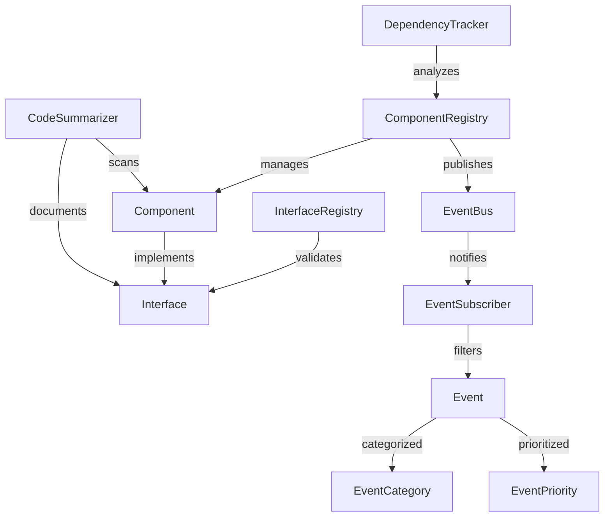

# Project Summary: aerolearn_ai

*Generated on code_summary.md*

Total Python files: 41

## Table of Contents

1. [Project Structure](#project-structure)
2. [Key Files](#key-files)
3. [Dependencies](#dependencies)
4. [Detailed Code Analysis](#detailed-code-analysis)

## Project Structure

```
├── app
│   ├── core
│   │   ├── auth
│   │   │   └── __init__.py
│   │   ├── db
│   │   │   └── __init__.py
│   │   ├── drive
│   │   │   └── __init__.py
│   │   └── ai
│   │       └── __init__.py
│   ├── ui
│   │   ├── common
│   │   │   └── __init__.py
│   │   ├── professor
│   │   │   └── __init__.py
│   │   ├── student
│   │   │   └── __init__.py
│   │   └── admin
│   │       └── __init__.py
│   ├── models
│   │   └── __init__.py
│   ├── utils
│   │   └── __init__.py
│   ├── config
│   │   └── __init__.py
│   ├── __init__.py
│   └── main.py
├── integrations
│   ├── interfaces
│   │   └── __init__.py
│   ├── registry
│   │   ├── __init__.py
│   │   ├── dependency_tracker.py
│   │   ├── component_registry.py
│   │   └── interface_registry.py
│   ├── events
│   │   ├── __init__.py
│   │   ├── event_types.py
│   │   ├── event_subscribers.py
│   │   └── event_bus.py
│   └── __init__.py
├── tests
│   ├── unit
│   │   ├── core
│   │   │   └── __init__.py
│   │   ├── ui
│   │   │   └── __init__.py
│   │   └── models
│   │       └── __init__.py
│   ├── integration
│   │   ├── __init__.py
│   │   ├── test_event_bus.py
│   │   ├── test_component_registry.py
│   │   ├── test_component_registry_async.py
│   │   └── test_component_registry_Simple.py
│   ├── ui
│   │   └── __init__.py
│   ├── fixtures
│   │   └── __init__.py
│   ├── examples
│   │   └── event_bus_example.py
│   └── __init__.py
├── docs
│   ├── architecture

│   ├── api

│   ├── user_guides

│   └── development

├── tools
│   ├── integration_monitor
│   │   └── __init__.py
│   └── project_management
│       └── __init__.py
├── resources
│   ├── styles

│   ├── templates
│   │   ├── ai_prompts

│   │   └── report_templates

│   └── sample_data
│       ├── courses

│       ├── users

│       └── content

├── scripts
│   ├── __init__.py
│   └── setup.py
├── untitled3.py
└── code_summarizer.py
```

## Key Files

### integrations\events\event_types.py

Event type definitions for the AeroLearn AI event system.

This module defines the event classes and types used throughout the system for
inter-compon...

- Classes: 12
- Functions: 0
- Dependency Score: 52.00

### integrations\registry\component_registry.py

Component registry for the AeroLearn AI system.

This module provides a centralized registry for all system components,
tracking their lifecycle, depe...

- Classes: 6
- Functions: 0
- Dependency Score: 45.00

### integrations\registry\interface_registry.py

Interface registry for the AeroLearn AI system.

This module provides a registry for component interfaces, ensuring components
properly implement requ...

- Classes: 5
- Functions: 1
- Dependency Score: 33.00

### code_summarizer.py

CodeSummarizer: A tool to create concise summaries of Python codebases
for maintaining context in AI assistant conversations.

This script:
1. Scans a...

- Classes: 2
- Functions: 1
- Dependency Score: 23.00

### integrations\events\event_subscribers.py

Event subscriber definitions and management for the AeroLearn AI event system.

This module provides the base classes and utilities for components to ...

- Classes: 3
- Functions: 0
- Dependency Score: 22.00

### integrations\events\event_bus.py

Event bus implementation for the AeroLearn AI event system.

This module provides the central event bus for inter-component communication,
implementin...

- Classes: 1
- Functions: 0
- Dependency Score: 20.00

### integrations\registry\dependency_tracker.py

Dependency tracking for the AeroLearn AI component system.

This module provides utilities for tracking, validating, and visualizing
component depende...

- Classes: 2
- Functions: 0
- Dependency Score: 18.00

### tests\examples\event_bus_example.py

Example usage of the event bus system.

This script demonstrates how to set up and use the event bus for
inter-component communication in the AeroLear...

- Classes: 3
- Functions: 0
- Dependency Score: 12.00

### tests\integration\test_component_registry.py

Revised Component Registry tests for Spyder - adapted to your implementation.

- Classes: 2
- Functions: 1
- Dependency Score: 11.00

### tests\integration\test_component_registry_async.py

Modified Component Registry tests for Spyder that patch event creation.

- Classes: 2
- Functions: 0
- Dependency Score: 10.00

## Dependencies

Key file relationships (files with most dependencies):

- **tests\examples\event_bus_example.py** depends on: integrations\events\event_bus.py, integrations\events\event_types.py, integrations\events\event_subscribers.py
- **tests\integration\test_component_registry.py** depends on: integrations\events\event_bus.py, integrations\registry\dependency_tracker.py, integrations\registry\interface_registry.py, integrations\registry\component_registry.py
- **tests\integration\test_component_registry_async.py** depends on: integrations\events\event_types.py, integrations\registry\component_registry.py


## Detailed Code Analysis

### integrations\events\event_types.py

**Description:**

Event type definitions for the AeroLearn AI event system.

This module defines the event classes and types used throughout the system for
inter-component communication. It provides a type-safe way to define and handle events.

**Classes:**

- `EventPriority`
 (inherits from: enum.IntEnum)


  Event priority levels for determining handling order.

- `EventCategory`
 (inherits from: enum.Enum)


  Categories for grouping related events.

- `Event`


  Base class for all events in the system.

  Methods: `serialize()`, `deserialize()`

- `SystemEvent`
 (inherits from: Event)


  System-level events related to application lifecycle and operations.

  Methods: `__init__()`

- `ContentEvent`
 (inherits from: Event)


  Events related to educational content operations.

  Methods: `__init__()`

- `UserEvent`
 (inherits from: Event)


  Events related to user actions and profile changes.

  Methods: `__init__()`

- `AIEvent`
 (inherits from: Event)


  Events related to AI operations and intelligence.

  Methods: `__init__()`

- `UIEvent`
 (inherits from: Event)


  Events related to user interface interactions.

  Methods: `__init__()`

- `SystemEventType`


  Common system event type constants.

- `ContentEventType`


  Common content event type constants.

- `UserEventType`


  Common user event type constants.

- `AIEventType`


  Common AI event type constants.


### integrations\registry\component_registry.py

**Description:**

Component registry for the AeroLearn AI system.

This module provides a centralized registry for all system components,
tracking their lifecycle, dependencies, and version information.

**Classes:**

- `ComponentRegisteredEvent`
 (inherits from: Event)


  Event fired when a component is registered.

  Methods: `__init__()`

- `ComponentUnregisteredEvent`
 (inherits from: Event)


  Event fired when a component is unregistered.

  Methods: `__init__()`

- `ComponentStateChangedEvent`
 (inherits from: Event)


  Event fired when a component's state changes.

  Methods: `__init__()`

- `ComponentState`


  Enum-like class for component lifecycle states.

- `Component`


  Base class for all registrable components in the system.

  Methods: `__init__()`, `declare_dependency()`, `require_interface()`, `provide_interface()`

- `ComponentRegistry`


  Central registry for AeroLearn AI system components.

  Methods: `__new__()`, `__init__()`, `register_component()`, `unregister_component()`, `get_component()`, ... (6 more)


### integrations\registry\interface_registry.py

**Description:**

Interface registry for the AeroLearn AI system.

This module provides a registry for component interfaces, ensuring components
properly implement required interfaces and allowing for interface discovery.

**Classes:**

- `InterfaceDefinitionError`
 (inherits from: Exception)


  Exception raised when an interface is improperly defined.

- `InterfaceImplementationError`
 (inherits from: Exception)


  Exception raised when an interface is improperly implemented.

- `Interface`


  Base class for all interfaces in the system.

  Methods: `get_interface_name()`, `get_interface_version()`, `get_required_methods()`, `validate_implementation()`

- `InterfaceRegisteredEvent`
 (inherits from: Event)


  Event fired when an interface is registered.

  Methods: `__init__()`

- `InterfaceRegistry`


  Registry for interfaces in the system.

  Methods: `__new__()`, `__init__()`, `register_interface()`, `get_interface()`, `get_interface_version()`, ... (4 more)

**Functions:**

- `implements(interface_cls)`

  Decorator to mark a class as implementing an interface.


### code_summarizer.py

**Description:**

CodeSummarizer: A tool to create concise summaries of Python codebases
for maintaining context in AI assistant conversations.

This script:
1. Scans a project directory for Python files
2. Extracts key information (imports, classes, functions, docstrings)
3. Creates a structured summary
4. Optionally enhances the summary using DeepSeek API

**Classes:**

- `Colors`


- `CodeSummarizer`


  Methods: `__init__()`, `scan_project()`, `_find_python_files()`, `_get_directory_structure()`, `_process_file()`, ... (11 more)

**Functions:**

- `main()`

  Main function that can be run both from command line and directly from an IDE.


### integrations\events\event_subscribers.py

**Description:**

Event subscriber definitions and management for the AeroLearn AI event system.

This module provides the base classes and utilities for components to subscribe to
and handle events from the event bus.

**Classes:**

- `EventFilter`


  Filter for matching events based on various criteria.

  Methods: `__init__()`, `matches()`

- `EventSubscriber`
 (inherits from: abc.ABC)


  Base class for components that subscribe to events.

  Methods: `__init__()`, `add_filter()`, `remove_all_filters()`, `is_interested_in()`

- `CallbackEventSubscriber`
 (inherits from: EventSubscriber)


  Event subscriber that delegates to a callback function.

  Methods: `__init__()`


### integrations\events\event_bus.py

**Description:**

Event bus implementation for the AeroLearn AI event system.

This module provides the central event bus for inter-component communication,
implementing the publisher-subscriber pattern with advanced event filtering
and asynchronous event handling.

**Classes:**

- `EventBus`


  Central event bus for the AeroLearn AI system.

  Methods: `__new__()`, `__init__()`, `register_subscriber()`, `unregister_subscriber()`, `get_stats()`, ... (3 more)


### integrations\registry\dependency_tracker.py

**Description:**

Dependency tracking for the AeroLearn AI component system.

This module provides utilities for tracking, validating, and visualizing
component dependencies and ensuring proper component initialization order.

**Classes:**

- `CircularDependencyError`
 (inherits from: Exception)


  Exception raised when a circular dependency is detected.

- `DependencyTracker`


  Utility for tracking and analyzing dependencies between components.

  Methods: `__init__()`, `validate_dependencies()`, `detect_circular_dependencies()`, `get_initialization_order()`, `get_dependency_tree()`, ... (4 more)


### tests\examples\event_bus_example.py

**Description:**

Example usage of the event bus system.

This script demonstrates how to set up and use the event bus for
inter-component communication in the AeroLearn AI system.

**Classes:**

- `SystemComponent`
 (inherits from: EventSubscriber)


  Example system component that publishes and subscribes to events.

  Methods: `__init__()`

- `ContentManager`
 (inherits from: EventSubscriber)


  Example content manager component.

  Methods: `__init__()`

- `UserManager`
 (inherits from: EventSubscriber)


  Example user manager component.

  Methods: `__init__()`


### tests\integration\test_component_registry.py

**Description:**

Revised Component Registry tests for Spyder - adapted to your implementation.

**Classes:**

- `TestComponentRegistry`


  Test wrapper for ComponentRegistry that disables event publishing.

  Methods: `__init__()`, `__getattr__()`, `restore()`

- `TestComponent`
 (inherits from: Component)


  Basic test component for registry tests.

  Methods: `__init__()`

**Functions:**

- `improved_register_component(component)`

  Register component directly with all necessary bookkeeping.


### tests\integration\test_component_registry_async.py

**Description:**

Modified Component Registry tests for Spyder that patch event creation.

**Classes:**

- `TestComponent`
 (inherits from: Component)


  Test component for registry tests.

  Methods: `__init__()`

- `TestComponentRegistry`


  Test wrapper for ComponentRegistry that disables event publishing.

  Methods: `__init__()`, `__getattr__()`, `restore()`


### tests\integration\test_component_registry_Simple.py

**Description:**

Simplified Spyder-compatible tests for the Component Registry system without events.

**Classes:**

- `TestComponent`
 (inherits from: Component)


  Test component for registry tests.

  Methods: `__init__()`

**Functions:**

- `safe_call(obj, primary_method, fallback_method)`

  Call primary_method if it exists, otherwise try fallback_method


### untitled3.py

**Functions:**

- `create_directory(path)`

  Create directory if it doesn't exist.

- `create_file(path, content)`

  Create file with given content.

- `create_init_file(path)`

  Create a Python __init__.py file.

- `generate_project_structure()`


### tests\integration\test_event_bus.py

**Description:**

Integration test for the event bus system.

This module tests the event bus functionality to ensure events are correctly
published and subscribers receive the events they are interested in.

**Classes:**

- `TestEventSubscriber`
 (inherits from: EventSubscriber)


  Test event subscriber that records received events.

  Methods: `__init__()`


### app\main.py

**Description:**

Main entry point for the AeroLearn AI application.

**Functions:**

- `main()`

  Initialize and run the AeroLearn AI application.


### app\__init__.py

**Description:**

AeroLearn AI - Aerospace Engineering Education Platform
Version: 0.1.0
Created: 2025-04-24

An AI-first education system for Aerospace Engineering that enhances teaching
and learning experiences through intelligent content management, personalized
learning assistance, and comprehensive analytics.


### app\core\auth\__init__.py

**Description:**

AeroLearn AI - Aerospace Engineering Education Platform
Created: 2025-04-24

This module is part of the AeroLearn AI project.


### app\core\db\__init__.py

**Description:**

AeroLearn AI - Aerospace Engineering Education Platform
Created: 2025-04-24

This module is part of the AeroLearn AI project.


### app\core\drive\__init__.py

**Description:**

AeroLearn AI - Aerospace Engineering Education Platform
Created: 2025-04-24

This module is part of the AeroLearn AI project.


### app\core\ai\__init__.py

**Description:**

AeroLearn AI - Aerospace Engineering Education Platform
Created: 2025-04-24

This module is part of the AeroLearn AI project.


### app\ui\common\__init__.py

**Description:**

AeroLearn AI - Aerospace Engineering Education Platform
Created: 2025-04-24

This module is part of the AeroLearn AI project.


### app\ui\professor\__init__.py

**Description:**

AeroLearn AI - Aerospace Engineering Education Platform
Created: 2025-04-24

This module is part of the AeroLearn AI project.


### app\ui\student\__init__.py

**Description:**

AeroLearn AI - Aerospace Engineering Education Platform
Created: 2025-04-24

This module is part of the AeroLearn AI project.


### app\ui\admin\__init__.py

**Description:**

AeroLearn AI - Aerospace Engineering Education Platform
Created: 2025-04-24

This module is part of the AeroLearn AI project.


### app\models\__init__.py

**Description:**

AeroLearn AI - Aerospace Engineering Education Platform
Created: 2025-04-24

This module is part of the AeroLearn AI project.


### app\utils\__init__.py

**Description:**

AeroLearn AI - Aerospace Engineering Education Platform
Created: 2025-04-24

This module is part of the AeroLearn AI project.


### app\config\__init__.py

**Description:**

AeroLearn AI - Aerospace Engineering Education Platform
Created: 2025-04-24

This module is part of the AeroLearn AI project.


### integrations\__init__.py

**Description:**

AeroLearn AI - Aerospace Engineering Education Platform
Created: 2025-04-24

This module is part of the AeroLearn AI project.


### integrations\interfaces\__init__.py

**Description:**

AeroLearn AI - Aerospace Engineering Education Platform
Created: 2025-04-24

This module is part of the AeroLearn AI project.


### integrations\registry\__init__.py

**Description:**

AeroLearn AI - Aerospace Engineering Education Platform
Created: 2025-04-24

This module is part of the AeroLearn AI project.


### integrations\events\__init__.py

**Description:**

AeroLearn AI - Aerospace Engineering Education Platform
Created: 2025-04-24

This module is part of the AeroLearn AI project.


### tests\__init__.py

**Description:**

AeroLearn AI - Aerospace Engineering Education Platform
Created: 2025-04-24

This module is part of the AeroLearn AI project.


### tests\unit\core\__init__.py

**Description:**

AeroLearn AI - Aerospace Engineering Education Platform
Created: 2025-04-24

This module is part of the AeroLearn AI project.


### tests\unit\ui\__init__.py

**Description:**

AeroLearn AI - Aerospace Engineering Education Platform
Created: 2025-04-24

This module is part of the AeroLearn AI project.


### tests\unit\models\__init__.py

**Description:**

AeroLearn AI - Aerospace Engineering Education Platform
Created: 2025-04-24

This module is part of the AeroLearn AI project.


### tests\integration\__init__.py

**Description:**

AeroLearn AI - Aerospace Engineering Education Platform
Created: 2025-04-24

This module is part of the AeroLearn AI project.


### tests\ui\__init__.py

**Description:**

AeroLearn AI - Aerospace Engineering Education Platform
Created: 2025-04-24

This module is part of the AeroLearn AI project.


### tests\fixtures\__init__.py

**Description:**

AeroLearn AI - Aerospace Engineering Education Platform
Created: 2025-04-24

This module is part of the AeroLearn AI project.


### tools\integration_monitor\__init__.py

**Description:**

AeroLearn AI - Aerospace Engineering Education Platform
Created: 2025-04-24

This module is part of the AeroLearn AI project.


### tools\project_management\__init__.py

**Description:**

AeroLearn AI - Aerospace Engineering Education Platform
Created: 2025-04-24

This module is part of the AeroLearn AI project.


### scripts\__init__.py

**Description:**

AeroLearn AI - Aerospace Engineering Education Platform
Created: 2025-04-24

This module is part of the AeroLearn AI project.


## AI-Enhanced Analysis

Here's the additional architectural analysis to enhance the summary:

+++ Architectural Analysis +++

1. High-Level Architectural Overview:
The system follows an event-driven architecture with registry-based component management. Core pillars:
- Event Bus (Pub/Sub): Central nervous system using EventBus for async communication
- Component Registry: Singleton managing component lifecycle/dependencies
- Interface Registry: Enforces interface contracts between components
- Dependency Tracker: Maintains dependency graph for initialization order

Key Data Flow:
Components ↔ Registry ↔ Event Bus ↔ Subscribers  
DependencyTracker → ComponentRegistry → InterfaceRegistry

2. Identified Design Patterns:
- Singleton: ComponentRegistry, InterfaceRegistry, EventBus
- Publisher-Subscriber: EventBus with EventSubscriber hierarchy
- Registry: Component/interface registration pattern
- Factory: Component registration with version validation
- Decorator: @implements for interface validation
- Observer: Event filtering system in EventSubscriber
- Strategy: Different event handling priorities
- Graph: DependencyTracker uses networkx for topological sorting

3. Refactoring Opportunities:
- Registry Duplication: Component/Interface registries could inherit from BaseRegistry
- Event Inheritance: SystemEvent/ContentEvent share identical __init__ - suggest Event factory
- Thread Safety: Mix of threading/asyncio in ComponentRegistry - recommend unified concurrency model
- Interface Validation: Could leverage Python Protocols for static checking
- Dependency Visualization: Add graph export hooks in DependencyTracker
- Testability: Introduce mocking framework for registry tests
- Event Serialization: Add protobuf/JSON schema validation in Event.serialize()

4. Critical Path Analysis:
Key Path 1: Component Registration
Component → Registry.register() → DependencyValidation → StateChangeEvent → EventBus

Key Path 2: Event Publishing
EventSource → EventBus.publish() → FilterMatching → AsyncHandlerExecution

Key Path 3: Dependency Resolution
DependencyTracker → ComponentGraph → TopologicalSort → InitOrderValidation

5. Class/Module Relationships:



Key Relationships:
- ComponentRegistry ↔ InterfaceRegistry: Bidirectional interface validation
- EventBus ↔ ComponentRegistry: Circular dependency for system events
- DependencyTracker → networkx: External graph library dependency
- Component ←┐ Interface: Multiple implementation relationships
    └───────────┘
- EventSubscriber ← CallbackSubscriber: Inheritance with specialization

This architecture enables loose coupling between components while maintaining strong contracts through interfaces. The event-driven model supports scalable distributed processing crucial for AI workflows.