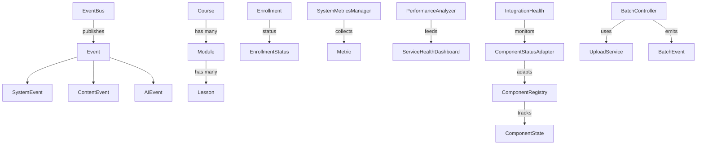

# Project Summary: aerolearn_ai

*Generated on code_summary.md*

Total Python files: 366

## Table of Contents

1. [Project Structure](#project-structure)
2. [Key Files](#key-files)
3. [Dependencies](#dependencies)
4. [Detailed Code Analysis](#detailed-code-analysis)

## Project Structure

```
├── app
│   ├── core
│   │   ├── auth
│   │   │   ├── __init__.py
│   │   │   ├── credential_manager.py
│   │   │   ├── user_profile.py
│   │   │   ├── authentication.py
│   │   │   ├── session.py
│   │   │   ├── authorization.py
│   │   │   └── permission_registry.py
│   │   ├── db
│   │   │   ├── __init__.py
│   │   │   ├── db_client.py
│   │   │   ├── schema.py
│   │   │   ├── migrations.py
│   │   │   ├── event_hooks.py
│   │   │   ├── db_events.py
│   │   │   ├── local_cache.py
│   │   │   ├── sync_manager.py
│   │   │   ├── content_db.py
│   │   │   └── course_admin.py
│   │   ├── drive
│   │   │   ├── __init__.py
│   │   │   ├── file_operations.py
│   │   │   ├── folder_structure.py
│   │   │   ├── metadata.py
│   │   │   ├── sync_manager.py
│   │   │   ├── metadata_schema_video.py
│   │   │   ├── metadata_inheritance_utilities.py
│   │   │   ├── metadata_store.py
│   │   │   └── metadata_persistence_manager.py
│   │   ├── ai
│   │   │   ├── __init__.py
│   │   │   ├── embedding.py
│   │   │   ├── content_similarity.py
│   │   │   ├── preprocessing.py
│   │   │   ├── vector_index.py
│   │   │   ├── conversation.py
│   │   │   ├── semantic_search.py
│   │   │   ├── concept_extraction.py
│   │   │   ├── resource_discovery.py
│   │   │   └── prompt_engineering.py
│   │   ├── api
│   │   │   ├── api_client.py
│   │   │   ├── deepseek_client.py
│   │   │   ├── google_drive_client.py
│   │   │   ├── __init__.py
│   │   │   └── course_api.py
│   │   ├── upload
│   │   │   ├── test_upload_service.py
│   │   │   ├── __init__.py
│   │   │   ├── upload_service.py
│   │   │   └── batch_controller.py
│   │   ├── validation
│   │   │   ├── format_validator.py
│   │   │   ├── main.py
│   │   │   └── __init__.py
│   │   ├── monitoring
│   │   │   ├── settings_manager.py
│   │   │   ├── metrics.py
│   │   │   ├── __init__.py
│   │   │   ├── notification_center.py
│   │   │   ├── pattern_detection.py
│   │   │   ├── interventions.py
│   │   │   ├── integration_monitor.py
│   │   │   └── resource_registry.py
│   │   ├── config
│   │   │   ├── api_secrets.py
│   │   │   ├── api_secrets_example.py
│   │   │   └── __init__.py
│   │   ├── extraction
│   │   │   ├── __init__.py
│   │   │   ├── structured_data_extractor.py
│   │   │   ├── text_extractor.py
│   │   │   └── multimedia_metadata_extractor.py
│   │   ├── vector_db
│   │   │   ├── vector_db_client.py
│   │   │   ├── schema.py
│   │   │   ├── index_manager.py
│   │   │   ├── sync_manager.py
│   │   │   └── __init__.py
│   │   ├── search
│   │   │   ├── base_search.py
│   │   │   ├── keyword_search.py
│   │   │   ├── semantic_backend.py
│   │   │   ├── result_aggregation.py
│   │   │   ├── permissions.py
│   │   │   └── __init__.py
│   │   ├── relationships
│   │   │   ├── knowledge_graph.py
│   │   │   ├── relationship_finder.py
│   │   │   ├── navigation.py
│   │   │   ├── visualization.py
│   │   │   ├── __init__.py
│   │   │   └── relationship_extractor.py
│   │   ├── external_resources
│   │   │   ├── __init__.py
│   │   │   ├── providers.py
│   │   │   ├── scoring.py
│   │   │   └── workflow.py
│   │   ├── conversation
│   │   │   ├── handlers
│   │   │   │   └── __init__.py
│   │   │   ├── __init__.py
│   │   │   └── handlers.py
│   │   ├── prompts
│   │   │   ├── template_engine.py
│   │   │   ├── optimizers.py
│   │   │   ├── parser.py
│   │   │   └── __init__.py
│   │   ├── integration
│   │   │   ├── integration_coordinator.py
│   │   │   └── __init__.py
│   │   ├── enrollment
│   │   │   ├── enrollment_service.py
│   │   │   └── __init__.py
│   │   ├── assessment
│   │   │   ├── session_manager.py
│   │   │   ├── question_engine.py
│   │   │   ├── grading.py
│   │   │   ├── manual_grading.py
│   │   │   ├── feedback.py
│   │   │   └── __init__.py
│   │   ├── project_management
│   │   │   ├── milestone_tracker.py
│   │   │   └── __init__.py
│   │   └── __init__.py
│   ├── ui
│   │   ├── common
│   │   │   ├── __init__.py
│   │   │   ├── component_base.py
│   │   │   ├── test_component_architecture.py
│   │   │   ├── component_registry.py
│   │   │   ├── main_window.py
│   │   │   ├── navigation.py
│   │   │   ├── form_controls.py
│   │   │   ├── content_browser.py
│   │   │   ├── content_preview.py
│   │   │   ├── metadata_editor.py
│   │   │   ├── course_structure_editor.py
│   │   │   ├── category_multiselect.py
│   │   │   ├── tag_autocomplete.py
│   │   │   └── course_organization_search.py
│   │   ├── professor
│   │   │   ├── __init__.py
│   │   │   ├── upload_widget.py
│   │   │   ├── upload_service.py
│   │   │   └── batch_upload_ui.py
│   │   ├── student
│   │   │   ├── widgets
│   │   │   │   ├── progress.py
│   │   │   │   ├── __init__.py
│   │   │   │   ├── progress_visualization.py
│   │   │   │   ├── course_navigator.py
│   │   │   │   ├── document_viewer.py
│   │   │   │   ├── video_player.py
│   │   │   │   ├── code_snippet_viewer.py
│   │   │   │   ├── image_viewer.py
│   │   │   │   ├── interactive_quiz.py
│   │   │   │   ├── content_highlighter.py
│   │   │   │   ├── interactive_diagram.py
│   │   │   │   ├── flashcard_widget.py
│   │   │   │   ├── richtext_note_editor.py
│   │   │   │   ├── note_reference_linker.py
│   │   │   │   ├── note_organizer.py
│   │   │   │   └── note_search.py
│   │   │   ├── __init__.py
│   │   │   ├── dashboard.py
│   │   │   ├── widget_registry.py
│   │   │   ├── widget_base.py
│   │   │   ├── dashboard_state.py
│   │   │   └── register_widgets.py
│   │   └── admin
│   │       ├── templates

│   │       ├── __init__.py
│   │       ├── dashboard.py
│   │       ├── user_management.py
│   │       ├── course_management.py
│   │       ├── system_config.py
│   │       └── resource_dashboard.py
│   ├── models
│   │   ├── __init__.py
│   │   ├── user.py
│   │   ├── course.py
│   │   ├── content.py
│   │   ├── assessment.py
│   │   ├── content_type_registry.py
│   │   ├── metadata_schema.py
│   │   ├── metadata_manager.py
│   │   ├── category.py
│   │   ├── tag.py
│   │   ├── category_suggestion.py
│   │   ├── tag_suggestion.py
│   │   ├── tag_search.py
│   │   ├── base.py
│   │   ├── topic.py
│   │   └── progress.py
│   ├── utils
│   │   ├── __init__.py
│   │   ├── crypto.py
│   │   └── config_loader.py
│   ├── config
│   │   └── __init__.py
│   ├── static
│   │   ├── js

│   │   └── css

│   ├── templates

│   ├── tools
│   │   ├── doc_generator.py
│   │   ├── docgen_entry.py
│   │   └── __init__.py
│   ├── __init__.py
│   └── main.py
├── integrations
│   ├── interfaces
│   │   ├── __init__.py
│   │   ├── base_interface.py
│   │   ├── content_interface.py
│   │   ├── storage_interface.py
│   │   └── ai_interface.py
│   ├── registry
│   │   ├── __init__.py
│   │   ├── dependency_tracker.py
│   │   ├── component_registry.py
│   │   ├── interface_registry.py
│   │   └── component_state.py
│   ├── events
│   │   ├── __init__.py
│   │   ├── event_types.py
│   │   ├── event_subscribers.py
│   │   └── event_bus.py
│   ├── monitoring
│   │   ├── __init__.py
│   │   ├── integration_health.py
│   │   ├── component_status.py
│   │   ├── transaction_logger.py
│   │   └── component_status_adapter.py
│   ├── week2
│   │   ├── orchestrator.py
│   │   └── __init__.py
│   └── __init__.py
├── tests
│   ├── unit
│   │   ├── core
│   │   │   ├── auth
│   │   │   │   ├── test_authentication.py
│   │   │   │   ├── test_authorization.py
│   │   │   │   └── __init__.py
│   │   │   ├── api
│   │   │   │   ├── test_api_clients.py
│   │   │   │   └── __init__.py
│   │   │   ├── upload
│   │   │   │   ├── test_upload_service.py
│   │   │   │   ├── __init__.py
│   │   │   │   └── test_batch_controller.py
│   │   │   ├── ai
│   │   │   │   ├── test_conversation.py
│   │   │   │   └── __init__.py
│   │   │   ├── monitoring
│   │   │   │   ├── test_notification_center.py
│   │   │   │   ├── test_metrics.py
│   │   │   │   ├── test_pattern_detection.py
│   │   │   │   ├── test_interventions.py
│   │   │   │   ├── __init__.py
│   │   │   │   └── test_resource_registry.py
│   │   │   ├── __init__.py
│   │   │   └── test_integration_health.py
│   │   ├── ui
│   │   │   ├── __init__.py
│   │   │   ├── test_progress_visualization.py
│   │   │   └── test_component_architecture.py
│   │   ├── models
│   │   │   ├── __init__.py
│   │   │   ├── test_metadata_manager.py
│   │   │   ├── test_content_type_registry.py
│   │   │   └── test_progress.py
│   │   ├── test_crypto.py
│   │   ├── test_credential_manager.py
│   │   ├── test_local_cache_and_sync.py
│   │   ├── __init__.py
│   │   └── test_pyqt6_charts.py
│   ├── integration
│   │   ├── interfaces
│   │   │   ├── test_base_interface.py
│   │   │   ├── test_content_interface.py
│   │   │   ├── test_storage_interface.py
│   │   │   ├── test_ai_interface.py
│   │   │   └── __init__.py
│   │   ├── monitoring
│   │   │   ├── test_service_health_dashboard.py
│   │   │   ├── test_dependency_tracking.py
│   │   │   ├── test_performance_analysis_tools.py
│   │   │   ├── __init__.py
│   │   │   ├── test_service_health_dashboard_integration.py
│   │   │   ├── test_integration_status_monitoring.py
│   │   │   ├── test_performance_analysis.py
│   │   │   └── test_resource_allocation.py
│   │   ├── registry
│   │   │   ├── test_dependency_tracking.py
│   │   │   ├── test_dependency_tracking_system.py
│   │   │   ├── __init__.py
│   │   │   ├── test_component_dependency_registry.py
│   │   │   ├── test_component_registry_dependency_tracking.py
│   │   │   ├── test_feature_tracker.py
│   │   │   └── test_milestone_tracker.py
│   │   ├── docs
│   │   │   ├── test_doc_generator.py
│   │   │   ├── __init__.py
│   │   │   └── test_doc_extraction.py
│   │   ├── __init__.py
│   │   ├── test_event_bus.py
│   │   ├── test_component_registry.py
│   │   ├── test_component_registry_async.py
│   │   ├── test_component_registry_Simple.py
│   │   ├── test_monitoring.py
│   │   ├── test_health_metrics.py
│   │   ├── test_component_status.py
│   │   ├── test_auth_event_bus.py
│   │   ├── test_db_integration.py
│   │   ├── test_phase1_foundation.py
│   │   ├── phase1_foundation_patch.py
│   │   ├── component_harness.py
│   │   ├── test_framework.py
│   │   ├── test_auth_integration.py
│   │   ├── test_storage_integration.py
│   │   ├── test_ui_integration.py
│   │   ├── test_upload_flow.py
│   │   ├── test_upload_metadata_integration.py
│   │   ├── test_batch_content_metadata.py
│   │   ├── test_professor_upload_workflow.py
│   │   ├── test_content_management_workflow.py
│   │   ├── test_admin_integration.py
│   │   ├── test_content_analysis_integration.py
│   │   ├── test_relationship_mapping_integration.py
│   │   ├── test_semantic_search_integration.py
│   │   ├── test_resource_discovery_integration.py
│   │   ├── test_week2_integration.py
│   │   ├── test_enrollment.py
│   │   ├── test_assessment_engine_day17.py
│   │   └── test_learning_analytics_integration.py
│   ├── ui
│   │   ├── __init__.py
│   │   ├── test_component_architecture.py
│   │   ├── test_main_window.py
│   │   ├── test_common_ui_controls.py
│   │   ├── test_professor_upload_widget.py
│   │   ├── test_course_organization_workflow.py
│   │   ├── test_course_structure_editor.py
│   │   ├── test_admin_auth.py
│   │   ├── test_user_management.py
│   │   ├── test_course_ops.py
│   │   ├── test_system_config.py
│   │   ├── test_student_dashboard.py
│   │   ├── test_multi_format_content_viewer.py
│   │   ├── test_student_dashboard_content_viewer.py
│   │   └── conftest.py
│   ├── fixtures
│   │   ├── sample_content
│   │   │   ├── __init__.py
│   │   │   └── repositories.py
│   │   └── __init__.py
│   ├── examples
│   │   └── event_bus_example.py
│   ├── models
│   │   ├── test_models.py
│   │   ├── test_course_structure.py
│   │   ├── test_category_tag_ops.py
│   │   ├── test_user_ops.py
│   │   └── test_course_admin.py
│   ├── core
│   │   ├── ai
│   │   │   ├── test_embedding.py
│   │   │   ├── test_content_similarity.py
│   │   │   ├── test_vector_index.py
│   │   │   ├── test_semantic_search.py
│   │   │   ├── __init__.py
│   │   │   ├── test_concept_extraction.py
│   │   │   ├── test_resource_discovery.py
│   │   │   ├── test_conversation.py
│   │   │   └── test_prompt_engineering.py
│   │   ├── extraction
│   │   │   ├── test_text_extractor.py
│   │   │   ├── test_structured_data_extractor.py
│   │   │   └── test_multimedia_metadata_extractor.py
│   │   ├── vector_db
│   │   │   └── test_vector_db.py
│   │   ├── search
│   │   │   ├── test_keyword_search.py
│   │   │   ├── test_semantic_backend.py
│   │   │   └── __init__.py
│   │   ├── relationships
│   │   │   ├── test_knowledge_graph.py
│   │   │   ├── test_relationship_finder.py
│   │   │   ├── test_navigation.py
│   │   │   ├── __init__.py
│   │   │   └── test_relationship_extractor.py
│   │   ├── external_resources
│   │   │   ├── test_providers.py
│   │   │   └── test_scoring.py
│   │   ├── prompts
│   │   │   ├── test_template_engine.py
│   │   │   ├── test_optimizers.py
│   │   │   ├── test_parser.py
│   │   │   └── __init__.py
│   │   ├── assessment
│   │   │   ├── __init__.py
│   │   │   ├── test_session_manager.py
│   │   │   ├── test_question_engine.py
│   │   │   ├── test_grading.py
│   │   │   ├── test_manual_grading.py
│   │   │   └── test_feedback.py
│   │   └── __init__.py
│   ├── comprehensive
│   │   ├── __init__.py
│   │   ├── test_end_to_end_workflows.py
│   │   ├── test_load_simulation.py
│   │   ├── test_security_checks.py
│   │   ├── test_data_consistency.py
│   │   └── conftest.py
│   ├── helpers
│   │   ├── test_monitoring_fixtures.py
│   │   └── __init__.py
│   ├── __init__.py
│   ├── conftest.py
│   └── metadata_store_tests.py
├── docs
│   ├── architecture
│   │   └── test_component_dependency_registry.py
│   ├── api

│   ├── user_guides

│   ├── development

│   ├── ui

│   ├── reports

│   └── generated

├── tools
│   ├── integration_monitor
│   │   └── __init__.py
│   ├── project_management
│   │   └── __init__.py
│   ├── docs

│   ├── auto_patch_test_root_import.py
│   └── auto_patch_all_tests.py
├── resources
│   ├── styles

│   ├── templates
│   │   ├── ai_prompts

│   │   └── report_templates

│   └── sample_data
│       ├── courses

│       ├── users

│       └── content

├── scripts
│   ├── tests
│   │   └── fixtures
│   │       └── sample_content

│   ├── __init__.py
│   ├── setup.py
│   ├── course_organization_selftest.py
│   ├── admin_interface_selftest.py
│   ├── content_analysis_selftest.py
│   ├── generate_test_fixtures.py
│   └── graphviz_export_example.py
├── .spyproject
│   └── config
│       ├── backups

│       └── defaults

├── .qodo

├── demos

├── untitled3.py
├── code_summarizer.py
├── setup.py
└── doc_indexer.py
```

## Key Files

### integrations\events\event_types.py

Event type definitions for the AeroLearn AI event system.

This module defines the event classes and types used throughout the system for
inter-compon...

- Classes: 17
- Functions: 0
- Dependency Score: 105.00

### app\models\course.py

Course model for AeroLearn AI.

Location: app/models/course.py
Depends on: integrations/events/event_bus.py, integrations/events/event_types.py, app/m...

- Classes: 6
- Functions: 0
- Dependency Score: 94.00

### app\core\monitoring\metrics.py

System Metrics & Alert Manager — AeroLearn AI
Save at: /app/core/monitoring/metrics.py

Features:
- Define metrics types and schema
- Register/report ...

- Classes: 7
- Functions: 11
- Dependency Score: 90.00

### integrations\monitoring\integration_health.py

Integration health monitoring for the AeroLearn AI system.

This module provides health metric collection, status tracking, and visualization
data str...

- Classes: 9
- Functions: 0
- Dependency Score: 82.00

### integrations\registry\component_registry.py

Component registry for the AeroLearn AI system.

This module provides a minimal implementation of the component registry
for TDD purposes, focusing on...

- Classes: 2
- Functions: 0
- Dependency Score: 79.00

### app\models\assessment.py

Assessment model for AeroLearn AI.

Location: app/models/assessment.py
Depends on: app/core/db/schema.py, integrations/events/event_bus.py

Wraps Prog...

- Classes: 11
- Functions: 0
- Dependency Score: 78.00

### app\models\content.py

Content model for AeroLearn AI (Topic, Module, Lesson, Quiz).

Location: app/models/content.py
Depends on: app/models/topic.py, integrations/events/ev...

- Classes: 8
- Functions: 0
- Dependency Score: 70.00

### integrations\monitoring\component_status_adapter.py

- Classes: 6
- Functions: 8
- Dependency Score: 68.00

### integrations\events\event_bus.py

Event bus implementation for the AeroLearn AI event system.

This module provides the central event bus for inter-component communication,
implementin...

- Classes: 1
- Functions: 0
- Dependency Score: 67.00

### app\core\upload\batch_controller.py

BatchUploadController: Coordinate and track multiple simultaneous uploads.

- Aggregates progress
- Controls pause/resume/cancel for all or any
- Repo...

- Classes: 4
- Functions: 2
- Dependency Score: 65.00

## Dependencies

Key file relationships (files with most dependencies):

- **app\models\course.py** depends on: integrations\events\event_bus.py, integrations\events\event_types.py
- **app\core\monitoring\metrics.py** depends on: integrations\monitoring\component_status_adapter.py, integrations\registry\component_registry.py
- **integrations\monitoring\integration_health.py** depends on: integrations\registry\component_registry.py, integrations\events\event_types.py
- **app\models\assessment.py** depends on: integrations\events\event_bus.py, integrations\events\event_types.py
- **app\models\content.py** depends on: app\models\course.py, integrations\events\event_bus.py, integrations\events\event_types.py
- **integrations\monitoring\component_status_adapter.py** depends on: integrations\registry\component_registry.py


## Detailed Code Analysis

### integrations\events\event_types.py

**Description:**

Event type definitions for the AeroLearn AI event system.

This module defines the event classes and types used throughout the system for
inter-component communication. It provides a type-safe way to define and handle events.

Event types can be accessed either through the EventType enum (for type checking and IDE support)
or through the category-specific classes (SystemEventType, ContentEventType, etc.) for
organizational clarity.

**Classes:**

- `EventType`
 (inherits from: enum.Enum)


  General event type enumeration for core system/event bus usage.

- `EventPriority`
 (inherits from: enum.IntEnum)


  Event priority levels for determining handling order.

- `EventCategory`
 (inherits from: enum.Enum)


  Categories for grouping related events.

- `Event`


  Base class for all events in the system.

  Methods: `serialize()`, `deserialize()`

- `SystemEvent`
 (inherits from: Event)


  System-level events related to application lifecycle and operations.

  Methods: `__init__()`

- `ContentEvent`
 (inherits from: Event)


  Events related to educational content operations.

  Methods: `__init__()`

- `UserEvent`
 (inherits from: Event)


  Events related to user actions and profile changes.

  Methods: `__init__()`

- `AIEvent`
 (inherits from: Event)


  Events related to AI operations and intelligence.

  Methods: `__init__()`

- `BatchEvent`
 (inherits from: Event)


  Events related to batch processing operations.

  Methods: `__init__()`

- `UIEvent`
 (inherits from: Event)


  Events related to user interface interactions.

  Methods: `__init__()`

- `EnrollmentEvent`
 (inherits from: Event)


  Events related to course enrollment processes.

  Methods: `__init__()`

- `SystemEventType`


  Common system event type constants.

- `ContentEventType`


  Common content event type constants.

- `UserEventType`


  Common user event type constants.

- `AIEventType`


  Common AI event type constants.

- `BatchEventType`


  Common batch processing event type constants.

- `EnrollmentEventType`


  Common enrollment event type constants.


### app\models\course.py

**Description:**

Course model for AeroLearn AI.

Location: app/models/course.py
Depends on: integrations/events/event_bus.py, integrations/events/event_types.py, app/models/user.py

Covers ORM models, relationships, validation, serialization, and event emission.

**Classes:**

- `EnrollmentStatus`
 (inherits from: enum.Enum)


  Status of an enrollment request.

- `Course`
 (inherits from: Base)


  Methods: `__repr__()`, `serialize()`, `validate()`, `archive()`, `restore()`, ... (9 more)

- `Module`
 (inherits from: Base)


  Methods: `__repr__()`, `serialize()`, `copy()`

- `Lesson`
 (inherits from: Base)


  Methods: `__repr__()`, `serialize()`

- `Enrollment`
 (inherits from: Base)


  Enrollment model for tracking user enrollments in courses.

  Methods: `__repr__()`, `approve()`, `reject()`, `cancel()`, `serialize()`

- `CourseModel`


  Methods: `__init__()`, `id()`, `title()`, `description()`, `modules()`, ... (2 more)


### app\core\monitoring\metrics.py

**Description:**

System Metrics & Alert Manager — AeroLearn AI
Save at: /app/core/monitoring/metrics.py

Features:
- Define metrics types and schema
- Register/report metrics for components
- Threshold-based alerting (with callback hooks)
- Real-time status query API
- Learning analytics and progress tracking metrics
- Component health monitoring and status history

**Classes:**

- `MetricType`
 (inherits from: Enum)


- `AlertLevel`
 (inherits from: Enum)


- `Metric`


  Methods: `__init__()`, `to_dict()`

- `MetricAlert`


  Methods: `__init__()`

- `SystemMetricsManager`


  Methods: `__new__()`, `__init__()`, `register_metric()`, `report_metric()`, `get_metric()`, ... (4 more)

- `ServiceHealthDashboard`


  Monitors and visualizes component/service health across the AeroLearn system.

  Methods: `__init__()`, `get_all_component_statuses()`, `get_dependency_graph()`, `watch_component()`, `status_for()`, ... (5 more)

- `PerformanceAnalyzer`


  Analyzes performance metrics for system components.

  Methods: `__init__()`, `set_dashboard()`, `benchmark_component()`, `measure_transaction_flow()`, `get_transaction_metrics()`, ... (4 more)

**Functions:**

- `track_learning_objective(user_id, objective_id, activities)`

  Track the degree of achievement for a specific learning objective by user.

- `monitor_time_on_task(user_id, activity_logs)`

  Monitor total time on task for a user.

- `calculate_completion_rate(user_id, module_ids, completion_logs)`

  Calculate overall module completion rate for the user.

- `analyze_performance_trends(user_id, performance_history)`

  Analyze trends in student performance over time.

- `assessment_performance_analytics(user_id, records)`

  Summarize assessment performance for user: mean, min, max, count.

- `engagement_score(user_id, interactions)`

  Sum engagement points for a user by interaction type.

- `competency_mapping(user_id, assessments)`

  Return set of competency_id values achieved by user; achieved if score >= threshold.

- `comparative_cohort_analytics(group1, group2)`

  Compare two cohorts by average progress/engagement.

- `save_analytics_result(student_id, data)`

  Save analytics results for a student to in-memory storage.

- `retrieve_analytics_result(student_id)`

  Retrieve previously saved analytics results for a student.

- `clear_analytics_storage()`

  Clear all stored analytics results.


### integrations\monitoring\integration_health.py

**Description:**

Integration health monitoring for the AeroLearn AI system.

This module provides health metric collection, status tracking, and visualization
data structures for monitoring the health of system integrations.

**Classes:**

- `HealthStatus`
 (inherits from: Enum)


  Health status levels for components and integrations.

- `HealthMetricType`
 (inherits from: Enum)


  Types of health metrics that can be collected.

- `HealthMetric`


  A single health metric measurement.

  Methods: `__init__()`, `get_status()`, `to_dict()`

- `HealthEvent`
 (inherits from: Event)


  Event fired when a significant health status change occurs.

  Methods: `__init__()`

- `HealthProvider`
 (inherits from: ABC)


  Interface for components that provide health information.

  Methods: `get_health_metrics()`, `get_health_status()`

- `IntegrationHealthError`
 (inherits from: Exception)


  Exception raised for errors in the integration health system.

- `IntegrationHealth`
 (inherits from: Component)


  Central system for tracking integration health across components.

  Methods: `__init__()`, `register_health_provider()`, `unregister_health_provider()`, `collect_metrics()`, `_update_metrics()`, ... (16 more)

- `IntegrationMonitor`


  Monitors integration points for transaction success, performance, and failures.

  Methods: `__init__()`, `log_transaction()`, `get_transaction()`, `report_failure()`, `get_recent_failures()`, ... (1 more)

- `IntegrationPointRegistry`


  Registry for integration points in the system.

  Methods: `__init__()`, `register_integration_point()`, `get_all_points()`, `get_point_details()`, `add_registry_listener()`, ... (2 more)


### integrations\registry\component_registry.py

**Description:**

Component registry for the AeroLearn AI system.

This module provides a minimal implementation of the component registry
for TDD purposes, focusing on registration, state management, and dependencies.

**Classes:**

- `Component`


  Base class for all registrable components in the system.

  Methods: `__init__()`, `declare_dependency()`, `__getitem__()`

- `ComponentRegistry`


  Central registry for AeroLearn AI system components.

  Methods: `__init__()`, `register_component()`, `unregister_component()`, `get_component()`, `get_components_by_type()`, ... (8 more)


### app\models\assessment.py

**Description:**

Assessment model for AeroLearn AI.

Location: app/models/assessment.py
Depends on: app/core/db/schema.py, integrations/events/event_bus.py

Wraps ProgressRecord and assessment-related logic; provides validation, serialization, and event integration.
Also defines the Answer, Rubric, ManualGrade, Submission, and Feedback classes required for all
core assessment workflows and tests.

**Classes:**

- `ProgressRecord`


  Mock implementation of ProgressRecord for testing purposes

  Methods: `__init__()`

- `Assessment`


  Assessment model for evaluating student knowledge

  Methods: `__init__()`, `add_question()`, `grade()`

- `Answer`


  General answer schema for MCQ, text, code, etc.

  Methods: `__init__()`

- `Rubric`


  Defines grading criteria for assessments

  Methods: `by_id()`

- `ManualGrade`


  Represents a manually assigned grade with details

- `Submission`


  Represents a student's submission for an assessment

  Methods: `__post_init__()`

- `Feedback`


  Feedback provided on a submission

- `ManualGradingAssignment`


  Represents a manual grading assignment for an assessment session, supporting kwargs for test compatibility.

  Methods: `__init__()`

- `QuestionType`
 (inherits from: Enum)


  Defines the types of questions supported in assessments

  Methods: `mcq()`, `text()`, `code()`, `essay()`

- `AssessmentSession`


  Represents an in-progress or completed assessment attempt by a specific user.

  Methods: `submit_answer()`, `finalize()`, `cancel()`, `is_completed()`, `is_active()`

- `AssessmentModel`


  Methods: `__init__()`, `id()`, `serialize()`, `validate()`


### app\models\content.py

**Description:**

Content model for AeroLearn AI (Topic, Module, Lesson, Quiz).

Location: app/models/content.py
Depends on: app/models/topic.py, integrations/events/event_bus.py

Handles Topic, Module, Lesson, Quiz logic; validation, serialization, and event integration.

**Classes:**

- `Quiz`


  Methods: `__init__()`

- `Question`


  Methods: `__init__()`

- `Content`


  Main content representation class that unifies all content types

  Methods: `__init__()`, `from_lesson()`, `from_topic()`

- `TopicModel`


  Methods: `__init__()`, `id()`, `serialize()`, `validate()`

- `ModuleModel`


  Methods: `__init__()`, `id()`, `serialize()`, `validate()`

- `LessonModel`


  Methods: `__init__()`, `id()`, `serialize()`, `validate()`

- `QuizModel`


  Methods: `__init__()`, `id()`, `serialize()`, `validate()`

- `QuestionModel`


  Methods: `__init__()`, `id()`, `serialize()`, `validate()`


### integrations\monitoring\component_status_adapter.py

**Classes:**

- `ComponentState`
 (inherits from: Enum)


- `SimpleComponentStatusProvider`
 (inherits from: ComponentStatusProvider)


  Simple adapter between a Component and ComponentStatusProvider interface.

  Methods: `__init__()`, `get_component_state()`, `get_status_details()`, `get_status()`, `provide_status()`

- `ComponentStatus`


  Represents the operational status of a monitored component.

  Methods: `__init__()`, `to_dict()`

- `EnhancedComponentStatusTracker`
 (inherits from: ComponentStatusTracker)


  Enhanced version of ComponentStatusTracker that ensures faithful propagation

  Methods: `__init__()`, `_providers()`, `register_status_provider()`, `update_component_status()`, `get_component_status()`, ... (7 more)

- `ComponentRegistry`


  Implementation of ComponentRegistry with dependency tracking support.

  Methods: `__init__()`, `clear()`, `register_component()`, `declare_dependency()`, `get_dependency_graph()`, ... (2 more)

- `ServiceHealthDashboard`


  Dashboard for monitoring component health with explicit dependency injection.

  Methods: `__init__()`, `get_all_component_statuses()`, `get_dependency_graph()`, `clear()`

**Functions:**

- `make_registry()`

  Create a new ComponentRegistry instance.

- `make_tracker(registry)`

  Create a new EnhancedComponentStatusTracker instance.

- `clear_all_status_tracking()`

  Clear all status tracking data for test isolation.

- `reset_tracking(status_tracker, registry)`

  Reset tracking for specific instances or the default ones.

- `register_with_status_tracker(component, system_status_tracker, registry)`

  Register a component with the status tracker.

- `get_system_status_tracker()`

  Get the default instance of the system status tracker

- `get_component_registry()`

  Get the default instance of the component registry

- `unregister_from_status_tracker(component_id, system_status_tracker)`

  Unregister a component from the status tracker.


### integrations\events\event_bus.py

**Description:**

Event bus implementation for the AeroLearn AI event system.

This module provides the central event bus for inter-component communication,
implementing the publisher-subscriber pattern with event filtering
and persistence for critical events.

**Classes:**

- `EventBus`


  Central event bus for the AeroLearn AI system.

  Methods: `get()`, `__new__()`, `__init__()`, `register_subscriber()`, `unregister_subscriber()`, ... (8 more)


### app\core\upload\batch_controller.py

**Description:**

BatchUploadController: Coordinate and track multiple simultaneous uploads.

- Aggregates progress
- Controls pause/resume/cancel for all or any
- Reports status per file & batch

**Classes:**

- `BatchStatus`
 (inherits from: Enum)


  Status of a batch upload operation

- `BatchEvent`


  Event object for batch upload notifications

  Methods: `__init__()`

- `BatchUploadListener`


  Concrete base listener for batch upload event notifications.

  Methods: `on_batch_event()`

- `BatchUploadController`


  Controller to manage batch uploads with aggregated progress and event reporting.

  Methods: `__init__()`, `add_listener()`, `notify_event()`, `_safe_on_batch_event()`, `_extract_file_path()`, ... (26 more)

**Functions:**

- `start_batch(self, batch_id, files, dest, callbacks, metadata)`

  Start batch with optional metadata

- `apply_metadata(self, batch_id, metadata)`

  Apply metadata to all files in batch


### integrations\interfaces\base_interface.py

**Description:**

Base interface definitions for the AeroLearn AI system.

This module provides the core interface contract infrastructure, including interface
registration, discovery, and method signature validation mechanisms. All specific
interfaces in the system should inherit from the base classes defined here.

**Classes:**

- `InterfaceVersion`


  Helper class for managing interface versioning.

  Methods: `__init__()`, `__str__()`, `from_string()`, `is_compatible_with()`

- `MethodSignature`


  Class for representing and validating method signatures.

  Methods: `__init__()`, `validate_implementation()`

- `InterfaceMethod`


  Decorator for interface methods that captures signature information.

  Methods: `__init__()`, `__get__()`

- `InterfaceError`
 (inherits from: Exception)


  Base exception for interface-related errors.

- `InterfaceImplementationError`
 (inherits from: InterfaceError)


  Exception raised when an interface is implemented incorrectly.

- `InterfaceRegistryError`
 (inherits from: InterfaceError)


  Exception raised for interface registration errors.

- `InterfaceVersionError`
 (inherits from: InterfaceError)


  Exception raised for interface version errors.

- `BaseInterface`
 (inherits from: abc.ABC)


  Base class for all interface contracts in the system.

  Methods: `register_interface()`, `get_interface()`, `get_all_interfaces()`, `get_interface_methods()`, `validate_implementation()`, ... (1 more)

- `InterfaceImplementation`


  Decorator for classes that implement interfaces.

  Methods: `__init__()`, `__call__()`

- `InterfaceRegisteredEvent`
 (inherits from: Event)


  Event fired when an interface is registered.

  Methods: `__init__()`

**Functions:**

- `register_all_interfaces()`

  Register all interfaces defined in the system.


### app\core\auth\authentication.py

**Classes:**

- `AuthEvent`
 (inherits from: Event)


  Event representing authentication-related changes (login, logout, failure).

  Methods: `__init__()`

- `AuthenticationProvider`
 (inherits from: ABC)


  Interface for authentication providers.

  Methods: `authenticate()`

- `LocalAuthenticationProvider`
 (inherits from: AuthenticationProvider)


  Simple authentication provider with in-memory user verification and event emission.

  Methods: `__init__()`, `authenticate()`, `logout()`

- `MFAProvider`


  Simple TOTP-like provider for MFA codes — 

  Methods: `__init__()`, `generate_code()`, `verify_code()`

- `AdminAuthService`


  Methods: `__init__()`, `authenticate_admin()`, `log_activity()`, `enforce_permission()`, `get_activity_log()`

- `AdminRoles`


- `AdminPermissions`


- `AuthenticationService`


  Main service interface for authentication logic.

  Methods: `__init__()`, `authenticate()`, `authenticate_admin()`, `logout()`, `enforce_permission()`, ... (2 more)


### app\core\auth\authorization.py

**Classes:**

- `Permission`


  Represents a single permission string, such as 'content.edit' or 'user.manage'.

  Methods: `__init__()`, `__str__()`, `__eq__()`, `__hash__()`

- `Role`


  Represents a user role (e.g., student, professor, admin), with a set of permissions.

  Methods: `__init__()`, `all_permissions()`, `add_permission()`, `add_parent()`

- `UserPermissions`


  Assigns roles and direct permissions to users (by user_id).

  Methods: `__init__()`, `assign_role()`, `remove_role()`, `assign_permission()`, `remove_permission()`, ... (3 more)

- `AuthorizationManagerClass`


  Central registry for roles, permissions, and user/role assignment.

  Methods: `__init__()`, `register_permission()`, `register_role()`, `set_role_parent()`, `assign_role_to_user()`, ... (9 more)

- `PermissionError`
 (inherits from: Exception)


**Functions:**

- `require_permission(permission)`

  Decorator for functions/methods to enforce the required permission.


### integrations\interfaces\ai_interface.py

**Description:**

AI interface contracts for the AeroLearn AI system.

This module defines the interfaces for AI-powered components, including language models,
content analysis, question answering, and recommendation systems.

**Classes:**

- `AIModelType`
 (inherits from: Enum)


  Types of AI models used in the system.

- `AIModelCapability`
 (inherits from: Enum)


  Specific capabilities that AI models might provide.

- `AIProviderType`
 (inherits from: Enum)


  Types of AI providers.

- `AIModelMetadata`


  Metadata about an AI model.

  Methods: `__init__()`

- `AIRequest`


  Base class for AI requests.

  Methods: `__init__()`

- `TextGenerationRequest`
 (inherits from: AIRequest)


  Request for text generation.

  Methods: `__init__()`

- `EmbeddingRequest`
 (inherits from: AIRequest)


  Request for text embedding.

  Methods: `__init__()`

- `AIResponse`


  Base class for AI responses.

  Methods: `__init__()`

- `TextGenerationResponse`
 (inherits from: AIResponse)


  Response from text generation.

  Methods: `__init__()`

- `EmbeddingResponse`
 (inherits from: AIResponse)


  Response from text embedding.

  Methods: `__init__()`

- `AIModelProviderInterface`
 (inherits from: BaseInterface)


  Interface for components that provide access to AI models.

- `ContentAnalysisInterface`
 (inherits from: BaseInterface)


  Interface for AI components that analyze educational content.

- `LearningAssistantInterface`
 (inherits from: BaseInterface)


  Interface for AI components that provide learning assistance.

- `PersonalizationInterface`
 (inherits from: BaseInterface)


  Interface for AI components that provide personalized recommendations.

- `AIUsageTrackingInterface`
 (inherits from: BaseInterface)


  Interface for components that track AI usage and costs.

**Functions:**

- `register_ai_interfaces()`

  Register all AI interfaces.


### integrations\monitoring\transaction_logger.py

**Description:**

Transaction logging for the AeroLearn AI system.

This module provides tools for tracking and logging cross-component transactions,
making it easier to trace operations as they flow through different parts of the system.

**Classes:**

- `TransactionStage`
 (inherits from: Enum)


  Stages of a transaction lifecycle.

- `TransactionEvent`
 (inherits from: Event)


  Event fired when a transaction changes stage.

  Methods: `__init__()`, `to_dict()`

- `TransactionError`
 (inherits from: Exception)


  Exception raised for errors in transaction processing.

- `Transaction`


  Represents a cross-component transaction.

  Methods: `__init__()`, `start()`, `process()`, `complete()`, `fail()`, ... (6 more)

- `TransactionContext`


  Context manager for transaction handling.

  Methods: `__init__()`, `__enter__()`, `__exit__()`

- `TransactionLogger`
 (inherits from: Component)


  System for logging and tracking cross-component transactions.

  Methods: `__init__()`, `create_transaction()`, `update_transaction()`, `get_transaction()`, `get_transactions_by_parent()`, ... (14 more)


### integrations\monitoring\component_status.py

**Description:**

Component status tracking for the AeroLearn AI system.

This module provides components for tracking and visualizing the status
of system components, including lifecycle state changes, health status,
and operational capability.

**Classes:**

- `StatusSeverity`
 (inherits from: Enum)


  Severity levels for component status changes.

- `StatusChangeEvent`
 (inherits from: Event)


  Event fired when a component's status changes.

  Methods: `__init__()`, `to_dict()`

- `ComponentStatusProvider`
 (inherits from: ABC)


  Interface for components that provide status information.

  Methods: `get_component_state()`, `get_status_details()`

- `ComponentStatus`


  Represents the status of a component at a specific point in time.

  Methods: `__init__()`, `to_dict()`, `set_status()`, `get_status()`

- `StatusHistoryEntry`


  A historical status entry for a component.

  Methods: `__init__()`, `to_dict()`

- `ComponentStatusTracker`
 (inherits from: Component)


  System for tracking component status changes over time.

  Methods: `__init__()`, `register_status_provider()`, `unregister_status_provider()`, `update_component_status()`, `update_all_statuses()`, ... (13 more)


### app\core\ai\conversation.py

**Description:**

Conversational AI entry point and session manager — AeroLearn AI.

This upgrade completes Task 14.1 requirements:
- Conversation flow management with state persistence
- Context tracking and memory
- Session & conversation history with privacy controls
- Pluggable, handler-based flow routing for component-specific logic

Supersedes previous basic Conversation/ConversationManager implementation.

**Classes:**

- `InMemoryConversationStore`


  Pluggable (currently in-memory) session persistence.

  Methods: `__init__()`, `get()`, `set()`, `delete()`, `all_sessions()`

- `ConversationContext`


  Tracks per-session dynamic memory/state.

  Methods: `__init__()`, `set()`, `get()`, `clear()`

- `ConversationHistory`


  Tracks user-bot conversation with privacy settings.

  Methods: `__init__()`, `add_turn()`, `get_history()`, `clear()`

- `ConversationState`


  Full persistent snapshot for user session.

  Methods: `__init__()`, `as_dict()`, `clear_privacy_sensitive()`

- `ConversationManager`


  Main orchestrator for conversational AI sessions.

  Methods: `__init__()`, `register_handler()`, `set_default_handler()`, `start_session()`, `end_session()`, ... (5 more)

**Functions:**

- `default_user_validator(user_id)`

- `default_handler(user_input, user_id, state, extra)`


### integrations\interfaces\storage_interface.py

**Description:**

Storage interface contracts for the AeroLearn AI system.

This module defines the interfaces for storage systems, including local and cloud
storage providers, synchronization mechanisms, and file operations.

It also provides a simple StorageInterface abstract base class that can be used
by orchestration and integration components.

**Classes:**

- `StorageScope`
 (inherits from: Enum)


  Defines the scope/visibility of stored data.

- `StoragePermission`
 (inherits from: Enum)


  Permission levels for stored items.

- `SyncStatus`
 (inherits from: Enum)


  Synchronization status for stored items.

- `StorageItem`


  Represents a storage item (file or folder) with metadata.

  Methods: `__init__()`, `to_dict()`, `from_dict()`

- `SyncConflict`


  Represents a synchronization conflict between local and remote versions.

  Methods: `__init__()`

- `SyncProgress`


  Represents the progress of a synchronization operation.

  Methods: `__init__()`, `completion_percentage()`

- `StorageProviderInterface`
 (inherits from: BaseInterface)


  Interface for components that provide storage capabilities.

- `SynchronizationInterface`
 (inherits from: BaseInterface)


  Interface for components that synchronize content between storage providers.

- `StorageQuotaInterface`
 (inherits from: BaseInterface)


  Interface for components that manage storage quotas.

- `StoragePermissionInterface`
 (inherits from: BaseInterface)


  Interface for components that manage storage permissions.

- `FileStreamingInterface`
 (inherits from: BaseInterface)


  Interface for components that provide file streaming capabilities.

- `StorageInterface`
 (inherits from: ABC)


  Abstract interface for storage service integration.

  Methods: `exists()`, `upload()`, `download()`, `delete()`, `list()`


### app\models\user.py

**Description:**

User model for AeroLearn AI.

Location: /app/models/user.py (canonical User model for FK integrity)
This must be the single source of User ORM, with __tablename__ = 'user'
All FK and relationship references must import/use this model and tablename.

Implements validation, event integration, and serialization.
Includes admin roles, MFA support, and permission checks.

**Classes:**

- `User`
 (inherits from: Base)


  Canonical User model with tablename 'user' for FK references.

  Methods: `__repr__()`, `get_progress()`

- `UserProfile`
 (inherits from: Base)


  User profile information.

- `UserModel`


  Wrapper class for User entity with business logic.

  Methods: `__init__()`, `id()`, `username()`, `email()`, `is_active()`, ... (9 more)


### app\models\metadata_manager.py

**Classes:**

- `MetadataField`


  Represents a metadata field definition.

  Methods: `__init__()`, `validate()`

- `MetadataSchema`


  Represents a schema with a set of metadata fields (required/optional).

  Methods: `__init__()`, `validate()`, `get_required_fields()`, `get_optional_fields()`

- `MetadataManager`


  Manages metadata across content, supports CRUD, inheritance, editing, and validation.

  Methods: `__init__()`, `register_schema()`, `get_schema()`, `set_metadata()`, `update_metadata()`, ... (12 more)


### tests\integration\interfaces\test_ai_interface.py

**Classes:**

- `TestAIEnums`


  Tests for AI-related enumerations.

  Methods: `test_ai_model_type_values()`, `test_ai_model_capability_values()`, `test_ai_provider_type_values()`

- `TestAIModelMetadata`


  Tests for the AIModelMetadata class.

  Methods: `test_init_with_required_fields()`, `test_init_with_all_fields()`

- `TestAIRequests`


  Tests for AI request classes.

  Methods: `test_ai_request_init()`, `test_text_generation_request_init()`, `test_embedding_request_init()`

- `TestAIResponses`


  Tests for AI response classes.

  Methods: `test_ai_response_init()`, `test_text_generation_response_init()`, `test_embedding_response_init()`

- `TestAIModelProviderInterface`


  Tests for the AIModelProviderInterface.

  Methods: `test_interface_registration()`

- `TestContentAnalysisInterface`


  Tests for the ContentAnalysisInterface.

  Methods: `test_interface_registration()`

- `TestLearningAssistantInterface`


  Tests for the LearningAssistantInterface.

  Methods: `test_interface_registration()`

- `TestPersonalizationInterface`


  Tests for the PersonalizationInterface.

  Methods: `test_interface_registration()`

- `TestAIUsageTrackingInterface`


  Tests for the AIUsageTrackingInterface.

  Methods: `test_interface_registration()`

- `TestRegisterAIInterfaces`


  Tests for the register_ai_interfaces function.

  Methods: `test_register_ai_interfaces()`, `test_individual_interface_registrations()`

**Functions:**

- `_add_project_root_to_syspath()`


### integrations\events\event_subscribers.py

**Description:**

Event subscriber definitions and management for the AeroLearn AI event system.

This module provides the base classes and utilities for components to subscribe to
and handle events from the event bus. It also defines the EventFilter interface for selective event handling.

**Classes:**

- `EventFilter`


  EventFilter selects which events a subscriber is interested in 

  Methods: `__init__()`, `matches()`, `filter()`

- `AcceptAllEventFilter`
 (inherits from: EventFilter)


  Default event filter that accepts all events.

  Methods: `__init__()`, `matches()`, `filter()`

- `CompositeEventFilter`
 (inherits from: EventFilter)


  Accepts events if any of the provided filters accept them.

  Methods: `__init__()`, `matches()`, `filter()`

- `EventSubscriber`


  Abstract base class for components that subscribe to events from the EventBus.

  Methods: `__init__()`, `add_filter()`, `on_event()`, `event_filter()`

- `LoggingEventSubscriber`
 (inherits from: EventSubscriber)


  Example event subscriber that logs all received events.

  Methods: `__init__()`, `on_event()`

- `CallbackEventSubscriber`
 (inherits from: EventSubscriber)


  Event subscriber that uses a provided callback function for event processing.

  Methods: `__init__()`, `on_event()`


### app\core\assessment\session_manager.py

**Description:**

File: session_manager.py
Location: /app/core/assessment/
Purpose: Manages assessment sessions, timing, state transitions. Integrates with question engine and grading logic.

This file is created in accordance with the Day 17 development plan and current project conventions.

**Classes:**

- `AssessmentSessionStatus`
 (inherits from: Enum)


- `AssessmentSession`


  Methods: `__init__()`, `is_active()`, `is_completed()`, `quiz()`, `get_questions()`, ... (16 more)

- `GradingEngine`


  Handles grading of assessment sessions

  Methods: `grade_session()`

- `AssessmentSessionManager`


  Methods: `__init__()`, `create_session()`, `get_session()`, `end_session()`, `start_session()`


### app\core\auth\user_profile.py

**Classes:**

- `UserProfile`


  Represents the user's profile and identity attributes.

  Methods: `__init__()`, `role()`, `to_dict()`, `from_dict()`

- `UserProfileManager`


  Core logic for user profile management (CRUD, validation, bulk ops).

  Methods: `__init__()`, `_validate_user_data()`, `create_user()`, `get_user()`, `update_user()`, ... (5 more)


### tests\integration\interfaces\test_storage_interface.py

**Classes:**

- `TestStorageEnums`


  Tests for storage-related enumerations.

  Methods: `test_storage_scope_values()`, `test_storage_permission_values()`, `test_sync_status_values()`

- `TestStorageItem`


  Tests for the StorageItem class.

  Methods: `test_init_with_required_fields()`, `test_init_with_all_fields()`, `test_to_dict()`, `test_from_dict()`

- `TestSyncConflict`


  Tests for the SyncConflict class.

  Methods: `test_init()`

- `TestSyncProgress`


  Tests for the SyncProgress class.

  Methods: `test_init_with_required_fields()`, `test_init_with_all_fields()`, `test_completion_percentage()`

- `TestStorageProviderInterface`


  Tests for the StorageProviderInterface.

  Methods: `test_interface_registration()`

- `TestSynchronizationInterface`


  Tests for the SynchronizationInterface.

  Methods: `test_interface_registration()`

- `TestStorageQuotaInterface`


  Tests for the StorageQuotaInterface.

  Methods: `test_interface_registration()`

- `TestStoragePermissionInterface`


  Tests for the StoragePermissionInterface.

  Methods: `test_interface_registration()`

- `TestFileStreamingInterface`


  Tests for the FileStreamingInterface.

  Methods: `test_interface_registration()`

**Functions:**

- `_add_project_root_to_syspath()`


### app\core\upload\upload_service.py

**Description:**

UploadService: Handles efficient, robust file uploads for AeroLearn AI.
Features:
- Chunked upload for large files
- Retry mechanism with configurable policies
- Concurrent upload management (queue, pausing)
- Progress tracking & status reporting
- Pluggable backend destination (cloud/local for now)
- Backoff strategy for retries
- Upload cancellation support

NOTE: This is a scaffold/partial for integration; extend as needed.

Author: AeroLearn AI Team

**Classes:**

- `UploadStatus`


- `UploadRequest`


  Methods: `__init__()`

- `BackoffStrategy`


  Implements exponential backoff with jitter for retries

  Methods: `__init__()`, `get_delay()`

- `UploadService`


  Methods: `__init__()`, `enqueue()`, `get_upload_status()`, `cancel_upload()`, `_worker()`, ... (8 more)


### app\ui\common\form_controls.py

**Description:**

AeroLearn AI — Standardized UI Form Controls module
(Migrated to PyQt6)

This module provides reusable, themed UI form controls for the desktop UI. 
Designed to be used with a UI toolkit such as PyQt6 (Qt), though logic is separated
for backend/UI framework independence and testability.

Includes:
- TextInputControl (single-line)
- PasswordInputControl
- MultiLineTextControl
- DropdownControl
- CheckboxControl

Implements:
- Input validation
- Error/validation message display
- Event emission (value changed, validation status)
- Theme/style compatibility
- Basic accessibility support

Integration: Hooks into EventBus system for notification and validation events.

**Classes:**

- `BaseFormControl`
 (inherits from: QWidget)


  Abstract base for AeroLearn form controls.

  Methods: `__init__()`, `_setup_ui()`, `_connect_events()`, `get_value()`, `set_value()`, ... (1 more)

- `TextInputControl`
 (inherits from: BaseFormControl)


  Methods: `_setup_ui()`, `_connect_events()`, `get_value()`, `set_value()`

- `PasswordInputControl`
 (inherits from: TextInputControl)


  Methods: `_setup_ui()`

- `MultiLineTextControl`
 (inherits from: BaseFormControl)


  Methods: `_setup_ui()`, `_connect_events()`, `get_value()`, `set_value()`

- `DropdownControl`
 (inherits from: BaseFormControl)


  Methods: `__init__()`, `_setup_ui()`, `_connect_events()`, `get_value()`, `set_value()`

- `CheckboxControl`
 (inherits from: BaseFormControl)


  Methods: `_setup_ui()`, `_connect_events()`, `get_value()`, `set_value()`

**Functions:**

- `create_test_form()`


### tests\integration\interfaces\test_base_interface.py

**Classes:**

- `TestInterfaceVersion`


  Tests for the InterfaceVersion class.

  Methods: `test_init()`, `test_str_representation()`, `test_from_string_valid()`, `test_from_string_invalid()`, `test_is_compatible_with()`

- `TestMethodSignature`


  Tests for the MethodSignature class.

  Methods: `test_capture_signature()`, `test_validate_implementation_valid()`, `test_validate_implementation_invalid_return()`, `test_validate_implementation_missing_param()`, `test_validate_implementation_invalid_param_type()`, ... (2 more)

- `TestBaseInterface`


  Tests for the BaseInterface class.

  Methods: `setup_method()`, `test_register_interface()`, `test_register_interface_no_name()`, `test_register_interface_duplicate_compatible()`, `test_register_interface_duplicate_incompatible()`, ... (3 more)

- `TestInterfaceImplementation`


  Tests for the InterfaceImplementation decorator.

  Methods: `setup_method()`, `test_valid_implementation()`, `test_invalid_implementation_missing_method()`, `test_invalid_implementation_wrong_signature()`, `test_implementation_with_component()`

- `TestRegisterAllInterfaces`


  Tests for the register_all_interfaces function.

  Methods: `setup_method()`, `test_register_all_interfaces()`

**Functions:**

- `_add_project_root_to_syspath()`


### tests\integration\interfaces\test_content_interface.py

**Classes:**

- `TestContentEnums`


  Tests for content-related enumerations.

  Methods: `test_content_type_values()`, `test_content_format_values()`

- `TestContentMetadata`


  Tests for the ContentMetadata class.

  Methods: `test_init_with_required_fields()`, `test_init_with_all_fields()`, `test_dict_functionality()`

- `TestContentReference`


  Tests for the ContentReference class.

  Methods: `test_init_with_required_fields()`, `test_init_with_all_fields()`

- `TestContentSearchResult`


  Tests for the ContentSearchResult class.

  Methods: `test_init_with_required_fields()`, `test_init_with_all_fields()`

- `TestContentProviderInterface`


  Tests for the ContentProviderInterface.

  Methods: `test_interface_registration()`

- `TestContentSearchInterface`


  Tests for the ContentSearchInterface.

  Methods: `test_interface_registration()`

- `TestContentIndexerInterface`


  Tests for the ContentIndexerInterface.

  Methods: `test_interface_registration()`

- `TestContentProcessorInterface`


  Tests for the ContentProcessorInterface.

  Methods: `test_interface_registration()`

- `TestContentAnalyzerInterface`


  Tests for the ContentAnalyzerInterface.

  Methods: `test_interface_registration()`

**Functions:**

- `_add_project_root_to_syspath()`


### app\core\relationships\knowledge_graph.py

**Description:**

File Location: /app/core/relationships/knowledge_graph.py

Defines KnowledgeGraph, Node, and Edge, used throughout the relationships subsystem.

**Classes:**

- `Node`


  Represents a concept or content item in the knowledge graph.

  Methods: `__init__()`, `__repr__()`

- `Edge`


  Represents a relationship between two nodes.

  Methods: `__init__()`, `__repr__()`

- `KnowledgeGraph`


  Simple in-memory representation of a knowledge graph.

  Methods: `__init__()`, `add_node()`, `add_edge()`, `add_relationship()`, `find_node()`, ... (7 more)


### app\core\validation\format_validator.py

**Description:**

Format Validation Framework for AeroLearn AI

- Pluggable architecture (built-in & plugin validators)
- Example: PDF, image, video, text
- Supports aerospace/CAD extensions

**Classes:**

- `ValidationResult`


  Methods: `__init__()`, `success()`, `errors()`

- `BaseValidator`


  Methods: `validate()`

- `PDFValidator`
 (inherits from: BaseValidator)


  Methods: `validate()`

- `ImageValidator`
 (inherits from: BaseValidator)


  Methods: `validate()`

- `VideoValidator`
 (inherits from: BaseValidator)


  Methods: `validate()`

- `TextValidator`
 (inherits from: BaseValidator)


  Methods: `validate()`

- `ValidationFramework`


  Methods: `__init__()`, `register()`, `register_plugin()`, `validate()`


### integrations\interfaces\content_interface.py

**Description:**

Content interface contracts for the AeroLearn AI system.

This module defines the interfaces for content management, including content
providers, content retrieval, and content processing components.

**Classes:**

- `ContentType`
 (inherits from: Enum)


  Enumeration of supported content types.

- `ContentFormat`
 (inherits from: Enum)


  Enumeration of specific content formats.

- `ContentMetadata`
 (inherits from: dict)


  Class for content metadata with standard fields and custom properties.

  Methods: `__init__()`

- `ContentReference`


  Reference to content that can be resolved by content providers.

  Methods: `__init__()`

- `ContentSearchResult`


  Result from a content search operation.

  Methods: `__init__()`

- `ContentProviderInterface`
 (inherits from: BaseInterface)


  Interface for components that provide access to content.

- `ContentSearchInterface`
 (inherits from: BaseInterface)


  Interface for components that provide content search capabilities.

- `ContentIndexerInterface`
 (inherits from: BaseInterface)


  Interface for components that index content for search.

- `ContentProcessorInterface`
 (inherits from: BaseInterface)


  Interface for components that process and transform content.

- `ContentAnalyzerInterface`
 (inherits from: BaseInterface)


  Interface for components that analyze content for insights.


### app\core\api\api_client.py

**Classes:**

- `APIClientError`
 (inherits from: Exception)


  Base exception for API client errors.

- `RateLimitExceeded`
 (inherits from: APIClientError)


  Raised when API rate limits are exceeded.

- `APIClient`


  Abstract base API client.

  Methods: `__init__()`, `authenticate()`, `rate_limited()`, `get_cache()`, `set_cache()`, ... (3 more)

- `DeepSeekAPIError`
 (inherits from: APIClientError)


- `DeepSeekClient`
 (inherits from: APIClient)


  Concrete API client for DeepSeek services.

  Methods: `__init__()`, `authenticate()`, `_do_request()`

- `GoogleDriveAPIError`
 (inherits from: APIClientError)


- `GoogleDriveClient`
 (inherits from: APIClient)


  Concrete API client for Google Drive services.

  Methods: `__init__()`, `authenticate()`, `_do_request()`


### app\ui\professor\upload_widget.py

**Description:**

Professor Material Upload Widget for AeroLearn AI
=================================================

PyQt6 widget for file uploads with drag-and-drop, multi-selection dialog,
file type detection, MIME validation, and event notification.

Features:
- Drag-and-drop upload zone with visual feedback
- File dialog selection with multi-file and MIME filtering
- Progress visualization per file
- MIME type validation and pluggable acceptance logic
- Upload event system (signals) for cross-component integration
- Extensible for backend upload integration

Author: AeroLearn AI Team
Date: 2025-04-25

Usage:
------
from app.ui.professor.upload_widget import ProfessorUploadWidget
# Add as a widget in your view/layout

API:
----
- fileUploadRequested(list[dict]): Emitted after validation with list of files
- fileUploadProgress(str, int): Emitted to update progress (file_id, percent)
- fileUploadCompleted(str, bool): Emitted on upload completion (file_id, success)
See method and signal docstrings for more.

**Classes:**

- `UploadWorker`
 (inherits from: QObject)


  Worker thread for handling file uploads asynchronously

  Methods: `__init__()`, `process()`

- `ProfessorUploadWidget`
 (inherits from: QWidget)


  Methods: `__init__()`, `dragEnterEvent()`, `dragLeaveEvent()`, `dropEvent()`, `open_file_dialog()`, ... (15 more)

**Functions:**

- `default_mime_validator(filepath, mimetype)`


### app\core\db\course_admin.py

**Description:**

Course Administration Service
Handles operations related to course management.

**Classes:**

- `SimpleCourse`


  Simple course model for testing without ORM dependencies

  Methods: `__init__()`

- `CourseAdminService`


  Methods: `__init__()`, `list_courses()`, `create_course()`, `archive_course()`, `restore_course()`, ... (2 more)

- `CourseAdminService`


  Methods: `__init__()`, `create_course()`, `archive_course()`, `restore_course()`, `enroll_users_bulk()`, ... (2 more)


### app\core\ai\embedding.py

**Description:**

File Location: app/core/ai/embedding.py

Purpose: This module provides embedding generation for various content types 
(text, document, multimedia), supporting the AeroLearn AI content analysis system.

**Classes:**

- `BaseEmbedder`


  Abstract base class for content embedders.

  Methods: `embed()`

- `TextEmbedder`
 (inherits from: BaseEmbedder)


  Embeds plain text into a dense vector using simple bag-of-words on lowercase letters

  Methods: `__init__()`, `embed()`

- `DocumentEmbedder`
 (inherits from: BaseEmbedder)


  Embeds a document (could be PDF, DOCX, etc.) by processing its text content.

  Methods: `__init__()`, `embed()`

- `MultimediaEmbedder`
 (inherits from: BaseEmbedder)


  Embeds multimedia (video, audio, image) by converting metadata to text

  Methods: `__init__()`, `embed()`

- `EmbeddingGenerator`


  EmbeddingGenerator is responsible for generating vector representations (embeddings) 

  Methods: `__init__()`, `embed()`


### integrations\registry\interface_registry.py

**Description:**

Interface registry for the AeroLearn AI system.

This module provides a registry for component interfaces, ensuring components
properly implement required interfaces and allowing for interface discovery.

**Classes:**

- `InterfaceDefinitionError`
 (inherits from: Exception)


  Exception raised when an interface is improperly defined.

- `InterfaceImplementationError`
 (inherits from: Exception)


  Exception raised when an interface is improperly implemented.

- `Interface`


  Base class for all interfaces in the system.

  Methods: `get_interface_name()`, `get_interface_version()`, `get_required_methods()`, `validate_implementation()`

- `InterfaceRegisteredEvent`
 (inherits from: Event)


  Event fired when an interface is registered.

  Methods: `__init__()`

- `InterfaceRegistry`


  Registry for interfaces in the system.

  Methods: `__new__()`, `__init__()`, `register_interface()`, `get_interface()`, `get_interface_version()`, ... (4 more)

**Functions:**

- `implements(interface_cls)`

  Decorator to mark a class as implementing an interface.


### app\models\content_type_registry.py

**Description:**

Content Type Registry

- Provides taxonomy and categorization for content
- Pluggable for future AI/content analysis
- Used in validation, display, extraction
- Supports multi-level detection strategies (extension, mimetype, plugin, AI)

**Classes:**

- `ContentType`


  Represents a content type with associated metadata.

  Methods: `__init__()`

- `ContentTypeRegistry`


  Registry for file/content type detection with multiple detection strategies.

  Methods: `__new__()`, `_initialize()`, `register()`, `register_detector()`, `detect_type()`, ... (4 more)


### app\core\auth\session.py

**Classes:**

- `Session`


  Represents an authenticated session.

  Methods: `__init__()`, `is_active()`, `touch()`, `log_activity()`, `deactivate()`

- `SessionManager`


  Handles session creation, validation, and expiration.

  Methods: `__init__()`, `create_session()`, `get_session()`, `invalidate_session()`, `cleanup_expired()`, ... (2 more)


### app\core\ai\content_similarity.py

**Description:**

File Location: app/core/ai/content_similarity.py

Purpose: Implements similarity detection for educational content, including
vector similarity metrics, thresholding, and recommendation heuristics.
Provides ContentSimilarityEngine as a unified interface for computing similarities
across content items.

**Classes:**

- `SimilarityCalculator`


  Provides static methods for common similarity metrics.

  Methods: `cosine_similarity()`, `jaccard_similarity()`

- `ContentSimilarityCalculator`


  Adapter API for project-wide content similarity calculations.

  Methods: `similarity_score()`

- `ContentSimilarityEngine`


  Unifies content similarity routines for the AeroLearn AI system.

  Methods: `__init__()`, `compute_similarities()`, `find_similar_content()`

**Functions:**

- `calculate_similarity(content_a, content_b, content_type, metric, threshold)`

  Embeds and compares two pieces of content (text, document, multimedia).

- `cross_content_similarity(content_list_a, content_list_b, content_type, metric, threshold)`

  Given two lists (e.g. lessons from two courses), computes pairwise similarity 

- `get_content_recommendations(target_content, candidate_contents, content_type, metric, top_k, threshold)`

  Recommends the top-K most similar items from candidate_contents to target_content.


### app\core\ai\concept_extraction.py

**Description:**

File Location: /app/core/ai/concept_extraction.py

Implements concept extraction from educational content (required for Task 13.2: Content Relationship Mapping).

This component identifies key concepts, entities, and skills from Content models.

**Classes:**

- `Concept`


  Represents an extracted concept (e.g., term, skill, entity).

  Methods: `__init__()`, `__repr__()`, `to_dict()`

- `ConceptExtractor`


  Base class for concept extractors.

  Methods: `extract()`, `extract_from_content()`

- `PatternConceptExtractor`
 (inherits from: ConceptExtractor)


  Extracts concepts from text using regex patterns.

  Methods: `__init__()`, `extract()`

- `DomainConceptExtractor`
 (inherits from: ConceptExtractor)


  Extracts concepts from a set of provided domain terms.

  Methods: `__init__()`, `extract()`

**Functions:**

- `_normalize_term(term)`

  Basic lemmatization to normalize terms (e.g., plurals to singular form).

- `normalize_to_ascii(s)`

  Remove accents/diacritics and lower-case.

- `extract_concept_relationships(content_id, text, extractor)`

  Identify relationships (content_id <-> concept) using the extractor.


### app\core\monitoring\notification_center.py

**Description:**

Notification Center for AeroLearn AI - Stub Implementation
Location: app/core/monitoring/notification_center.py

This is a simplified stub implementation of the NotificationCenter
for compatibility with service dashboard tests.

**Classes:**

- `NotificationCategory`
 (inherits from: Enum)


- `NotificationPriority`
 (inherits from: Enum)


- `NotificationStatus`
 (inherits from: Enum)


- `Notification`


  Methods: `__init__()`, `mark_read()`, `archive()`, `to_dict()`

- `NotificationCenter`


  Stub implementation of NotificationCenter that maintains the same interface

  Methods: `__init__()`, `subscribe()`, `unsubscribe()`, `notify()`, `get_notifications()`, ... (3 more)


### app\core\monitoring\settings_manager.py

**Description:**

System Settings Manager for AeroLearn AI
Save at: /app/core/monitoring/settings_manager.py

Provides:
- Definition of global system settings (as schema)
- Validated set/get/update methods
- Persistence (JSON or YAML)
- Change notification (callback/event hooks)
- Default settings with override support

**Classes:**

- `SettingValidationError`
 (inherits from: Exception)


- `SystemSettingsManager`


  Methods: `__new__()`, `__init__()`, `_validate()`, `_load()`, `save()`, ... (5 more)


### app\core\monitoring\resource_registry.py

**Classes:**

- `ResourceAssignment`


- `Resource`


- `ResourceRegistry`


  Resource Registry for tracking, assignment, availability, and conflict analysis.

  Methods: `__init__()`, `clear()`, `register_resource()`, `assign_resource()`, `get_resource()`, ... (4 more)


### app\ui\student\widgets\course_navigator.py

**Description:**

Course Material Navigator Widget for Student UI

Location: /app/ui/student/widgets/course_navigator.py
-------------------------------------------------------------------------------
Implements:
    - Hierarchical navigation structure (Course > Module > Lesson > Content)
    - Content type filtering (by video, document, quiz, etc.)
    - Search within course materials
    - Breadcrumb navigation and navigation history
    - Favorites and recently accessed tracking
    - Dynamic integration with different content types
    - Customization extension points
-------------------------------------------------------------------------------
Fix:
    - Filtering/search now builds filtered tree for display, never modifying the originals
      (avoids empty tree during/after search and failures in testing).
-------------------------------------------------------------------------------

Integrate this widget into the student dashboard or main content view for content exploration.

Dependencies:
    - Expects Course, Module, Lesson data structures (from app/models)
    - Optionally interacts with user profile or preferences for favorites/recent

**Classes:**

- `CourseMaterialNavigator`
 (inherits from: QWidget)


  Methods: `__init__()`, `_refresh_tree()`, `_filtered_courses()`, `_filtered_modules()`, `_filtered_lessons()`, ... (16 more)


### tests\integration\component_harness.py

**Classes:**

- `ComponentTestHarness`


  Generic test harness for initializing, managing, and verifying system component behavior in integration tests.

  Methods: `__init__()`, `register_component()`, `init_all()`, `start_all()`, `stop_all()`, ... (1 more)

- `MockComponent`


  Example mock component for use in harness-based tests.

  Methods: `__init__()`, `init()`, `start()`, `stop()`, `handle_event()`

- `EventCaptureUtility`


  Utility for subscribing to global events (such as via event bus)

  Methods: `__init__()`, `subscribe()`, `unsubscribe()`, `clear()`, `get_events()`, ... (1 more)

**Functions:**

- `_add_project_root_to_syspath()`


### app\models\progress.py

**Description:**

app/models/progress.py
======================

Data models for student progress tracking across modules, lessons, quizzes, with standardized metrics.

Location: app/models/progress.py

**Classes:**

- `ProgressStatus`
 (inherits from: Enum)


- `Progress`


  Core progress tracking model with status and step tracking.

  Methods: `__init__()`, `update_status()`, `percent_complete()`, `aggregate()`, `serialize()`, ... (3 more)


### integrations\registry\dependency_tracker.py

**Description:**

Dependency tracking for the AeroLearn AI component system.

This module provides utilities for tracking, validating, and visualizing
component dependencies and ensuring proper component initialization order.

**Classes:**

- `CircularDependencyError`
 (inherits from: Exception)


  Exception raised when a circular dependency is detected.

- `DependencyTracker`


  Utility for tracking and analyzing dependencies between components.

  Methods: `__init__()`, `declare_dependency()`, `has_dependency()`, `validate_dependencies()`, `detect_circular_dependencies()`, ... (6 more)


### app\core\monitoring\pattern_detection.py

**Description:**

Pattern detection, analytics integration, and learning progress trigger logic.
Implements: activity sequence analysis, resource utilization, study habit, learning style.

**Classes:**

- `ComponentStatus`


  Represents the operational status of a monitoring component.

  Methods: `__init__()`, `to_dict()`

- `HealthReport`


  Aggregates component statuses into a comprehensive health report.

  Methods: `__init__()`, `add_component_status()`, `to_dict()`

**Functions:**

- `detect_activity_sequences(event_log)`

  Analyze order and transitions in user learning events.

- `detect_resource_utilization(event_log)`

  Detect overall and per-type resource usage from logs.

- `infer_study_habits(event_log)`

  Identify study habit patterns (e.g., cramming, steady, random).

- `classify_learning_style(event_log)`

  Classify the learning style: e.g., 'visual', 'auditory', 'kinesthetic', 'mixed'.

- `run_pattern_detection(progress_records)`

  Analyze raw progress records and return detected patterns (e.g., at-risk).

- `aggregate_learning_data(records)`

  Aggregate and combine learning activity data from multiple models/components.

- `should_trigger_intervention(analytics)`

  Decide if intervention should be triggered based on analytics.

- `get_intervention_recommendations(student_id, analytics)`

  Generate personalized intervention recommendations for a specific student.


### tests\integration\test_monitoring.py

**Classes:**

- `MockComponent`
 (inherits from: Component, HealthProvider, ComponentStatusProvider)


  Mock component for testing monitoring systems.

  Methods: `__init__()`, `get_health_metrics()`, `get_health_status()`, `set_health_status()`, `get_component_state()`, ... (2 more)

- `TestMonitoringSystem`
 (inherits from: unittest.TestCase)


  Test cases for the monitoring system components.

  Methods: `setUp()`, `test_health_metrics_collection()`, `test_health_status_changes()`, `test_overall_system_health()`, `test_component_status_tracking()`, ... (6 more)

**Functions:**

- `_add_project_root_to_syspath()`


### tests\integration\test_ui_integration.py

**Classes:**

- `FakeContentProvider`


  Methods: `__init__()`, `get_content()`, `list_content()`

- `DummyUIComponent`


  Methods: `__init__()`, `load_content()`, `update_data()`, `subscribe_to_events()`

- `SimpleEventBus`


  Methods: `__init__()`, `publish()`, `on()`

**Functions:**

- `_add_project_root_to_syspath()`

- `ui_integration_env()`

- `test_ui_loads_content_and_triggers_event(ui_integration_env)`

- `test_ui_update_triggers_event(ui_integration_env)`

- `test_end_to_end_ui_to_data_workflow(ui_integration_env)`

- `test_ui_event_handler_performance(ui_integration_env)`


### tests\integration\test_upload_metadata_integration.py

**Classes:**

- `DummyUploadRequest`


  Methods: `__init__()`

- `DummyUpload`


  Methods: `__init__()`, `upload_iter()`, `enqueue()`, `pause()`, `resume()`, ... (1 more)

- `DummyValidationFramework`


  Methods: `__init__()`, `validate_batch()`, `validate_file()`, `validate()`

**Functions:**

- `patch_upload_request(monkeypatch)`

- `test_batch_upload_metadata_consistency()`

- `test_batch_metadata_inheritance()`

  Test that batch metadata is properly inherited by all files in the batch

- `test_ui_batch_progress()`

  Test UI integration with batch upload progress tracking

- `test_end_to_end_workflow()`

  Test complete end-to-end workflow from batch creation to completion


### tests\integration\test_content_management_workflow.py

**Description:**

Integration Test Suite for Content Management (Task 9.4)
Covers:
- Upload and metadata workflows with UI and service layers
- Batch operations with mixed content types
- Metadata consistency across components
- Content type detection accuracy across formats
- Summarizes/document test results

Assumptions:
- Access to ProfessorUploadWidget, BatchUploadController, MetadataManager, ContentDB, and ContentTypeRegistry classes.
- Pytest and mocking facilities available.

**Classes:**

- `DummyUploadRequest`


  Methods: `__init__()`

- `DummyUploadService`


  Simulate uploads asynchronously with progress and completion for integration tests.

  Methods: `__init__()`, `enqueue()`, `_simulate_upload()`, `pause()`, `resume()`, ... (1 more)

- `PatchedContentTypeRegistry`


  Methods: `get_content_type()`

**Functions:**

- `create_temp_file_with_content(suffix, content)`

- `temp_test_files()`

  Create files of various types for upload tests

- `setup_content_management_mocks(qtbot)`

  Set up UI, DB, metadata, and batch controller for integration.

- `test_upload_and_metadata_workflow(qtbot, temp_test_files, setup_content_management_mocks)`

  Test that upload and metadata workflow integrates end-to-end.

- `test_batch_operations_mixed_content(qtbot, temp_test_files, setup_content_management_mocks)`

  Test batch upload operations with mixed file types.

- `test_metadata_consistency(qtbot, temp_test_files, setup_content_management_mocks)`

  Verify that metadata is consistent across DB, widget, and batch controller.

- `test_content_type_detection_accuracy(temp_test_files)`

  Validate content type detection across formats using ContentTypeRegistry.

- `test_document_results_and_issues()`

  Manually generates a result doc (for developer review only).


### app\core\monitoring\integration_monitor.py

**Description:**

Stub implementation for Integration Status Monitoring.
Location: /app/core/monitoring/integration_monitor.py

Implements protocol-driven interfaces per plan and test requirements.
Fulfills requirements of:
    - /docs/development/day19_plan.md (Task 3.6.3)
    - /docs/architecture/service_health_protocol.md
    - /docs/architecture/health_monitoring_protocol.md
    - /docs/architecture/architecture_overview.md
    - /code_summary.md (module structure)
**Only class signatures & method stubs; add logic according to TDD process.**

**Classes:**

- `IntegrationHealthEvent`


  Methods: `__init__()`

- `IntegrationPointRegistry`


  Methods: `__init__()`, `register_integration_point()`, `get_all_points()`

- `IntegrationMonitor`


  Implements service/integration health monitoring, transaction audit/history,

  Methods: `__init__()`, `log_transaction()`, `get_transaction()`, `get_recent_failures()`, `get_health_events()`, ... (3 more)


### app\core\assessment\feedback.py

**Description:**

File: feedback.py
Location: /app/core/assessment/
Purpose: Feedback delivery to students, notifications, analytics. Fulfills the feedback-related tasks in the Day 17 Plan.
- Adds FeedbackService as a system-level API expected by test and integration code.

All new assessment engine logic is placed under app/core/assessment/ per project conventions.

**Classes:**

- `FeedbackEngine`


  Methods: `__init__()`, `deliver_feedback()`, `_notify()`, `track_response()`, `feedback_effectiveness()`, ... (3 more)

- `FeedbackService`


  Service façade for feedback delivery, notification, and analytics,

  Methods: `send_feedback()`, `get_feedback_history()`, `get_notifications()`, `get_analytics()`


### app\core\project_management\milestone_tracker.py

**Description:**

Milestone Tracker and Registry

Implements Day 20 Plan (Task 3.7.2): milestone registry and management, supporting cross-component planning, dependency graph, progress, and risk.

Location: /app/core/project_management/milestone_tracker.py

Compliant with:
  - /docs/architecture/dependency_tracking_protocol.md
  - registry/protocol graph API conventions
  - status, audit, history, and error handling requirements

Follows: TDD, file structure, and naming rules per /code_summary.md and day20_plan.md

**Classes:**

- `MilestoneStatus`
 (inherits from: Enum)


- `MilestoneHistoryRecord`


- `Milestone`


  Methods: `update_status()`, `recalculate_progress()`

- `MilestoneRegistry`


  Registry and manager for system/project milestones.

  Methods: `__init__()`, `register_milestone()`, `get_milestone()`, `update_milestone_status()`, `declare_milestone_dependency()`, ... (5 more)


### app\ui\common\component_base.py

**Classes:**

- `BaseComponent`


  Base class for all UI components.

  Methods: `__init__()`, `version()`, `status()`, `on_init()`, `on_start()`, ... (7 more)


### code_summarizer.py

**Description:**

CodeSummarizer: A tool to create concise summaries of Python codebases
for maintaining context in AI assistant conversations.

This script:
1. Scans a project directory for Python files
2. Extracts key information (imports, classes, functions, docstrings)
3. Creates a structured summary
4. Optionally enhances the summary using DeepSeek API

**Classes:**

- `Colors`


- `CodeSummarizer`


  Methods: `__init__()`, `scan_project()`, `_find_python_files()`, `_get_directory_structure()`, `_process_file()`, ... (11 more)

**Functions:**

- `main()`

  Main function that can be run both from command line and directly from an IDE.


### app\core\ai\resource_discovery.py

**Classes:**

- `ResourceResult`


  Standardized resource result format as expected by tests.

  Methods: `__init__()`, `__eq__()`, `__hash__()`

- `ResourceDiscoveryOrchestrator`


  Coordinates resource discovery from multiple providers,

  Methods: `__init__()`, `find_relevant_resources()`

- `ResourceDiscovery`


  Legacy class maintained for backward compatibility.

  Methods: `__init__()`, `discover_resources()`, `integrate_resources()`


### app\core\external_resources\providers.py

**Classes:**

- `BaseResourceProvider`


  Abstract external resource provider.

  Methods: `load_default_providers()`, `fetch_resources()`, `find_resources()`

- `DeepSeekResourceProvider`
 (inherits from: BaseResourceProvider)


  Methods: `fetch_resources()`

- `MockProvider`
 (inherits from: BaseResourceProvider)


  A mock provider returning deterministic, static resources for use in tests.

  Methods: `fetch_resources()`


### app\ui\admin\system_config.py

**Description:**

Admin System Config & Monitoring UI — AeroLearn AI
Save at: /app/ui/admin/system_config.py

Connects:
- SystemSettingsManager (from core.monitoring)
- SystemMetricsManager (from core.monitoring)
Provides:
- UI for viewing/editing validated system settings
- Interactive component dependency visualization (stub for integration)
- Health metrics/alerts dashboard

**Classes:**

- `AdminSystemConfigController`


  Controller for system settings/config and system monitoring dashboard.

  Methods: `get_all_settings()`, `update_setting()`, `get_all_metrics()`, `get_alerts()`, `get_component_dependency_graph()`, ... (3 more)

- `SystemMonitorUI`


  Stub for System Monitoring UI exposed to admin users.

  Methods: `update_health_status()`, `display_content_similarities()`


### app\models\tag.py

**Classes:**

- `Tag`
 (inherits from: Base)


  Methods: `__repr__()`


### tests\integration\test_auth_integration.py

**Classes:**

- `DummyAuth`


  Methods: `authenticate_user()`, `create_session()`, `get_user_profile()`

- `FakeEventBus`


  Methods: `__init__()`, `publish()`, `clear()`

**Functions:**

- `_add_project_root_to_syspath()`

- `event_bus()`

- `auth_system(event_bus)`

- `test_authenticate_multiple_roles(auth_system, event_bus)`

- `test_invalid_authentication_fires_event(auth_system, event_bus)`

- `test_session_created_on_auth(auth_system)`

- `test_logout_event_firing(auth_system, event_bus)`

- `test_user_profile_retrieval()`

- `test_auth_end_to_end_workflow(auth_system, event_bus)`

- `test_performance_multiple_auth(auth_system)`


### tests\integration\test_storage_integration.py

**Classes:**

- `DummyLocalStorage`


  Methods: `upload_file()`, `download_file()`, `delete_file()`, `list_files()`

- `DummyCloudStorage`


  Methods: `upload_file()`, `download_file()`, `delete_file()`, `list_files()`

**Functions:**

- `_add_project_root_to_syspath()`

- `reset_storage()`

- `storage_system(request)`

- `test_file_upload_and_download(storage_system)`

- `test_file_delete_and_list(storage_system)`

- `test_cross_backend_integrity()`

- `test_end_to_end_storage_workflow(storage_system)`

- `test_storage_performance_upload(storage_system)`


### tests\ui\test_admin_auth.py

**Classes:**

- `DummyUserProfile`


  Methods: `__init__()`, `role()`

- `DummyCredentialManager`


  Minimal test stub for credential checking.

  Methods: `verify_password()`

- `DummyUserModel`


  Minimal stub matching UserModel API/behavior for testing.

  Methods: `__init__()`, `get_user_by_username()`, `is_admin()`

**Functions:**

- `user_profile_patch(monkeypatch)`

- `auth_service()`

- `dummy_admin_user()`

- `test_fail_with_wrong_password(auth_service, dummy_admin_user)`

- `test_fail_with_wrong_mfa(auth_service, monkeypatch, dummy_admin_user)`

- `test_successful_admin_login(monkeypatch, auth_service, dummy_admin_user)`

- `test_dashboard_permission_enforcement(monkeypatch, auth_service, dummy_admin_user)`


### app\core\db\local_cache.py

**Description:**

Local Cache System for AeroLearn AI
- Local cache storage using SQLite (for persistence and offline ops)
- Invalidation logic for expiration or manual/integrity-based removes
- Cache prioritization support for critical data
- Thread-safe design

**Classes:**

- `LocalCacheInvalidationPolicy`


  Handles cache invalidation policies (time-based, manual, integrity).

  Methods: `__init__()`, `is_expired()`

- `LocalCache`


  Local cache storage supporting offline operation and prioritization.

  Methods: `__new__()`, `__init__()`, `set()`, `get()`, `delete()`, ... (5 more)


### app\core\extraction\text_extractor.py

**Classes:**

- `TextExtractionError`
 (inherits from: Exception)


- `TextExtractor`


  Extracts raw text from various document formats including PDF, DOCX, PPTX, and TXT.

  Methods: `extract()`, `extract_text()`, `_extract_text_from_pdf()`, `_extract_text_from_docx()`, `_extract_text_from_pptx()`, ... (1 more)


### app\core\assessment\grading.py

**Description:**

File: grading.py
Location: /app/core/assessment/
Purpose: Core auto-grading logic: MCQs, text/NLP, code (with stubbed runners), partial credit system.

Fulfills assessment grading requirements in the Day 17 Plan.

**Classes:**

- `GradingRuleError`
 (inherits from: Exception)


- `GradingEngine`


  Handles grading of assessment questions and sessions.

  Methods: `grade_multiple_choice()`, `grade_text()`, `grade_code()`, `grade_partial_credit()`, `grade()`, ... (1 more)


### app\core\db\sync_manager.py

**Description:**

SyncManager for AeroLearn AI
- Handles synchronization between local cache and remote persistence (or server)
- Implements conflict resolution (last-writer-wins for now, pluggable in future)
- Batch synchronization and detection of offline/online state

**Classes:**

- `RemoteSyncProvider`


  Simulated remote store (would be replaced with actual DB/API client).

  Methods: `__init__()`, `pull()`, `push()`, `get()`

- `SyncManager`


  Manage synchronization between the local cache and remote (cloud/server).

  Methods: `__init__()`, `go_offline()`, `go_online()`, `sync()`, `resolve_conflict()`, ... (2 more)


### app\core\vector_db\vector_db_client.py

**Description:**

Vector database client for AeroLearn AI.

Handles connection, insertion, retrieval, search, deletion, and schema operations for vector storage.
Abstraction allows plugging in different engines (e.g., FAISS, Milvus, Pinecone).

**Classes:**

- `VectorDBClient`


  Methods: `__init__()`, `add_vector()`, `add_bulk()`, `search()`, `update_vector()`, ... (6 more)


### app\core\vector_db\index_manager.py

**Description:**

Vector index management for AeroLearn AI.
Handles creation, rebuilding, update and optimization of vector indices for efficient search.

**Classes:**

- `VectorIndexManager`


  Methods: `__init__()`, `build_index()`, `search()`, `update_index()`, `delete_from_index()`, ... (3 more)


### app\core\assessment\manual_grading.py

**Description:**

File: manual_grading.py
Location: /app/core/assessment/
Purpose: Manual grading API for professors (rubric/scoring, annotation, batch grading support),
           fulfilling manual grading task in the Day 17 Plan.
         Service-layer ManualGradingService for assignment and grading integration, enabling orchestration
         and correct imports from tests/integration/test_assessment_engine_day17.py.

**Classes:**

- `ManualGradingInterface`


  Methods: `view_submission()`, `apply_rubric()`, `annotate()`, `batch_grade()`

- `ManualGradingService`


  Service-layer class for managing manual grading workflow:

  Methods: `assign()`, `grade()`, `batch_grade()`, `_generate_feedback()`


### app\ui\admin\user_management.py

**Description:**

File location: /app/ui/admin/user_management.py

Admin User Management UI Interface.
Implements user CRUD, role assignment, activity log viewing, and bulk actions for institutional deployment.
Ties into core logic via user_profile and permission system.

This file should be saved at: /app/ui/admin/user_management.py

**Classes:**

- `UserManagementUI`


  Admin-facing interface for managing users:

  Methods: `__init__()`, `create_user()`, `read_user()`, `update_user()`, `delete_user()`, ... (9 more)


### app\models\metadata_schema.py

**Description:**

Metadata Schema and Editor

- Extensible schema for required/optional metadata fields
- Base editor UI class for dynamic metadata editing
- Enables validation, inheritance, and search

**Classes:**

- `MetadataSchemaField`


  Methods: `__init__()`

- `MetadataSchema`


  Methods: `__init__()`, `required_fields()`, `optional_fields()`, `as_dict()`

- `MetadataEditorBase`


  Methods: `__init__()`, `set_field()`, `get_metadata()`


### app\ui\common\main_window.py

**Description:**

Main application window for AeroLearn AI.

Implements:
- Central widget layout with view-switching (navigation)
- Role-based navigation (hooked)
- Status bar showing integration health
- Window state persistence/restoration
- Theme and style management

Requires PyQt6 (or compatible PySide6).

**Classes:**

- `MainWindow`
 (inherits from: QMainWindow)


  Methods: `__init__()`, `add_example_views()`, `update_role_navigation()`, `update_integration_health()`, `closeEvent()`, ... (5 more)


### app\models\category.py

**Classes:**

- `Category`
 (inherits from: Base)


  Methods: `__repr__()`


### integrations\registry\component_state.py

**Classes:**

- `ComponentState`
 (inherits from: Enum)


  Methods: `from_any()`


### tests\unit\core\monitoring\test_interventions.py

**Classes:**

- `DummyStudent`


  Methods: `__init__()`

- `DummyProfessor`


  Methods: `__init__()`

- `DummyProgressRecord`


  Methods: `__init__()`

- `TestInterventionSuggestionSystem`


  Methods: `test_early_warning_indicators()`, `test_targeted_resource_recommendations()`, `test_personalized_learning_path_suggestions()`, `test_professor_notifications_for_at_risk()`


### tests\core\ai\test_semantic_search.py

**Description:**

File: /tests/core/ai/test_semantic_search.py
Purpose: Unit tests for /app/core/ai/semantic_search.py

This file should be saved as /tests/core/ai/test_semantic_search.py according to the project structure.

**Classes:**

- `DummyKeywordBackend`


  Methods: `search()`

- `DummySemanticBackend`


  Methods: `search()`

- `DummyUser`


  Methods: `__init__()`

**Functions:**

- `simple_context()`

- `test_keyword_only(simple_context)`

- `test_semantic_only(simple_context)`

- `test_hybrid_and_dedupe(simple_context)`

- `test_permission_filtering(simple_context)`

- `test_score_aggregation(simple_context)`

- `test_empty_results(simple_context)`


### app\core\db\content_db.py

**Description:**

ContentDB stub for integration testing.

Provides minimal is_uploaded logic for test_professor_upload_workflow.

Location: /app/core/db/content_db.py

**Classes:**

- `ContentDB`


  Methods: `__init__()`, `mark_uploaded()`, `is_uploaded()`


### app\core\enrollment\enrollment_service.py

**Description:**

Location: /app/core/enrollment/enrollment_service.py

Handles all business logic and orchestration for course enrollment workflow.

**Classes:**

- `EnrollmentService`


  Service class for managing course enrollments and enrollment requests.

  Methods: `__init__()`, `browse_courses()`, `search_courses()`, `request_enrollment()`, `approve_enrollment()`, ... (4 more)


### app\models\base.py


### tests\ui\test_component_architecture.py

**Classes:**

- `MockEvent`


  Methods: `__init__()`

- `MockEventBus`


  Methods: `__init__()`, `subscribe()`, `publish()`

**Functions:**

- `_add_project_root_to_syspath()`

- `mock_event_bus()`

- `test_base_component_lifecycle_and_status(mock_event_bus)`

- `test_event_handler_registration_and_callback(mock_event_bus)`

- `test_registry_register_and_discover()`

- `test_registry_replace_component()`

- `test_dependency_injection_and_replacement()`

- `test_bulk_lifecycle_operations()`


### scripts\course_organization_selftest.py

**Description:**

Course Organization Feature: Day 10 Self-Test Script

- Can be run directly by maintainers/developers to verify end-to-end implementation.
- Covers course structure, category/tag assignment, search/filter, UI linkages, and migration.
- Use with in-memory/test DB for non-destructive checks.

Run:
    python scripts/course_organization_selftest.py

**Classes:**

- `Course`
 (inherits from: Base)


- `Module`
 (inherits from: Base)


- `Lesson`
 (inherits from: Base)


- `Category`
 (inherits from: Base)


- `Tag`
 (inherits from: Base)


**Functions:**

- `search_courses_by_tag(session, tag_name)`

- `search_courses_by_tag_partial(session, partial)`

- `main()`


### app\core\db\db_client.py

**Description:**

Database Client for AeroLearn AI
Handles SQLAlchemy engine and session management.
Edit DB_URL in schema.py as required for different environments.

**Classes:**

- `DBClient`


  Methods: `__new__()`, `_initialize()`, `get_session()`, `dispose()`, `session_scope()`, ... (6 more)


### tests\unit\core\upload\test_batch_controller.py

**Classes:**

- `DummyListener`
 (inherits from: BatchUploadListener)


  Methods: `__init__()`, `on_batch_event()`

**Functions:**

- `fake_files()`

- `file_patches(fake_files)`

- `dummy_upload_service()`

- `dummy_validation_framework()`

- `test_batch_add_and_progress(file_patches)`

- `test_batch_validation_fail(file_patches)`

- `test_pause_resume_cancel(file_patches)`

- `test_file_not_found(file_patches)`

- `test_mixed_file_validation(file_patches)`

- `test_batch_with_named_id(file_patches)`

- `test_detailed_progress_reporting(file_patches)`

- `test_validation_events(file_patches)`


### tests\integration\test_admin_integration.py

**Description:**

Location: /tests/integration/test_admin_integration.py
(Chosen according to implementation plan in day11_done_criteria.md and standard practice for integration tests.)

Integration tests for Admin Interface:
- Tests span user management, course management, config, monitoring.
- Each test should isolate and verify correct cross-component effects.

**Classes:**

- `SimpleCourse`


  Methods: `__init__()`

- `InMemoryCourseAdminService`


  Methods: `__init__()`, `list_courses()`, `create_course()`, `archive_course()`, `restore_course()`

**Functions:**

- `admin_test_context()`

- `test_user_management_integration(admin_test_context)`

  Admin can create, update, assign roles, and view user logs.

- `test_course_management_content_integration(admin_test_context)`

  Admin operations affect course and content state.

- `test_system_config_and_dependency(admin_test_context)`

  Changing system config applies across related components.

- `test_monitoring_metrics_simulated(admin_test_context)`

  Simulate workload, monitor metric and alert changes using system_metrics API.


### app\core\search\base_search.py

**Description:**

File: /app/core/search/base_search.py
Purpose: Abstract/protocol definitions for search backends and results.

This file should be saved as /app/core/search/base_search.py according to the project structure.

**Classes:**

- `SearchResult`
 (inherits from: dict)


  Dict with required fields for all search results:

- `SearchBackend`
 (inherits from: ABC)


  Base interface for all search backends.

  Methods: `search()`


### app\core\relationships\navigation.py

**Description:**

File Location: /app/core/relationships/navigation.py

Provides relationship-based navigation (recommendation, path finding) over the knowledge graph.

**Classes:**

- `RelationshipNavigator`


  Supports finding recommended next concepts/nodes based on relationships.

  Methods: `__init__()`, `_get_node()`, `recommend_next()`, `find_path()`, `get_related_content()`, ... (2 more)


### app\core\relationships\relationship_extractor.py

**Description:**

Implements concept-to-content and inter-concept relationship extraction.

Location: /app/core/relationships/relationship_extractor.py

**Classes:**

- `ConceptRelationship`


  Represents a relationship between two concepts or between a concept and a content object.

  Methods: `__init__()`, `__repr__()`

- `RelationshipExtractor`


  Extracts explicit and implicit relationships between concepts or content.

  Methods: `extract_content_relationships()`, `extract_interconcept_relationships()`


### app\core\prompts\template_engine.py

**Description:**

Prompt Template Engine
Location: /app/core/prompts/template_engine.py
Handles template-based prompt generation with support for variables, context, and extensible registration.

**Classes:**

- `TemplateNotFoundError`
 (inherits from: Exception)


- `PromptTemplateEngine`


  Handles registration and rendering of prompt templates, variable interpolation, and context merging.

  Methods: `__init__()`, `register_template()`, `get_template()`, `render_template()`


### app\ui\common\test_component_architecture.py

**Classes:**

- `MockEvent`


  Methods: `__init__()`

- `MockEventBus`


  Methods: `__init__()`, `subscribe()`, `publish()`

**Functions:**

- `mock_event_bus()`

- `test_component_creation_and_lifecycle(mock_event_bus)`

- `test_component_event_handler_and_publish(mock_event_bus)`

- `test_component_registry_add_discover_replace()`

- `test_dependency_injection()`

- `test_lifecycle_bulk_operations()`


### app\ui\common\component_registry.py

**Classes:**

- `ComponentRegistry`


  Registry for UI components (Singleton).

  Methods: `__init__()`, `instance()`, `register_component()`, `register_component_class()`, `get_component()`, ... (5 more)


### app\ui\common\course_structure_editor.py

**Description:**

CourseStructureEditor: UI component for hierarchical editing and sequencing
of courses, modules, lessons, supporting drag-and-drop, order changes,
and prerequisite assignment.

Intended for PyQt5/PySide2, but UI toolkit can be swapped.

**Classes:**

- `CourseStructureEditor`
 (inherits from: QWidget)


  Methods: `__init__()`, `load_course_structure()`, `on_drop_event()`, `recalculate_orders()`, `save_structure()`, ... (5 more)


### tests\unit\test_credential_manager.py

**Classes:**

- `TestCredentialManager`
 (inherits from: unittest.TestCase)


  Methods: `setUp()`, `tearDown()`, `_cleanup_files()`, `test_store_and_retrieve_credential()`, `test_encryption_at_rest()`, ... (7 more)

**Functions:**

- `_add_project_root_to_syspath()`


### tests\unit\ui\test_component_architecture.py

**Classes:**

- `DummyLesson`


  Methods: `__init__()`

- `DummyModule`


  Methods: `__init__()`

- `DummyCourse`


  Methods: `__init__()`

**Functions:**

- `app()`

- `test_navigator_shows_courses_and_lessons(app)`

- `test_navigator_search_filters_lessons(app)`

- `test_navigator_favorites_and_recent(app)`


### tests\integration\test_framework.py

**Classes:**

- `InterfaceComplianceTest`


  Validates that a component implements the required interface contract

  Methods: `__init__()`, `validate()`

- `TestScenarioBuilder`


  Builds and runs structured integration test scenarios.

  Methods: `__init__()`, `add_step()`, `run()`

**Functions:**

- `_add_project_root_to_syspath()`

- `test_component_lifecycle()`

  Test: Component harness initializes, starts and tears down components.

- `test_event_capture_utility()`

  Test: EventCaptureUtility captures events via dummy event bus.

- `test_interface_compliance()`

  Test: InterfaceComplianceTest properly checks interface contract.

- `test_scenario_builder_runall()`

  Test: TestScenarioBuilder properly runs a sample scenario.


### tests\core\ai\test_conversation.py

**Functions:**

- `always_true_validator(user_id)`

- `always_false_validator(user_id)`

- `echo_handler(user_input, user_id, state, extra)`

- `make_manager(store, validator)`

- `test_session_creation_and_retrieval()`

- `test_session_denies_invalid_user()`

- `test_session_persistence_and_history()`

- `test_switch_handler()`

- `test_end_session_wipes_and_removes()`

- `test_privacy_controls_clear_context_and_history()`

- `test_set_and_update_privacy_level()`

- `test_handle_input_invalid_session_fails()`

- `test_handler_registration_errors()`

- `test_conversation_context()`

- `test_conversation_history()`

- `test_in_memory_conversation_store()`


### app\core\ai\semantic_search.py

**Description:**

File: /app/core/ai/semantic_search.py
Purpose: Core logic for hybrid semantic and keyword search with permission filtering and aggregation.

Save and update at /app/core/ai/semantic_search.py according to the project structure.

Implements:
- Hybrid keyword+semantic search logic
- Result aggregation and deduplication
- Component-specific target search
- Permission filtering
- Customizable scoring and rank boosting

Typical usage:
    search = HybridSemanticSearch(keyword_backend=KeywordSearch())
    results = search.search(query, targets, context, user_id)

**Classes:**

- `PermissionDenied`
 (inherits from: Exception)


  Exception raised when a user doesn't have permission to access content

- `HybridSemanticSearch`


  Unified search interface combining keyword and semantic strategies,

  Methods: `__init__()`, `search()`, `search_legacy()`


### app\core\external_resources\scoring.py

**Classes:**

- `ResourceScorer`


  Class encapsulating resource scoring and filtering logic.

  Methods: `score()`, `filter_by_score()`

**Functions:**

- `score_resource(resource, course)`

  Compute a relevance/quality score between this resource and the course.


### app\ui\student\widgets\interactive_diagram.py

**Description:**

File location: /app/ui/student/widgets/interactive_diagram.py

Purpose:
    Provides an extensible interactive diagram widget for student engagement in AeroLearn AI content.
    Supports clickable/selectable elements (nodes), annotations, and provides hooks for integration with lessons or quizzes.

Context:
    Fulfills the Interactive Diagrams Framework aspect of Task 3.2.3, per day16_plan.md.

Usage:
    To be embedded in student content viewers or quizzes for diagram-based interaction.

Author:
    AeroLearn AI Development

**Classes:**

- `DiagramNode`
 (inherits from: QGraphicsEllipseItem)


  Represents a diagram node (circle) that can be clicked, selected, and annotated.

  Methods: `__init__()`, `mousePressEvent()`

- `InteractiveDiagramWidget`
 (inherits from: QWidget)


  Methods: `__init__()`, `populate_diagram()`, `annotate_selected_node()`, `mousePressEvent()`


### app\ui\student\widgets\richtext_note_editor.py

**Description:**

File location: /app/ui/student/widgets/richtext_note_editor.py

Purpose:
    Provides a rich text note editor for the AeroLearn AI student interface,
    supporting text formatting (bold, italic, underline, lists), content embedding, and basic organization,
    as the first step of Task 3.2.4: Student Note-Taking System.

Integration:
    To be embedded within student dashboard/content views.
    Will later be linked to note persistence and content reference features.

Author:
    AeroLearn AI Development

**Classes:**

- `RichTextNoteEditor`
 (inherits from: QWidget)


  Methods: `__init__()`, `on_text_changed()`, `make_bold()`, `make_italic()`, `make_underline()`, ... (4 more)


### integrations\week2\orchestrator.py

**Description:**

SAVE THIS FILE AT: /integrations/week2/orchestrator.py

Purpose:
- Orchestrates week 2 system integrations between content management, storage, indexing/AI, admin and monitoring.
- Imports and utilizes interfaces from content, storage, AI analysis, admin, and monitoring.
- This is the primary integration automation entry point for Week 2 deliverables.

How to extend: 
- Add specific handler implementations as subsystems become concrete.

**Classes:**

- `Week2Orchestrator`


  Main orchestrator for Week 2 integration efforts.

  Methods: `__init__()`, `sync_content_with_storage()`, `index_content_with_ai()`, `link_admin_to_monitoring()`, `connect_similarity_to_admin()`, ... (1 more)


### tests\unit\core\auth\test_authentication.py

**Classes:**

- `DummyEventBus`


  Methods: `__init__()`

- `TestAuthenticationProviderAndSession`
 (inherits from: unittest.TestCase)


  Methods: `setUp()`, `test_login_success_event_emission()`, `test_login_failure_event_emission()`, `test_session_creation_and_expiry()`, `test_logout_event_emission()`, ... (2 more)

**Functions:**

- `_add_project_root_to_syspath()`


### tests\integration\test_component_status.py

**Classes:**

- `DummyComponentState`
 (inherits from: Enum)


- `DummyProvider`
 (inherits from: ComponentStatusProvider)


  Methods: `__init__()`, `get_component_state()`, `get_status_details()`

**Functions:**

- `_add_project_root_to_syspath()`

- `test_register_status_provider_and_update()`

- `test_state_change_records_history_and_severity()`

- `test_history_limit_and_filter()`

- `test_dependency_tracking_and_warnings()`

- `test_status_summary()`


### tests\integration\phase1_foundation_patch.py

**Functions:**

- `_add_project_root_to_syspath()`

- `matches(self, event)`

  Determine whether the event matches this filter.

- `register_component(self, component_id, version)`

  Register a component by id and version only (test-friendly API).

- `register_component_instance(self, component)`

  Register a full Component instance (production API).

- `declare_dependency(self, dependent, requirements)`

  For testing: add a trivial mapping of dependencies from module to list.

- `has_dependency(self, dependent, requirement)`

  For testing: Check if dependent has declared requirement in stub.

- `interface_method(method)`

  Decorator for marking interface methods (test supports normal signature).

- `collect_metric(self, key, value)`

  Set a metric for test stubs.

- `get_metric(self, key)`

  Get metric for test stub.

- `__init__(self)`

- `set_status(self, component, status)`

- `get_status(self, component)`

- `__init__(self)`

- `log_transaction(self, source, target, type_, data)`

- `get_logs(self)`


### tests\ui\test_student_dashboard.py

**Description:**

Tests for Student Dashboard Framework

Save this file as /tests/ui/test_student_dashboard.py

Covers:
- StudentDashboard: basic rendering, layout, customization
- StudentWidgetRegistry: widget registration/listing
- DashboardState: persistence of per-student widget layouts
- Widget base: interface contract
- Registration and use of sample ProgressWidget
- Registration and integration of new widgets: InteractiveQuizWidget, ContentHighlighterWidget, 
  InteractiveDiagramWidget, FlashcardWidget, RichTextNoteEditor, NoteReferenceLinker, 
  NoteOrganizerWidget, NoteSearchWidget

Uses pytest style, consistent with other UI component tests.

**Classes:**

- `DummyWidget`
 (inherits from: StudentDashboardWidget)


  Methods: `render()`

**Functions:**

- `test_widget_registry_register_and_get()`

- `test_dashboardstate_set_and_get_layout()`

- `test_student_dashboard_renders_registered_widgets()`

- `test_dashboard_handles_missing_widget_gracefully()`

- `test_studentdashboard_customize_layout()`

- `test_widget_config_schema()`

- `test_register_widgets_function_registers_progress_widget()`

- `test_progress_widget_renders_basic_html()`

- `test_widget_registry_has_integrated_widgets(widget_id, widget_cls)`

  Ensure all new widgets are present in the default registry.

- `test_dashboard_can_render_all_integrated_widgets(widget_id, widget_cls)`

  Test that dashboard can instantiate and include all new widgets.

- `test_dashboard_renders_full_grid_of_integration_widgets()`

  Test a dashboard containing all new widgets in grid layout.


### tests\core\assessment\test_manual_grading.py

**Description:**

File: test_manual_grading.py
Location: /tests/core/assessment/
Purpose: Unit tests for ManualGradingInterface: rubric application, annotation, batch grading.
Fixes assertion to match 'percent' as float (not callable).

**Classes:**

- `DummyRubric`


  Methods: `__init__()`

- `DummyAnswer`


  Methods: `__init__()`

- `DummySubmission`


  Methods: `__init__()`

**Functions:**

- `test_apply_rubric()`

- `test_annotate()`

- `test_batch_grade()`


### app\core\drive\metadata_store.py

**Classes:**

- `MetadataStore`


  Simple file-based persistence for demonstration.

  Methods: `__init__()`, `_load()`, `_save()`, `save_metadata()`, `get_metadata()`, ... (3 more)


### app\core\extraction\structured_data_extractor.py

**Classes:**

- `StructuredDataExtractionError`
 (inherits from: Exception)


- `StructuredDataExtractor`


  Extracts tabular data from PDF, DOCX, and PPTX files.

  Methods: `extract_tables()`, `_extract_tables_from_pdf()`, `_extract_tables_from_docx()`, `_extract_tables_from_pptx()`, `extract_diagrams()`


### app\core\search\keyword_search.py

**Description:**

File: /app/core/search/keyword_search.py
Purpose: Keyword-based search backend for AeroLearn AI

This file should be saved as /app/core/search/keyword_search.py according to the project structure.

**Classes:**

- `KeywordSearch`
 (inherits from: SearchBackend)


  Concrete implementation of a keyword-based search backend.

  Methods: `search()`, `_compute_score()`


### app\core\assessment\question_engine.py

**Description:**

File: question_engine.py
Location: /app/core/assessment/
Purpose: Renders questions, validates answers, provides interface for user interaction and integrates into assessment sessions.
Imports fixed to match model structure.

**Classes:**

- `QuestionRenderError`
 (inherits from: Exception)


- `QuestionEngine`


  Methods: `render()`, `validate_answer()`


### app\ui\professor\upload_service.py

**Description:**

Professor UploadService for AeroLearn AI
========================================

Handles file upload with chunked uploads, retry policies, concurrency management and progress event notification.

Features:
- Chunked file reads/writes for large file support
- Retry with backoff on failure (configurable)
- Concurrency management allowing prioritized queue
- Progress event hooks for UI feedback
- Simple in-memory upload queue (could swap for persistent/job-based)
- Designed for integration with ProfessorUploadWidget

Author: AeroLearn AI Team
Date: 2025-04-25

API:
----
- upload_files(files: List[dict]): Start upload for given file specs
- signals: uploadProgress(file_id, percent), uploadCompleted(file_id, success), uploadFailed(file_id, error)
- Configurable: chunk_size, max_retries, concurrent_uploads

Usage:
from app.core.upload.upload_service import UploadService

service = UploadService()
service.upload_files([...])
service.uploadProgress.connect(...)
service.uploadCompleted.connect(...)

**Classes:**

- `UploadService`
 (inherits from: QObject)


  Methods: `__init__()`, `upload_files()`, `_enqueue_upload()`, `_start_uploads()`, `_upload_file_with_retry()`, ... (3 more)


### app\ui\student\dashboard.py

**Description:**

Student Dashboard: Main entrypoint for the student dashboard UI.

This file should be saved as /app/ui/student/dashboard.py based on current project structure.

This version integrates all interactive content and note-taking widgets.

The dashboard provides:
- Responsive grid layout for widgets
- State management and persistence
- Widget registration/integration
- Customization hooks (stubbed)
- Course material navigation
- Multi-format and interactive content viewers
- Note-taking and organization tools

**Classes:**

- `StudentDashboard`


  Methods: `__init__()`, `render()`, `customize()`, `render_content_viewer()`, `display_content()`


### app\utils\crypto.py

**Classes:**

- `CryptoUtils`


  Methods: `__init__()`, `generate_key()`, `generate_salt()`, `encrypt()`, `decrypt()`


### tests\unit\core\monitoring\test_metrics.py

**Classes:**

- `TestProgressTrackingMetrics`


  Methods: `test_learning_objective_achievement()`, `test_time_on_task_monitoring()`, `test_completion_rate_analytics()`, `test_performance_trend_analysis()`

- `TestPerformanceMetricsCalculation`


  Methods: `test_assessment_performance_analytics()`, `test_engagement_scoring_system()`, `test_competency_mapping()`, `test_comparative_cohort_analytics()`


### tests\core\ai\test_embedding.py

**Description:**

File Location: tests/core/ai/test_embedding.py

Purpose: Unit tests for TextEmbedder, DocumentEmbedder, and MultimediaEmbedder.

**Classes:**

- `TestTextEmbedder`
 (inherits from: unittest.TestCase)


  Methods: `test_text_embed_shape()`, `test_text_embed_repeatability()`, `test_empty_text()`

- `TestDocumentEmbedder`
 (inherits from: unittest.TestCase)


  Methods: `test_document_embedding()`

- `TestMultimediaEmbedder`
 (inherits from: unittest.TestCase)


  Methods: `test_multimedia_embedding()`


### app\core\drive\sync_manager.py

**Description:**

File: sync_manager.py

Implements file synchronization between local cache and remote backend (e.g., Google Drive).
Handles conflict resolution, batch sync, and uses MetadataManager for change detection.

**Classes:**

- `ConflictType`


- `SyncConflict`
 (inherits from: Exception)


  Methods: `__init__()`

- `SyncManager`


  Methods: `__init__()`, `sync_file()`, `sync_all()`


### app\core\drive\metadata_schema_video.py

**Classes:**

- `MetadataField`


  Methods: `__init__()`, `validate()`

- `MetadataSchema`


  Methods: `__init__()`, `validate()`, `get_field()`, `get_required_fields()`, `get_optional_fields()`


### app\ui\student\widgets\note_organizer.py

**Description:**

File location: /app/ui/student/widgets/note_organizer.py

Purpose:
    Provides a UI for organizing student notes—listing all notes, tagging them, renaming, deleting, and basic note categorization.

Context:
    Fulfills Task 3.2.4 (Student Note-Taking System): note organization and tagging.

Integration:
    Callable from the dashboard/note editor or embedded as needed.
    Expects notes_data as [{'id', 'title', 'tags', 'content_html'}].

Author:
    AeroLearn AI Development

**Classes:**

- `NoteOrganizerWidget`
 (inherits from: QWidget)


  Methods: `__init__()`, `refresh_notes()`, `find_note_by_id()`, `select_note()`, `delete_note()`, ... (2 more)


### tests\unit\core\test_integration_health.py

**Classes:**

- `TestHealthMonitoring`
 (inherits from: unittest.TestCase)


  Test suite for the health metric collection system.

  Methods: `setUp()`, `tearDown()`, `test_metric_registration()`, `test_metric_update()`, `test_counter_metric()`, ... (4 more)

**Functions:**

- `_add_project_root_to_syspath()`


### tests\unit\models\test_content_type_registry.py

**Functions:**

- `test_pdf_detection_by_extension()`

- `test_pdf_detection_by_mimetype()`

- `test_slide_deck_detection()`

- `test_image_detection()`

- `test_video_detection()`

- `test_cad_detection()`

- `test_simulation_detection()`

- `test_unknown_detection()`

- `test_ai_detector_fallback()`

- `test_metadata_extraction()`

- `test_supported_types_and_taxonomy()`

- `test_plugin_registration_and_detection()`

- `test_error_handling()`


### tests\integration\test_assessment_engine_day17.py

**Description:**

Integration Tests – Assessment Engine (AeroLearn AI Day 17 Integration)

This file must be saved at: /tests/integration/test_assessment_engine_day17.py

Covers:
  - Assessment session management and delivery integration
  - Auto-grading multi-type questions (MCQ, text NLP, code)
  - Manual grading (rubrics, feedback)
  - Feedback notification and analytics

Assumes all core and model implementations are complete.

**Functions:**

- `test_user()`

- `test_professor()`

- `quiz_mixed_types()`

- `assessment_session(test_user, quiz_mixed_types)`

- `test_assessment_session_lifecycle(assessment_session)`

- `test_question_rendering_and_answer_validation(assessment_session)`

- `test_timed_assessment_controls(monkeypatch, assessment_session)`

- `test_autograding_flow(assessment_session)`

- `test_partial_credit_and_mixed_types(assessment_session)`

- `test_manual_grading_assignment_and_feedback(test_user, test_professor, assessment_session)`

- `test_feedback_notification_and_analytics(test_user, assessment_session)`

- `test_cross_module_assessment_integration(test_user)`

- `test_full_pipeline_student_progress_updates(test_user)`


### tests\ui\test_common_ui_controls.py

**Classes:**

- `NotificationManager`
 (inherits from: QWidget)


  Simple notification logger for UI tests.

  Methods: `__init__()`, `notify()`

- `TestMainWindow`
 (inherits from: QWidget)


  Methods: `__init__()`, `submit_form()`

**Functions:**

- `_add_project_root_to_syspath()`

- `main()`

- `test_pyqt6_installed()`

  Minimal test to show that the UI test suite is present and PyQt6 is importable.


### tests\examples\event_bus_example.py

**Classes:**

- `SystemComponent`
 (inherits from: EventSubscriber)


  Example system component that publishes and subscribes to events.

  Methods: `__init__()`

- `ContentManager`
 (inherits from: EventSubscriber)


  Example content manager component.

  Methods: `__init__()`

- `UserManager`
 (inherits from: EventSubscriber)


  Example user manager component.

  Methods: `__init__()`

**Functions:**

- `_add_project_root_to_syspath()`


### tests\core\ai\test_concept_extraction.py

**Description:**

File Location: /tests/core/ai/test_concept_extraction.py

Unit tests for the concept extraction module (/app/core/ai/concept_extraction.py)
Covers extraction logic, domain term bias, extraction-to-relationship mapping, and field merging.

**Classes:**

- `DummyContent`


  Methods: `__init__()`

**Functions:**

- `test_basic_extraction()`

- `test_no_false_positives()`

- `test_confidence_range()`

- `test_domain_term_boost()`

  Test that domain terms are given higher confidence even if not capitalized.

- `test_extract_relationships()`

  Test extraction of relationships between content and concepts.

- `test_empty_text()`

- `test_no_duplicates()`

- `test_content_extraction_combined_fields()`

- `test_concept_attributes()`


### app\core\auth\credential_manager.py

**Classes:**

- `CredentialManager`


  Methods: `__init__()`, `_load_or_generate_salt()`, `store_credential()`, `retrieve_credential()`, `_load_credentials()`, ... (1 more)


### app\core\api\deepseek_client.py

**Classes:**

- `DeepSeekAPIError`
 (inherits from: APIClientError)


- `DeepSeekClient`
 (inherits from: APIClient)


  Concrete API client for DeepSeek services.

  Methods: `__init__()`, `authenticate()`, `_do_request()`


### app\core\api\google_drive_client.py

**Classes:**

- `GoogleDriveAPIError`
 (inherits from: APIClientError)


- `GoogleDriveClient`
 (inherits from: APIClient)


  Concrete API client for Google Drive services.

  Methods: `__init__()`, `authenticate()`, `_do_request()`


### app\core\extraction\multimedia_metadata_extractor.py

**Classes:**

- `MultimediaMetadataExtractionError`
 (inherits from: Exception)


- `MultimediaMetadataExtractor`


  Extracts metadata from images, audio, and video files as much as supported.

  Methods: `extract_image_metadata()`, `extract_audio_metadata()`, `extract_video_metadata()`


### app\core\search\semantic_backend.py

**Description:**

File: /app/core/search/semantic_backend.py
Purpose: Semantic vector search backend

This file should be saved as /app/core/search/semantic_backend.py according to the project structure.

**Classes:**

- `SemanticSearchBackend`
 (inherits from: SearchBackend)


  Embedding-based semantic search backend.

  Methods: `search()`

**Functions:**

- `embed_text(text)`

  Improved dummy embedding: Bag-of-characters (lowercase a-z and space).

- `cosine_similarity(vec1, vec2)`


### app\core\prompts\optimizers.py

**Description:**

Prompt Optimizer Module
Location: /app/core/prompts/optimizers.py

Provides prompt optimization/filtering strategies for improving LLM results.

**Classes:**

- `PromptOptimizer`


  Applies optimization heuristics to improve prompt efficacy.

  Methods: `__init__()`, `optimize()`, `_shorten_prompt()`


### app\ui\common\content_preview.py

**Description:**

AeroLearn AI — Content Preview Component (PyQt6)

This module provides the ContentPreview UI widget for displaying quick previews of content
selected in the browser. Handles text, images, PDF, video, and provides graceful fallback.

Features:
- Preview for multiple file/content types (text, image, PDF, etc)
- Dynamic selection of preview provider based on detected content type
- "Open with" actions allowing content launch in associated editors/viewers
- Drag-and-drop integration for UI/file sharing
- Preview loading errors are handled and surfaced to user via notification
- Notification system for preview/interaction feedback

**Classes:**

- `ContentPreview`
 (inherits from: QWidget)


  ContentPreview widget for dynamically showing the preview of content item/file.

  Methods: `__init__()`, `_setup_ui()`, `preview_content()`, `_show_text_preview()`, `_try_read()`, ... (4 more)


### app\ui\student\widget_base.py

**Description:**

Widget base class for all student dashboard widgets.
Save at: /app/ui/student/widget_base.py

Defines standard API for rendering, configuration and settings.

**Classes:**

- `StudentDashboardWidget`


  Methods: `__init__()`, `render()`, `get_config_schema()`


### tests\integration\test_component_registry.py

**Classes:**

- `TestComponentRegistry`


  Test wrapper for ComponentRegistry that disables event publishing.

  Methods: `__init__()`, `__getattr__()`, `restore()`

- `TestComponent`
 (inherits from: Component)


  Basic test component for registry tests.

  Methods: `__init__()`

**Functions:**

- `_add_project_root_to_syspath()`

- `improved_register_component(component)`

  Register component directly with all necessary bookkeeping.


### tests\integration\test_health_metrics.py

**Classes:**

- `DummyHealthProvider`
 (inherits from: HealthProvider)


  Methods: `__init__()`, `get_health_metrics()`, `get_health_status()`

**Functions:**

- `_add_project_root_to_syspath()`

- `test_register_and_collect_metrics()`

- `test_status_transition_on_metric_thresholds()`

- `test_collect_metrics_error_handling()`

- `test_aggregation_and_history()`

- `test_health_status_cache()`


### tests\ui\test_main_window.py

**Classes:**

- `DummyAuthService`


  Methods: `__init__()`, `get_current_role()`

**Functions:**

- `_add_project_root_to_syspath()`

- `qt_app()`

  Provide QApplication only once per pytest session.

- `test_window_initialization(qt_app)`

- `test_navigation_role_switch(qt_app)`

- `test_status_bar_health(qt_app)`

- `test_theme_toggle(qt_app)`

- `test_window_state_persistence(qt_app)`


### tests\core\ai\test_content_similarity.py

**Description:**

File Location: tests/core/ai/test_content_similarity.py

Purpose: Unit tests for content similarity and recommendation logic.

**Classes:**

- `TestSimilarityCalculator`
 (inherits from: unittest.TestCase)


  Methods: `test_cosine_similarity_self()`, `test_cosine_similarity_orthogonal()`, `test_jaccard_similarity()`

- `TestSimilarityFunctions`
 (inherits from: unittest.TestCase)


  Methods: `test_calculate_similarity_threshold()`, `test_cross_content_similarity_matrix()`, `test_recommendations()`


### tests\core\relationships\test_relationship_extractor.py

**Classes:**

- `DummyContent`


  Methods: `__init__()`, `__repr__()`

- `DummyConcept`


  Methods: `__init__()`, `__repr__()`

**Functions:**

- `test_content_relationships()`

- `test_interconcept_relationships()`


### tests\core\assessment\test_grading.py

**Description:**

File: test_grading.py
Location: /tests/core/assessment/
Purpose: Unit tests for the GradingEngine: MCQ, text, code, partial credit.

**Classes:**

- `DummyQuestion`


  Methods: `__init__()`

- `DummyAnswer`


  Methods: `__init__()`

**Functions:**

- `test_grade_mcq()`

- `test_grade_text()`

- `test_grade_code()`

- `test_grade_partial_credit()`


### app\core\db\event_hooks.py

**Description:**

Event Bus hooks for publishing DB changes.
This uses real project models (User, Module, Lesson, etc).

**Classes:**

- `EventBus`


  Methods: `publish()`

**Functions:**

- `after_insert(mapper, connection, target)`

- `after_update(mapper, connection, target)`

- `after_delete(mapper, connection, target)`

- `install_event_hooks()`


### app\core\drive\metadata_persistence_manager.py

**Classes:**

- `MetadataStore`


  Simple file-based persistence for demonstration.

  Methods: `__init__()`, `_load()`, `_save()`, `save_metadata()`, `get_metadata()`, ... (3 more)


### app\core\monitoring\interventions.py

**Description:**

Interventions and notification logic for monitoring and supporting students.

Location: /app/core/monitoring/interventions.py

Implements the four main features required by unit test_interventions.py:
- Early warning indicators for at-risk students
- Targeted resource recommendations
- Personalized learning path suggestions
- Professor notifications for at-risk students

**Functions:**

- `early_warning_indicator(progress_records)`

  Return list of at-risk students based on provided progress records.

- `recommend_resources(student_profile, analytics)`

  Suggest targeted resources (resource IDs) based on student and analytics.

- `suggest_learning_path(student_profile, learning_objectives)`

  Generate an ordered list of learning activity IDs as a personalized path.

- `notify_professor_at_risk_students(professor, students_at_risk)`

  Notify professor with data on at-risk students.

- `create_intervention(student_id, pattern)`

  Stub: Create an intervention for the given student based on a pattern.


### app\ui\common\navigation.py

**Description:**

Navigation management for AeroLearn AI main window.

Handles:
- Sidebar navigation UI
- View registration and switching
- Role-based navigation

Requires PyQt6 (or compatible PySide6).

**Classes:**

- `NavigationManager`


  Methods: `__init__()`, `set_stacked_widget()`, `register_view()`, `switch_to_role()`, `on_navigate()`


### app\ui\common\tag_autocomplete.py

**Classes:**

- `TagAutocomplete`
 (inherits from: QWidget)


  UI for assigning tags with autocomplete and free entry.

  Methods: `__init__()`, `_update_completer()`, `_refresh_list()`, `_add_tag()`, `get_selected_tags()`


### app\ui\student\widgets\document_viewer.py

**Description:**

File Location: /app/ui/student/widgets/document_viewer.py
Purpose: DocumentViewerWidget for rendering PDF, text, and HTML course content.
Reason: Support optional student_id for context; fits project convention for student content widgets.

**Classes:**

- `DocumentViewerWidget`
 (inherits from: QWidget)


  Multi-format Document Viewer Widget for student content interaction.

  Methods: `__init__()`, `load_content()`, `_show_pdf()`, `_show_text_or_html()`, `_show_unsupported()`


### app\ui\student\widgets\interactive_quiz.py

**Description:**

File location: /app/ui/student/widgets/interactive_quiz.py

Purpose:
    Provides an interactive quiz widget for student content interaction in the AeroLearn AI platform.

Context:
    This code fulfills Task 3.2.3 (first subtask) as described in /docs/development/day16_plan.md.

Usage:
    Integrated into the student dashboard/module page for quiz delivery within course content.

Author:
    AeroLearn AI Development

**Classes:**

- `InteractiveQuizWidget`
 (inherits from: QWidget)


  Methods: `__init__()`, `create_quiz_ui()`, `show_question()`, `option_selected()`, `on_next_clicked()`


### app\ui\student\widgets\flashcard_widget.py

**Description:**

File location: /app/ui/student/widgets/flashcard_widget.py

Purpose:
    Provides an interactive flashcard widget for spaced repetition and rapid concept review in the AeroLearn AI student interface.
    Students flip cards, mark as 'known' (easy) or 'unknown' (review), and summary is provided for progress tracking.

Context:
    Fulfills the "flashcard component" subtask in Task 3.2.3 Interactive Content Elements (/docs/development/day16_plan.md).

Integration:
    Can be embedded in the student dashboard, module/lesson views, or called with a set of flashcards tied to a content unit.

Author:
    AeroLearn AI Development

**Classes:**

- `FlashcardWidget`
 (inherits from: QWidget)


  Methods: `__init__()`, `update_ui()`, `flip_card()`, `mark_card()`, `next_card()`


### app\ui\admin\course_management.py

**Classes:**

- `CourseManagementWindow`
 (inherits from: QtWidgets.QWidget)


  Methods: `__init__()`, `setup_ui()`, `load_courses()`, `get_selected_course_id()`, `create_course()`, ... (3 more)


### app\models\tag_search.py

**Functions:**

- `search_courses_by_tag(session, tag_name)`

  Return all courses tagged with the given tag name (case-insensitive exact).

- `search_modules_by_tag(session, tag_name)`

  Return all modules tagged with the given tag name.

- `search_lessons_by_tag(session, tag_name)`

  Return all lessons tagged with the given tag name.

- `search_courses_by_tag_partial(session, tag_fragment)`

  Return all courses with a tag *containing* the given string.

- `search_courses_by_tags(session, tags_list)`

  Return all courses matching ANY tag in the list.


### app\tools\doc_generator.py

**Description:**

AeroLearn AI Documentation Generator
------------------------------------
Implements: Day 20 Plan, Task 3.7.4 ('Documentation Generator')
Location: /app/tools/doc_generator.py

Features:
- Component interface documentation extraction (from /app/core/, /integrations/, etc.)
- Integration point & protocol documentation compilation (/docs/architecture/*protocol.md, /docs/api/*protocol.md)
- API reference collation (/docs/api/*.md)
- Completeness/cross-reference check using /docs/doc_index.md
- Site output: Markdown, saved to /docs/generated/index.md (+ README, errors)
- Logs missing, extraneous, and undocumented items

This module can be used as both a library (for tests) and a CLI tool.

**Classes:**

- `DocGenerator`


  Methods: `__init__()`, `load_doc_index()`, `find_protocol_docs()`, `find_api_docs()`, `extract_component_interfaces()`, ... (3 more)


### tests\unit\core\auth\test_authorization.py

**Classes:**

- `TestAuthorizationAndPermissions`
 (inherits from: unittest.TestCase)


  Methods: `setUp()`, `test_permission_and_role_equality()`, `test_role_permission_inheritance()`, `test_user_role_assignment_and_permission_check()`, `test_dynamic_permission_assignment_and_removal()`, ... (2 more)

**Functions:**

- `_add_project_root_to_syspath()`


### tests\unit\core\api\test_api_clients.py

**Functions:**

- `_add_project_root_to_syspath()`

- `test_deepseek_authentication()`

- `test_google_drive_authentication()`

- `test_deepseek_success_request_is_cached()`

- `test_google_drive_success_request_is_cached()`

- `test_deepseek_error_handling()`

- `test_google_drive_error_handling()`

- `test_deepseek_rate_limit()`

- `test_google_drive_rate_limit()`

- `test_rate_limit_resets_after_period()`

- `test_clearing_cache()`


### tests\unit\core\monitoring\test_notification_center.py

**Description:**

Unit tests for Notification Center

Location: /tests/unit/core/monitoring/test_notification_center.py
(Place this file in the tests/unit/core/monitoring/ directory as per project conventions)

**Functions:**

- `_make_simple_notification(title, message, category, priority, recipient_id, data, source)`

- `setup_function()`

- `test_basic_notification_delivery_and_history()`

- `test_subscription_and_callback(monkeypatch)`

- `test_priority_filtering()`

- `test_category_filtering()`

- `test_broadcast_notification_to_all()`

- `test_mark_as_read_and_archive()`

- `test_search_notifications()`

- `test_unsubscribe()`

- `test_thread_safety()`


### tests\integration\test_component_registry_async.py

**Classes:**

- `TestComponent`
 (inherits from: Component)


  Test component for registry tests.

  Methods: `__init__()`

- `TestComponentRegistry`


  Test wrapper for ComponentRegistry that disables event publishing.

  Methods: `__init__()`, `__getattr__()`, `restore()`

**Functions:**

- `_add_project_root_to_syspath()`


### tests\integration\test_auth_event_bus.py

**Classes:**

- `AuthEventRecorder`
 (inherits from: EventSubscriber)


  Methods: `__init__()`

- `AsyncTestCase`
 (inherits from: unittest.IsolatedAsyncioTestCase)


- `TestAuthEventBusIntegration`
 (inherits from: AsyncTestCase)


**Functions:**

- `_add_project_root_to_syspath()`


### tests\integration\test_batch_content_metadata.py

**Description:**

Integration & Unit Tests for Batch Upload, Content Type, and Metadata Management
Covers AeroLearn AI Week 2: Tasks 9.1–9.4

Location: /tests/integration/test_batch_content_metadata.py

**Functions:**

- `dummy_files()`

- `upload_service()`

- `test_batch_upload_lifecycle(dummy_files, upload_service)`

- `test_batch_progress_aggregation(dummy_files, upload_service)`

- `test_batch_validation_summary(dummy_files, upload_service)`

- `test_content_type_detection_hierarchy(dummy_files)`

- `test_content_type_plugin_extension()`

- `test_metadata_schema_cross_format()`

- `test_metadata_inheritance_for_batch(dummy_files)`

- `test_metadata_search_and_filter(dummy_files)`

- `test_integration_upload_metadata_contenttype(dummy_files, upload_service)`


### tests\integration\registry\test_component_registry_dependency_tracking.py

**Description:**

Integration tests for ComponentRegistry dependency tracking as required
by /docs/architecture/dependency_tracking_protocol.md and
/docs/development/day19_plan.md (Task 3.6.2).

Covers registration, dependency management, graph queries,
impact analysis, version compatibility stub, and removal.

Test coverage and scenarios follow the documented protocol and examples.

**Functions:**

- `registry()`

- `test_register_and_get_component(registry)`

- `test_register_duplicate_component_fails(registry)`

- `test_declare_dependency_success(registry)`

- `test_declare_dependency_unknown_fails(registry)`

- `test_dependency_graph_and_removal(registry)`

- `test_analyze_dependency_impact(registry)`

- `test_version_compatibility_stub(registry)`

- `test_remove_updates_dependencies(registry)`

- `test_get_dependencies_returns_empty_if_none(registry)`

- `test_unregister_component_returns_false_if_absent(registry)`


### app\core\drive\file_operations.py

**Description:**

File: file_operations.py

Implements file upload and download operations with support for local and remote (Google Drive) backends.
Uses events to notify about operations and errors. Metadata updates handled via metadata.py.

**Classes:**

- `FileOperationError`
 (inherits from: Exception)


  Custom exception type for file operations.

- `FileOperations`


  Methods: `__init__()`, `upload()`, `download()`, `delete()`


### app\core\vector_db\schema.py

**Description:**

Vector DB schema definitions for AeroLearn AI.
Defines standard metadata fields, vector index configuration, and filter rules.

**Classes:**

- `VectorEntry`


  Methods: `__init__()`, `to_dict()`

- `VectorDBIndexConfig`


  Methods: `__init__()`, `as_dict()`


### app\core\prompts\parser.py

**Description:**

Prompt Response Parser
Location: /app/core/prompts/parser.py

Responsible for extracting structured information from LLM responses.

**Classes:**

- `ResponseParser`


  Methods: `parse()`


### app\ui\common\content_browser.py

**Description:**

AeroLearn AI - Content Browser Component
(Migrated to PyQt6)

This module provides the ContentBrowser UI widget for displaying lists and trees of
content items (documents, lessons, media, etc.), supporting filtering, search, selection,
and drag-and-drop integration.

Intended for use with a Qt UI stack (PyQt/PySide), but logic is separable.

Features:
- List and tree mode for content
- Icons/thumbnails per type
- Text search/filter
- Selection events (single, multiple)
- Drag-and-drop support (signals/hooks)
- EventBus integration for content selection

Extensible to work with actual content models/data sources.

**Classes:**

- `ContentBrowser`
 (inherits from: QWidget)


  Widget to browse, search, and select content items.

  Methods: `__init__()`, `_setup_ui()`, `_populate()`, `_filter_content()`, `_item_selected()`, ... (1 more)

**Functions:**

- `create_test_content_browser()`


### app\ui\common\category_multiselect.py

**Classes:**

- `CategoryMultiSelect`
 (inherits from: QWidget)


  UI control for multi-selecting categories to assign to Course, Module, or Lesson.

  Methods: `__init__()`, `_populate_list()`, `get_selected_category_ids()`, `_emit_selection()`


### app\ui\student\widget_registry.py

**Description:**

Student Widget Registry for Dashboard
Save at: /app/ui/student/widget_registry.py

Handles registration of widgets so that dashboard containers are composable and extensible.

**Classes:**

- `StudentWidgetRegistry`


  Methods: `__init__()`, `register()`, `get_widget()`, `list_widgets()`


### tests\integration\test_semantic_search_integration.py

**Description:**

INTEGRATION TEST
File: /tests/integration/test_semantic_search_integration.py

Purpose:
    Integration test for hybrid semantic search with correct predicate-based permission filtering
    for each result. Uses a per-result predicate function matching HybridSemanticSearch's expected filter.
    All test assertions use r["data"][...] fields.

    Place in /tests/integration/ as per code_summary.md and roadmap.

**Functions:**

- `permission_filter_predicate(user, result)`

  Permission filter for a SINGLE result dict, to match HybridSemanticSearch usage.

- `sample_env()`

- `dummy_user(sample_env)`

- `test_context(sample_env)`

- `test_hybrid_search_permission_filtering_and_aggregation(sample_env)`

- `test_semantic_vs_keyword_results(sample_env)`

- `test_aggregation_and_deduplication(sample_env)`

- `test_empty_query_returns_nothing(sample_env)`

- `test_search_accuracy_edge_case(sample_env)`

- `test_semantic_search_with_test_context(dummy_user, test_context)`


### tests\integration\test_enrollment.py

**Functions:**

- `db_session()`

  Creates a new database session (and schema) for each test.

- `dummy_user(db_session)`

- `dummy_approver(db_session)`

- `dummy_course(db_session)`

- `service(db_session, dummy_course)`

- `test_request_enrollment(service, db_session, dummy_user, dummy_course)`

- `test_approve_enrollment(service, db_session, dummy_user, dummy_approver, dummy_course)`

- `test_reject_enrollment(service, db_session, dummy_user, dummy_approver, dummy_course)`

- `test_cancel_enrollment(service, db_session, dummy_user, dummy_course)`

- `test_get_enrollment_status(service, db_session, dummy_user, dummy_approver, dummy_course)`


### tests\core\assessment\test_question_engine.py

**Description:**

File: test_question_engine.py
Location: /tests/core/assessment/
Purpose: Unit tests for the QuestionEngine (rendering and answer validation).

**Classes:**

- `DummyQuestion`


  Methods: `__init__()`

- `DummyAnswer`


  Methods: `__init__()`

**Functions:**

- `test_render_question()`

- `test_validate_answer_mcq()`


### tests\core\assessment\test_feedback.py

**Description:**

File: test_feedback.py
Location: /tests/core/assessment/
Purpose: Unit tests for FeedbackEngine: feedback delivery, notification, response tracking, analytics.

**Classes:**

- `DummySubmission`


  Methods: `__init__()`

- `DummyFeedback`


  Methods: `__init__()`

**Functions:**

- `test_deliver_feedback(monkeypatch)`

- `test_feedback_response_tracking_and_analytics()`


### app\core\db\schema.py

**Description:**

Schema configuration for AeroLearn AI: DECOUPLED VERSION
No ORM Topic class defined here; it is now in app/models/topic.py.
This avoids circular import with app.models.content and enables clean layering.

Location: /app/core/db/schema.py (per code_summary.md: schema/config belong here.)


### app\core\db\migrations.py

**Description:**

Database migration and verification tools for AeroLearn AI.
Provides utilities for creating, dropping, and inspecting database tables.

**Functions:**

- `create_all_tables()`

  Create all tables defined in the Base metadata.

- `drop_all_tables()`

  Drop all tables defined in the Base metadata.

- `list_tables()`

  List all tables in the database.

- `verify_schema()`

  Verify that the database schema matches the expected schema.

- `get_table_details(table_name)`

  Get detailed information about a specific table.

- `run_migration(version)`

  Run migration to specified version or latest.


### app\core\ai\vector_index.py

**Description:**

AI utility for interacting with the AeroLearn AI Vector DB index.
Provides a VectorIndex class that adapts the VectorIndexManager for easier use.

**Classes:**

- `VectorIndex`


  VectorIndex provides a simplified API for adding embeddings and querying similarity,

  Methods: `__init__()`, `add_embedding()`, `search()`

**Functions:**

- `get_vector_index(embedding_dim, backend)`

  Factory for creating a new VectorIndex.

- `add_content_embedding(vector_index, content_id, vector, metadata)`

  Add content embedding and associated metadata to the vector DB.

- `query_similar_content(vector_index, query_vector, top_k, filter_metadata)`

  Find similar content using vector search, filter with metadata if needed.


### app\core\ai\prompt_engineering.py

**Description:**

AeroLearn AI Prompt Engineering Orchestrator

This module provides the main entry point for prompt generation, context-aware assembly,
optimization, and response parsing within AeroLearn AI.

Location: /app/core/ai/prompt_engineering.py

**Classes:**

- `PromptEngineering`


  Main class handling prompt engineering workflow:

  Methods: `__init__()`, `generate_prompt()`, `parse_response()`


### app\core\validation\main.py

**Description:**

ValidationSystem: Main interface for all content format validations.

This system loads registered validators (PDF, image, video, text, etc)
and provides a unified check method.

Location: /app/core/validation/main.py

**Classes:**

- `ValidationSystem`


  Methods: `__init__()`, `infer_validator()`, `check()`


### app\core\vector_db\sync_manager.py

**Description:**

Handles synchronization and persistence for AeroLearn AI vector DB.
Features local file backup/restore, and (if extended) remote sync with a production vector DB.

**Classes:**

- `VectorDBSyncManager`


  Methods: `__init__()`, `start_auto_sync()`, `stop_auto_sync()`, `_run()`, `persist()`, ... (1 more)


### app\core\external_resources\__init__.py

**Classes:**

- `ExternalResourceManager`


  Methods: `__init__()`, `query_all_providers()`, `attach_resources_to_course()`


### app\ui\student\dashboard_state.py

**Description:**

DashboardState for layout and widget tracking per student.
Save at: /app/ui/student/dashboard_state.py

Stub persistence with in-memory dict; extendible for DB/Redis.

**Classes:**

- `DashboardState`


  Methods: `__init__()`, `get_layout()`, `set_layout()`


### app\ui\student\widgets\video_player.py

**Description:**

File Location: /app/ui/student/widgets/video_player.py
Purpose: VideoPlayerWidget for rendering video content within the student UI with learning-centric controls.
Reason: Required for Task 3.2.2 as part of the Multi-Format Content Viewer set.
Add student_id param to support integration context.

**Classes:**

- `VideoPlayerWidget`
 (inherits from: QWidget)


  Video Player Widget for student content consumption.

  Methods: `__init__()`, `load_content()`, `_on_media_status()`


### app\ui\student\widgets\content_highlighter.py

**Description:**

File location: /app/ui/student/widgets/content_highlighter.py

Purpose:
    Provides an interactive widget for students to highlight and annotate content (text) in the AeroLearn AI platform.

Context:
    Fulfills Interactive Content Elements, as per Task 3.2.3 (second subtask) in /docs/development/day16_plan.md.

To be used:
    Embedded in content viewer UI; communicates with persistence backend for storing highlights/annotations.

Author:
    AeroLearn AI Development

**Classes:**

- `ContentHighlighterWidget`
 (inherits from: QWidget)


  Methods: `__init__()`, `highlight_selection()`, `annotate_selection()`


### app\ui\student\widgets\note_reference_linker.py

**Description:**

File location: /app/ui/student/widgets/note_reference_linker.py

Purpose:
    Allows students to link notes with specific course content (lessons, modules, highlights, or even precise locations in documents/videos),
    supporting cross-referencing and deep linking in the AeroLearn AI note-taking workflow.

Context:
    Core for Task 3.2.4: Student Note-Taking System — content reference linking.

Integration:
    Can be used alongside the rich text editor, viewers, and persistent storage systems.

Author:
    AeroLearn AI Development

**Classes:**

- `NoteReferenceLinker`
 (inherits from: QWidget)


  Methods: `__init__()`, `_prepare_reference_options()`, `link_selected()`


### app\ui\student\widgets\note_search.py

**Description:**

File location: /app/ui/student/widgets/note_search.py

Purpose:
    Enables students to search and filter their notes by title, tag, or note content.
    Supports signal-based integration with note organizer and editor widgets.

Context:
    Satisfies Task 3.2.4: Student Note-Taking System (note search and filtering).

Integration:
    Meant to be invoked from the student dashboard, note organizer, or as a standalone search feature.

Author:
    AeroLearn AI Development

**Classes:**

- `NoteSearchWidget`
 (inherits from: QWidget)


  Methods: `__init__()`, `perform_search()`, `select_result()`


### tests\unit\test_local_cache_and_sync.py

**Functions:**

- `_add_project_root_to_syspath()`

- `reset_cache_singletons()`

- `test_cache_storage_and_retrieval(tmp_path)`

- `test_cache_expiry(tmp_path)`

- `test_cache_priority(tmp_path)`

- `test_cache_offline_mode_sync(tmp_path)`

- `test_sync_conflict_resolution(tmp_path)`

- `test_cache_invalidation(tmp_path)`

- `test_cache_persistence(tmp_path)`


### tests\integration\test_content_analysis_integration.py

**Description:**

Integration tests for AeroLearn AI content analysis pipeline.

Save this file as: /tests/integration/test_content_analysis_integration.py

Changes:
- Only create a PDF if fpdf is actually present; otherwise skip PDF-related tests.
- Use the project-standard embedder (`TextEmbedder().embed()`) for text embeddings.
- All extractor calls use real filepaths to real files created in the test environment
- All vector index build/batch calls now use dicts of IDs to vectors/metadata, matching add_bulk signature

--- PATCHED/FIXED for vector dimension error ---
- Dynamically determine embedding dimension from TextEmbedder
- Ensure vector_index is always constructed with the actual embedding size
- This makes the integration test robust to changes in embedder model.

**Functions:**

- `example_docs(tmp_path)`

- `embedding_dim()`

- `vector_index(embedding_dim)`

- `make_id(fname, idx)`

  Guarantee unique, reproducible ID for each example vector.

- `test_content_extraction_pipeline(example_docs)`

- `test_embedding_and_vector_index(example_docs, vector_index)`

- `test_similarity_across_content_types(example_docs, embedding_dim)`

- `test_vector_search_performance(example_docs, embedding_dim)`

- `test_cross_component_access(example_docs, embedding_dim)`


### tests\integration\registry\test_component_dependency_registry.py

**Functions:**

- `registry()`

- `test_register_single_dependency(registry)`

  Components must be permitted to register their dependencies as per protocol structure.

- `test_register_multiple_dependencies(registry)`

  Allow registering multiple dependencies for a single component and retrieve as a set.

- `test_register_dependency_chain(registry)`

  Support deep chains: dependency graph traversal must resolve full ancestry as per protocol.

- `test_detect_circular_dependency(registry)`

  Circular dependencies must be detected upon registration and forbidden.

- `test_version_compatibility_pass(registry)`

  Should allow registration if version constraints are compatible as defined in the protocol.

- `test_version_compatibility_fail(registry)`

  Should raise VersionCompatibilityError if constraints are violated.

- `test_dependency_impact_analysis(registry)`

  Simulate a dependency removal/add and verify that impact analysis covers all affected components.

- `test_visualization_output_format(registry)`

  Registry must emit a data structure suitable for visualization (e.g., node/edge list as per protocol).


### tests\ui\test_user_management.py

**Description:**

File location: /tests/ui/test_user_management.py

Unit tests for /app/ui/admin/user_management.py (UserManagementUI).

**Classes:**

- `TestUserManagementUI`
 (inherits from: unittest.TestCase)


  Methods: `setUp()`, `test_create_and_read_user()`, `test_update_user()`, `test_delete_user()`, `test_list_users()`, ... (1 more)


### tests\models\test_user_ops.py

**Description:**

File location: /tests/models/test_user_ops.py

Unit tests for /app/core/auth/user_profile.py

**Classes:**

- `TestUserProfileManager`
 (inherits from: unittest.TestCase)


  Methods: `setUp()`, `test_create_and_get_user()`, `test_update_user()`, `test_delete_user()`, `test_list_users()`, ... (1 more)


### tests\models\test_course_admin.py

**Classes:**

- `MockCourseManagementWindow`
 (inherits from: QWidget)


  Mock implementation of CourseManagementWindow for testing

  Methods: `__init__()`, `setup_ui()`, `load_courses()`

**Functions:**

- `app()`

- `test_simple_widget(app)`

  Test that a basic PyQt widget can be created and displayed

- `test_mock_course_management_window(app)`

  Test our mock CourseManagementWindow implementation


### docs\architecture\test_component_dependency_registry.py

**Description:**

Tests for the Component Dependency Registry as specified in:
- /docs/development/day19_plan.md (Task 3.6.2)
- /docs/architecture/dependency_tracking_protocol.md

Test Cases to be filled in as protocol and requirements are confirmed:

**Classes:**

- `TestComponentDependencyRegistry`


  Methods: `test_register_single_dependency()`, `test_register_dependency_chain()`, `test_dependency_validation()`, `test_version_compatibility_check()`, `test_dependency_impact_analysis()`, ... (1 more)


### app\core\drive\folder_structure.py

**Description:**

File: folder_structure.py

Defines folder structure management utilities for file storage system.
Able to create, verify, list, and traverse folders both locally and in external backends.

**Classes:**

- `FolderStructure`


  Methods: `__init__()`, `create_folder()`, `folder_exists()`, `list_folders()`, `get_folder_tree()`


### app\core\drive\metadata.py

**Description:**

File: metadata.py

Manages metadata for files and directories, including custom tags, versioning, and change detection.

**Classes:**

- `MetadataManager`


  Methods: `__init__()`, `generate_file_hash()`, `set_metadata()`, `get_metadata()`, `detect_change()`


### app\core\relationships\relationship_finder.py

**Description:**

File Location: /app/core/relationships/relationship_finder.py

Identifies relationships between extracted concepts/content.

**Classes:**

- `RelationshipFinder`


  Finds relationships (prerequisite, reference, related) between concepts or content nodes.

  Methods: `__init__()`, `find_relationships()`


### app\core\integration\integration_coordinator.py

**Description:**

SAVE THIS FILE AT: /app/core/integration/integration_coordinator.py

Purpose:
- Core extension point for all major cross-component integrations.
- Allows app-layer to invoke week2 orchestrator cleanly and provides hooks for future integrations.

How to extend:
- Register additional orchestration routines as new integrations are added.

**Classes:**

- `IntegrationCoordinator`


  High-level integration controller; expose unified API for app core.

  Methods: `__init__()`, `perform_week2_integrations()`


### app\ui\professor\batch_upload_ui.py

**Classes:**

- `BatchUploadUI`
 (inherits from: QWidget)


  Methods: `__init__()`, `on_batch_event()`


### app\ui\student\widgets\progress_visualization.py

**Description:**

app/ui/student/widgets/progress_visualization.py
===============================================

Widget for visualizing student progress:
- Progress bars for module/lesson
- Line/bar charts for time-series and comparisons

Location: app/ui/student/widgets/progress_visualization.py

**Classes:**

- `ProgressVisualizationWidget`
 (inherits from: QWidget)


  Visualization widget for student progress, supporting multiple metrics.

  Methods: `__init__()`, `init_ui()`


### app\ui\student\widgets\code_snippet_viewer.py

**Description:**

File Location: /app/ui/student/widgets/code_snippet_viewer.py
Purpose: CodeSnippetViewerWidget for displaying code files with syntax highlighting.
Reason: Required for Task 3.2.2. Follows project UI widget conventions.
Notes: Uses QScintilla if available, else basic display.

**Classes:**

- `CodeSnippetViewerWidget`
 (inherits from: QWidget)


  Displays code with syntax highlighting.

  Methods: `__init__()`, `load_content()`


### app\ui\student\widgets\image_viewer.py

**Description:**

File Location: /app/ui/student/widgets/image_viewer.py
Purpose: ImageViewerWidget for displaying images and providing annotation tools.
Reason: Required for Task 3.2.2, per viewer widget convention.

**Classes:**

- `ImageViewerWidget`
 (inherits from: QWidget)


  Image Viewer with annotation features (stub version).

  Methods: `__init__()`, `load_content()`


### tests\integration\test_phase1_foundation.py

**Functions:**

- `_add_project_root_to_syspath()`

- `test_event_filter_matching()`

- `test_component_registry_and_discovery()`

- `test_dependency_tracking_validation()`

- `test_base_interface_signature_validation()`

- `test_integration_health_collect()`

- `test_component_status_tracking()`

- `test_transaction_logger()`


### tests\integration\test_week2_integration.py

**Description:**

SAVE THIS FILE AT: /tests/integration/test_week2_integration.py

Purpose:
- Integration-level tests for week 2 orchestrator and core integration controller.
- Confirms connections among all target subsystems.

How to use:
- Populate with real/fake/mock subsystems as those become test-ready.

**Functions:**

- `fake_content_db()`

- `fake_storage()`

- `fake_ai_analysis()`

- `fake_similarity()`

- `fake_admin_monitor_ui()`

- `fake_integration_health()`

- `orchestrator(fake_content_db, fake_storage, fake_ai_analysis, fake_similarity, fake_admin_monitor_ui, fake_integration_health)`

- `test_week2_full_integration(monkeypatch, orchestrator)`


### tests\integration\monitoring\test_service_health_dashboard.py

**Description:**

Integration tests for the Service Health Dashboard.
Day 19 plan: Verifies component status monitoring, dependency visualization,
real-time status updates, historical uptime tracking, and documentation presence.

**Functions:**

- `component_registry()`

  Get a (singleton) component registry.

- `dashboard()`

  Service health dashboard using shared tracker.

- `test_component_status_reporting(dashboard, component_registry)`

  Verify all registered components report their status, dashboard displays correct info.

- `test_dependency_visualization(dashboard, component_registry)`

  Dashboard reflects dependencies (integration graph).

- `test_real_time_status_updates(dashboard, component_registry)`

  Dashboard updates instantly when a component state changes.

- `test_historical_uptime_tracking(dashboard, component_registry)`

  Dashboard maintains/exposes a history of component status.

- `test_health_status_integration(dashboard, component_registry)`

  All components report their status to the dashboard; dashboard aggregates correctly.

- `test_component_health_protocol_documentation_exists()`

  Protocol documentation for health monitoring must exist and be discoverable.


### tests\integration\monitoring\test_performance_analysis_tools.py

**Description:**

Test Suite: Performance Analysis Tools Integration Tests
Location: /tests/integration/monitoring/test_performance_analysis_tools.py

Covers Day 19 Plan Task 3.6.4:
- Component-specific benchmarks
- Cross-component transaction timing
- Resource utilization tracking
- Bottleneck identification
- Integration with multi-component workflows
- Accuracy of analysis

Interacts with analytics and monitoring code (app/core/monitoring/metrics.py).

**Functions:**

- `analyzer()`

  Returns a configured PerformanceAnalyzer instance for testing.

- `test_component_performance_benchmark(analyzer)`

  PerformanceAnalyzer can benchmark a single component.

- `test_cross_component_transaction_timing(analyzer)`

  Can measure and report timing information for cross-component workflows.

- `test_resource_utilization_tracking(analyzer)`

  Analyzer can track and expose CPU/memory for a component.

- `test_performance_bottleneck_identification(analyzer)`

  Analyzer identifies bottleneck components in a workflow.

- `test_multi_component_workflow_analysis(analyzer)`

  Analyzer can evaluate complex workflows spanning multiple components.

- `test_performance_measurement_accuracy(analyzer)`

  Verifies the accuracy of measured/monitored performance metrics.

- `test_performance_analysis_documentation_exists()`

  Methodology docs should exist.


### tests\integration\monitoring\test_integration_status_monitoring.py

**Description:**

Integration Status Monitoring – Integration Tests
File Location: /tests/integration/monitoring/test_integration_status_monitoring.py

Covers Task 3.6.3 (Day 19 Plan), as specified by:
- /docs/architecture/service_health_protocol.md
- /docs/architecture/health_monitoring_protocol.md
- /docs/architecture/architecture_overview.md
- /docs/development/day19_plan.md
- /code_summary.md (module mapping/conventions)

Tests:
 - Integration point registry (register, list, info)
 - Transaction logging (success, failure, metadata)
 - Failure detection/alerting (event, callback contract)
 - Performance metrics (timings, throughput)
 - History and audit (historical query, event logging)
 - Protocol compliance (state/contract)

**Functions:**

- `integration_registry()`

- `monitor()`

- `test_register_integration_point(integration_registry)`

- `test_log_successful_transaction(monitor, integration_registry)`

- `test_log_failed_transaction_and_event(monitor, integration_registry)`

- `test_performance_metrics(monitor, integration_registry)`

- `test_history_and_audit(monitor, integration_registry)`

- `test_alert_on_failure(monitor, integration_registry)`


### tests\integration\monitoring\test_performance_analysis.py

**Functions:**

- `setup_components()`

- `perf_analyzer()`

- `metrics_manager()`

- `dashboard()`

- `test_component_benchmark_recording(setup_components, perf_analyzer)`

  The system must support benchmarking and retrieval of component performance over time.

- `test_cross_component_transaction_timing(setup_components, perf_analyzer)`

  The system must correctly time transactions that span multiple components.

- `test_resource_utilization_tracking(setup_components, perf_analyzer)`

  The system must aggregate, track, and return component resource utilization metrics.

- `test_performance_bottleneck_detection_and_alerting(setup_components, perf_analyzer, dashboard)`

  If a component's performance drops below a threshold, it should be flagged, 


### tests\fixtures\sample_content\repositories.py

**Description:**

File: /tests/fixtures/sample_content/repositories.py

Purpose:
    Provides create_sample_repositories() for semantic search and integration tests.
    - Returns repositories (dict), users (dict by role), and a mock AuthorizationManagerClass
    - Ensures repositories contain the science content and keywords the tests check for
    - Content in flat dicts, not nested under 'data'

Per project structure (see code_summary.md), all test content/data factories go here.

**Classes:**

- `MockAuthorizationManager`


  Minimal mock of AuthorizationManagerClass—expand as needed for search permission logic.

  Methods: `has_permission()`

**Functions:**

- `create_sample_repositories()`

  Returns (repositories, users_dict, auth_manager_mock) for semantic search integration tests.


### tests\core\assessment\test_session_manager.py

**Description:**

File: test_session_manager.py
Location: /tests/core/assessment/
Purpose: Unit tests for the AssessmentSessionManager and AssessmentSession classes.

Ensure session start, answer, pause/resume, and timeout logic.

**Classes:**

- `DummyAssessment`


- `DummyAnswer`


**Functions:**

- `test_create_and_complete_session()`

- `test_session_timeout()`


### app\core\api\course_api.py

**Description:**

Location: /app/core/api/course_api.py (NEW FILE)

Provides REST API endpoints for course browsing, searching, enrollment request/approval/cancel,
integrating with EnrollmentService and Course model.

**Functions:**

- `browse_courses()`

  Browse all courses.

- `search_courses(query)`

  Search courses by keyword.

- `request_enrollment(course_id, user_id)`

  Request enrollment in a course.

- `approve_enrollment(course_id, user_id, approver_id)`

  Approve a pending enrollment request.

- `reject_enrollment(course_id, user_id, approver_id)`

  Reject an enrollment request.

- `cancel_enrollment(course_id, user_id)`

  Cancel an enrollment request (by student).

- `get_enrollment_status(course_id, user_id)`

  Get current enrollment status for this user/course.


### app\ui\common\metadata_editor.py

**Classes:**

- `MetadataEditorBase`


  Methods: `__init__()`, `set_field()`, `get_metadata()`, `interactive_edit()`


### app\ui\student\widgets\progress.py

**Description:**

Sample progress widget for dashboard.
Save as /app/ui/student/widgets/progress.py

Shows standard widget pattern for extension.

**Classes:**

- `ProgressWidget`
 (inherits from: StudentDashboardWidget)


  Methods: `render()`


### app\ui\admin\resource_dashboard.py

**Classes:**

- `ResourceDashboard`


  Minimal dashboard adapter for resource allocations.

  Methods: `__init__()`, `get_resource_table()`, `get_utilization_summary()`, `get_constraints_overview()`


### app\models\category_suggestion.py

**Classes:**

- `CategorySuggestionService`


  Suggests categories for content using either rule-based or AI/statistical analysis.

  Methods: `suggest()`


### app\models\tag_suggestion.py

**Classes:**

- `TagSuggestionService`


  Suggests tags for content using simple keyword matching or ML backend.

  Methods: `suggest()`


### tests\unit\core\monitoring\test_pattern_detection.py

**Classes:**

- `TestLearningPatternDetection`


  Methods: `test_activity_sequence_analysis()`, `test_resource_utilization_patterns()`, `test_study_habit_identification()`, `test_learning_style_classification()`


### tests\unit\models\test_progress.py

**Description:**

Unit tests for the Progress model in app/models/progress.py.

This file ensures correct instantiation, updating, aggregation, and serialization
of user/module progress tracking records.

**Classes:**

- `TestProgressModel`


  Methods: `test_progress_creation()`, `test_update_progress_status()`, `test_progress_aggregation()`, `test_progress_serialization()`


### tests\integration\test_learning_analytics_integration.py

**Classes:**

- `TestLearningAnalyticsIntegration`


  Methods: `test_full_progress_to_intervention_pipeline()`, `test_cross_component_data_aggregation()`, `test_intervention_trigger_accuracy()`, `test_data_persistence_and_retrieval()`


### tests\integration\registry\test_dependency_tracking_system.py

**Description:**

Test Suite: Dependency Tracking System Integration Tests
Location: /tests/integration/registry/test_dependency_tracking_system.py

Covers Day 19 Plan Task 3.6.2:
- Component dependency registry
- Dependency visualization tools
- Version compatibility checking
- Dependency impact analysis
- Validation with complex chains
- Declaration/validation specifications

These tests will drive changes in integrations/registry/component_registry.py, possible new modules, and related code.

**Functions:**

- `dependency_registry()`

  Create a dependency registry with some pre-configured components for testing.

- `test_register_and_retrieve_dependencies(dependency_registry)`

  Should be able to register and retrieve dependencies between components.

- `test_dependency_visualization(dependency_registry)`

  Should generate accurate dependency graph data for visualization.

- `test_version_compatibility_verification(dependency_registry)`

  Should verify component version compatibility across dependencies.

- `test_dependency_impact_analysis(dependency_registry)`

  Should perform impact analysis when changing/removing components.

- `test_complex_dependency_chain_validation(dependency_registry)`

  Registry should validate and handle complex, nested dependency chains.

- `test_dependency_declaration_specifications_coverage(dependency_registry)`

  Should enforce/depend on spec-compliant dependency declarations.


### tests\integration\registry\test_feature_tracker.py

**Description:**

Integration tests for the Feature Development Tracker.
Day 20 Plan - Task 3.7.1
Location: /tests/integration/registry/test_feature_tracker.py

Test protocol compliance for:
 - Feature registry creation and mapping
 - Status and progress update tracking
 - Dependency linking between features
 - Cross-component feature tracking
 - Propagation of status updates
 - Compliance with registry/dependency/monitoring protocols

**Functions:**

- `feature_registry()`

- `test_register_feature(feature_registry)`

  Can register a new feature with a name, status, and mapped component

- `test_update_feature_status(feature_registry)`

  Feature status updates are tracked and history is maintained

- `test_feature_dependency_linking(feature_registry)`

  Can link dependencies between features and retrieve dependency graph

- `test_cross_component_feature_tracking(feature_registry)`

  Feature registry allows features spanning and referencing multiple components

- `test_feature_status_propagation(feature_registry)`

  Status propagation: Updates to a feature status propagate to dependent features/components according to rules

- `test_compliance_with_protocols(feature_registry)`

  Feature registry complies with registry/dependency protocol: correct events, dependency graph, audit history, error handling


### tests\integration\registry\test_milestone_tracker.py

**Description:**

Integration tests for the Milestone Tracker (Day 20 Plan - Task 3.7.2)
Location: /tests/integration/registry/test_milestone_tracker.py

Covers:
 - Milestone definition and registration
 - Dependency graph and mapping
 - Progress calculation and status updates
 - Cross-component milestone linkage
 - Risk assessment API
 - Protocol compliance (dependency, status, registry requirements)

**Functions:**

- `milestone_registry()`

- `test_register_milestone(milestone_registry)`

  Can register a new milestone with name, status, and mapped components (single/multiple)

- `test_milestone_dependency_mapping(milestone_registry)`

  Can define and query milestone dependencies (dependency graph compliant)

- `test_progress_calculation(milestone_registry)`

  Milestone's progress is calculated accurately from completion status of tasks/features/components

- `test_cross_component_linkage(milestone_registry)`

  Milestones can span and connect across multiple system components

- `test_milestone_risk_assessment(milestone_registry)`

  Risk assessment API provides non-bogus info about at-risk/incomplete dependencies

- `test_protocol_compliance(milestone_registry)`

  Milestone tracker complies with registry, dependency, status, and audit history protocols


### tests\ui\test_system_config.py

**Description:**

UNIT TESTS: Admin System Config/Monitoring
Save at: /tests/ui/test_system_config.py

**Functions:**

- `setup_module(module)`

- `test_get_all_settings_defaults()`

- `test_update_setting_valid()`

- `test_update_setting_invalid()`

- `test_get_all_metrics_report()`

- `test_alerts_warnings_and_critical()`

- `test_dependency_graph_data()`


### tests\core\vector_db\test_vector_db.py

**Description:**

Unit and integration tests for VectorDBClient and VectorIndexManager in AeroLearn AI.
Covers vector CRUD, index building, search, update, delete, filter, and persistence.

**Functions:**

- `test_vector_db_crud_operations()`

- `test_vector_db_bulk_and_search()`

- `test_vector_db_search_with_filter()`

- `test_vector_db_persistence_and_load(tmp_path)`

- `test_index_manager_build_and_search()`

- `test_index_manager_update_and_delete()`

- `test_index_manager_persist_and_load(tmp_path)`


### scripts\setup.py

**Description:**

Setup script for AeroLearn AI development environment.

**Functions:**

- `check_python_version()`

  Check if Python version is compatible.

- `create_virtual_env(venv_path)`

  Create a virtual environment.

- `install_dependencies(venv_path, dev)`

  Install project dependencies.

- `setup_environment(env_file)`

  Set up environment variables.

- `setup_pre_commit(venv_path)`

  Install and configure pre-commit hooks.

- `create_secure_directory()`

  Create secure directory for credentials.

- `main()`

  Main setup function.


### app\core\auth\permission_registry.py

**Functions:**

- `assign_user_role(user_id, role_name)`

- `assign_user_permission(user_id, permission)`

- `get_user_permissions(user_id)`


### app\ui\admin\dashboard.py

**Classes:**

- `AdminDashboard`


  Methods: `__init__()`, `render()`, `get_navigation()`


### app\models\topic.py

**Description:**

File: /app/models/topic.py
Purpose: Defines the SQLAlchemy ORM Topic class for use in content-related models and schema.
Rationale: Moved out of /app/core/db/schema.py to break circular import (between content.py and schema.py).
           Per project structure in /code_summary.md, ORM models should reside in /app/models/.

**Classes:**

- `Topic`
 (inherits from: Base)


### tests\unit\test_crypto.py

**Classes:**

- `TestCryptoUtils`
 (inherits from: unittest.TestCase)


  Methods: `setUp()`, `test_encryption_decryption()`

**Functions:**

- `_add_project_root_to_syspath()`


### tests\unit\core\upload\test_upload_service.py

**Functions:**

- `_add_project_root_to_syspath()`

- `qapp()`

- `dummy_file()`

- `test_successful_upload(qapp, dummy_file)`

- `test_upload_retries_on_error(qapp, dummy_file, monkeypatch)`

- `test_upload_failed_emits_error(qapp, dummy_file, monkeypatch)`


### tests\unit\core\monitoring\test_resource_registry.py

**Functions:**

- `test_register_resource(registry)`

- `test_resource_assignment_to_component(registry)`

- `test_resource_availability_tracking(registry)`

- `test_detect_conflict_in_assignment(registry)`

- `test_resource_utilization_metrics(registry)`

- `registry()`


### tests\integration\test_event_bus.py

**Classes:**

- `TestEventSubscriber`
 (inherits from: EventSubscriber)


  Test subscriber that records received events for verification.

  Methods: `__init__()`, `reset()`

**Functions:**

- `_add_project_root_to_syspath()`


### tests\integration\test_component_registry_Simple.py

**Classes:**

- `TestComponent`
 (inherits from: Component)


  Test component for registry tests.

  Methods: `__init__()`

**Functions:**

- `_add_project_root_to_syspath()`

- `safe_call(obj, primary_method, fallback_method)`

  Call primary_method if it exists, otherwise try fallback_method


### tests\integration\test_db_integration.py

**Functions:**

- `_add_project_root_to_syspath()`

- `reset_db()`

- `test_schema_and_migration()`

- `test_user_module_lesson_crud()`

- `test_relationships_and_queries()`

- `test_event_hooks()`


### tests\integration\test_relationship_mapping_integration.py

**Description:**

INTEGRATION TEST
File: /tests/integration/test_relationship_mapping_integration.py

Purpose:
    This file contains the integration test suite for content relationship mapping,
    as required by Day 13.2 of the project plan (/docs/development/day13_plan.md).

    It covers:
      - Extraction of domain concepts from content
      - Population and validation of the knowledge graph (nodes, edges, relationships)
      - Navigation/recommendation using the modeled relationships
      - DOT export for visualization of graph structure

Test Placement Rationale:
    This test MUST be located at /tests/integration/ per the AeroLearn AI
    project structure policy (see /code_summary.md: 'tests/integration/').
    Integration tests validate cross-module workflows, here spanning concept extraction,
    relationships, and navigation, with coverage of real code paths and system states.

    Always include an explicit rationale and file path in new test or code files.

Requirements traceability: Day 13.2 (see /docs/development/day13_plan.md)

**Classes:**

- `DummyContent`


  A stand-in class for lessons, modules, or other course content for extraction tests.

  Methods: `__init__()`

**Functions:**

- `test_contents()`

  Provides several learning material examples across multiple physics domains.

- `test_relationship_integration(test_contents)`

  INTEGRATION: Concept Extraction, Knowledge Graph Construction, Navigation


### tests\integration\test_resource_discovery_integration.py

**Description:**

File: /tests/integration/test_resource_discovery_integration.py

Purpose:
    Integration tests for the external resource discovery API, tying together course content,
    resource provider(s), scoring, filtering, end-to-end deduplication and relevance logic.
    As required by /docs/development/day13_plan.md.

Requires:
    - /app/core/ai/resource_discovery.py (ResourceDiscoveryOrchestrator)
    - /app/core/external_resources/providers.py (provider classes)
    - /app/core/external_resources/scoring.py (scoring/filtering)
    - /tests/fixtures/sample_content.py, plus external resource mocks

**Functions:**

- `resource_env()`

- `test_basic_resource_discovery(resource_env)`

- `test_resource_scoring_and_filtering(resource_env)`

- `test_provider_deduplication(resource_env)`

- `test_quality_and_metadata_fields(resource_env)`

- `test_full_integration_flow_with_edge_cases(resource_env)`


### tests\integration\monitoring\test_dependency_tracking.py

**Functions:**

- `component_registry()`

- `test_register_and_query_dependency(component_registry)`

  Register a dependency and ensure it is correctly registered and queryable.

- `test_dependency_visualization_data(component_registry)`

  Dependency graph/explorer returns the correct structure for visualization.

- `test_version_compatibility_verification(component_registry)`

  The registry can be queried to verify version compatibility across dependencies.

- `test_dependency_impact_analysis(component_registry)`

  Determine the impact if a dependency goes offline or is upgraded.

- `test_dependency_declaration_specification_documentation()`

  Specification documentation for dependency declaration exists.


### tests\integration\docs\test_doc_generator.py

**Description:**

Integration tests for the Documentation Generator subsystem.

Covers:
- Completeness: All relevant components, APIs, integration/protocol docs are present in the output.
- Accuracy: Interface, protocol, integration point, and API details match source files.
- Site generation: Outputs merge protocol, API, and component docs.
- Compliance: All docs in /docs/doc_index.md are referenced or flagged.

Requires: Sample extracted docs, generated site output, and matchers.

Test plan:
- Run generator end-to-end.
- Compare output against doc index for missing files.
- Check for protocol cross-referencing in final site output.
- Spot check API reference and interface summaries.

NOTE: Actual expectations/descriptions will be implemented after generator foundation is in place.

**Functions:**

- `doc_generator(tmp_path)`

  Fixture: returns doc generator CLI or API for integration use.

- `test_docs_cover_doc_index(doc_generator)`

  Test that ALL files in docs/doc_index.md are referenced in generated output.

- `test_protocol_docs_included(doc_generator)`

  Test that major protocols are present and cross-referenced in the final site.

- `test_api_reference_accuracy(doc_generator)`

  Test that API references match extracted signatures/descriptions.

- `test_integration_point_compilation(doc_generator)`

  Test that integration point documentation is compiled and linked in the output.

- `test_doc_site_generation(doc_generator)`

  Test the documentation site generation workflow end-to-end.


### tests\ui\test_professor_upload_widget.py

**Functions:**

- `qapp()`

- `widget(qapp, qtbot)`

- `test_add_files_and_selection(widget)`

- `test_mimetype_detection(widget)`

- `test_progress_bar_updates(widget, qtbot)`

- `test_completed_and_failed_labels(widget, qtbot)`


### tests\ui\test_multi_format_content_viewer.py

**Description:**

File Location: /tests/ui/test_multi_format_content_viewer.py
Purpose: Functional and construction tests for student content viewer widgets (Task 3.2.2).

**Functions:**

- `qt_app()`

- `test_document_viewer_text(qt_app, tmp_path)`

- `test_document_viewer_html(qt_app, tmp_path)`

- `test_code_snippet_viewer_python(qt_app, tmp_path)`

- `test_image_viewer_load(qt_app)`

- `test_video_player_stub(qt_app)`


### tests\ui\test_student_dashboard_content_viewer.py

**Description:**

File Location: /tests/ui/test_student_dashboard_content_viewer.py
Purpose: Integration tests for StudentDashboard's handling of multi-format content viewing.

**Functions:**

- `qt_app()`

- `test_dashboard_text_viewer(qt_app, tmp_path)`

- `test_dashboard_html_viewer(qt_app, tmp_path)`

- `test_dashboard_code_viewer(qt_app, tmp_path)`

- `test_dashboard_image_viewer(qt_app, tmp_path)`

- `test_dashboard_unsupported_extension(qt_app, tmp_path)`


### tests\models\test_course_structure.py

**Functions:**

- `in_memory_db()`

- `test_course_module_lesson_hierarchy(in_memory_db)`

- `test_ordering_constraints(in_memory_db)`

- `test_prerequisite_relationships(in_memory_db)`

- `test_category_assignment(in_memory_db)`

- `test_tag_assignment(in_memory_db)`


### tests\core\ai\test_resource_discovery.py

**Classes:**

- `DummyCourse`


  Methods: `__init__()`

**Functions:**

- `test_discover_resources(monkeypatch)`

- `test_integration(monkeypatch)`


### tests\core\ai\test_prompt_engineering.py

**Functions:**

- `prompt_engineering()`

- `test_end_to_end_prompt_generation(prompt_engineering)`

- `test_prompt_optimization_shortening(prompt_engineering)`

- `test_parse_response_json(prompt_engineering)`

- `test_parse_response_invalid_json(prompt_engineering)`

- `test_missing_template_raises(prompt_engineering)`


### tests\core\relationships\test_relationship_finder.py

**Description:**

File Location: /tests/core/relationships/test_relationship_finder.py

Unit tests for RelationshipFinder.

**Classes:**

- `Dummy`


  Methods: `__init__()`

**Functions:**

- `test_relatedness()`

- `test_prereq_and_references()`


### tests\core\external_resources\test_providers.py

**Classes:**

- `DummyCourse`


  Methods: `__init__()`

**Functions:**

- `test_deepseek_missing_key(monkeypatch)`

- `test_deepseek_api(monkeypatch)`


### app\core\ai\preprocessing.py

**Classes:**

- `ContentPreprocessor`


  Performs basic content preprocessing for AI analysis.

  Methods: `clean_text()`, `preprocess_batch()`


### app\core\upload\test_upload_service.py

**Functions:**

- `qapp()`

- `dummy_file()`

- `test_successful_upload(qapp, dummy_file)`

- `test_upload_retries_on_error(qapp, dummy_file, monkeypatch)`

- `test_upload_failed_emits_error(qapp, dummy_file, monkeypatch)`


### app\ui\common\course_organization_search.py

**Classes:**

- `CourseOrganizationSearch`
 (inherits from: QWidget)


  Search/filter control for courses, modules, or lessons by tag or category.

  Methods: `__init__()`, `_search()`


### tests\unit\models\test_metadata_manager.py

**Functions:**

- `schema_for_pdf()`

- `schema_for_video()`

- `test_required_fields()`

- `test_inheritance_logic()`

- `test_search_and_filter()`


### tests\integration\test_professor_upload_workflow.py

**Description:**

Integration Test: Professor Upload Workflow

This test covers:
- UI upload → backend service → validation → event/callback → metadata
- Batch upload and progress
- Metadata assignment and consistency

Location: /tests/integration/test_professor_upload_workflow.py

**Functions:**

- `publish(self, event_or_type, payload)`

- `qapp()`

  Ensure a QApplication exists.

- `test_full_upload_workflow(qapp, tmp_path)`

- `stop(self)`

  Force immediate shutdown with thread cleanup

- `test_full_upload_workflow(qapp, tmp_path)`


### tests\integration\monitoring\test_service_health_dashboard_integration.py

**Description:**

Integration test for ServiceHealthDashboard (using correct status provider registration).

Location: /tests/integration/monitoring/test_service_health_dashboard_integration.py

Uses the shared test harness from /tests/helpers/test_monitoring_fixtures.py to provide
a real ComponentRegistry, SYSTEM_STATUS_TRACKER, and dashboard. Covers registration,
status changes, real-time update, and historical tracking.

Run with pytest.

**Functions:**

- `monitoring_setup()`

- `register_monitored_component(registry, tracker, StatusProvider, component)`

- `test_registration_and_status_update(monitoring_setup)`

- `test_historical_uptime_tracking(monitoring_setup)`

- `test_real_time_status_update(monitoring_setup)`


### tests\integration\registry\test_dependency_tracking.py

**Description:**

Integration Test: Dependency Tracking System

Location: /tests/integration/registry/test_dependency_tracking.py

Covers:
- Component registration and dependency declaration
- Dependency graph validation
- Dependency impact analysis
- (Optional) Version compatibility checks

Production features under test: /integrations/registry/component_registry.py

**Functions:**

- `fresh_registry(monkeypatch)`

- `test_dependency_registration_and_graph()`

- `test_dependency_impact_analysis()`

- `test_version_compatibility_is_true_for_now()`

- `test_dependency_cycle_is_supported_or_documented()`


### tests\integration\docs\test_doc_extraction.py

**Description:**

Unit tests for component interface and protocol doc extraction logic in DocGenerator.

Covers:
- Interface/function/class extraction from sample source files
- Protocol block extraction from protocol docs
- Handling of edge cases (undocumented, malformed, cross-ref)
- Extraction completeness compared to sample listings

Test plan:
- Use fixtures/sample source with known docstrings/sections.
- Run extractor, compare output to expected.
- Mark TODO for generator integration.

**Functions:**

- `test_extract_component_interfaces()`

- `test_extract_integration_points()`

- `test_extract_protocol_blocks()`

- `test_undocumented_sections_flagged()`

- `test_cross_reference_resolution()`


### tests\ui\test_course_structure_editor.py

**Functions:**

- `qapp()`

  Global QApplication fixture

- `mock_course_data()`

- `test_load_and_reorder(qapp)`

- `test_save_structure(qapp)`

- `test_prerequisite_dialog(qapp)`


### tests\models\test_models.py

**Functions:**

- `_add_project_root_to_syspath()`

- `test_user_model_creation_and_validation()`

- `test_course_model_and_relationships()`

- `test_content_models()`

- `test_assessment_model()`


### tests\models\test_category_tag_ops.py

**Functions:**

- `in_memory_db()`

- `test_category_assignment_and_removal(in_memory_db)`

- `test_tag_assignment_and_removal(in_memory_db)`

- `test_category_suggestion_stub()`

- `test_tag_suggestion_stub()`


### tests\core\relationships\test_knowledge_graph.py

**Description:**

File Location: /tests/core/relationships/test_knowledge_graph.py

Unit tests for KnowledgeGraph, Node, Edge, and relationship navigation.

**Functions:**

- `test_add_nodes_and_edges()`

- `test_neighbors()`

- `test_knowledge_graph_basic()`

- `test_dot_export()`

- `test_navigation_and_traversal()`


### tests\core\relationships\test_navigation.py

**Description:**

File Location: /tests/core/relationships/test_navigation.py

Unit tests for RelationshipNavigator, which provides recommendations based on the knowledge graph.

**Functions:**

- `make_graph()`

- `test_recommend_next()`

- `test_find_path()`

- `test_get_related_content()`

  Test that navigator can find content related to a specific concept.

- `test_get_recommendations_for_content()`

  Test that navigator can recommend related content based on shared concepts.


### tests\core\external_resources\test_scoring.py

**Classes:**

- `DummyCourse`


  Methods: `__init__()`

**Functions:**

- `test_score_resource()`


### untitled3.py

**Functions:**

- `create_directory(path)`

  Create directory if it doesn't exist.

- `create_file(path, content)`

  Create file with given content.

- `create_init_file(path)`

  Create a Python __init__.py file.

- `generate_project_structure()`


### app\core\search\permissions.py

**Description:**

File: /app/core/search/permissions.py
Purpose: Filtering search results by user permissions

This file should be saved as /app/core/search/permissions.py according to the project structure.

**Functions:**

- `filter_by_permission(user, results)`

  Returns only items user is allowed to see based on permissions.


### app\ui\student\register_widgets.py

**Description:**

Registers built-in student dashboard widgets.
Save as /app/ui/student/register_widgets.py

**Functions:**

- `register_student_widgets(registry)`


### app\utils\config_loader.py

**Description:**

config_loader.py

Location: /app/utils/config_loader.py

This utility is introduced because main.py imports load_config from this path.
It belongs here based on AeroLearn AI's project structure (see code_summary.md).
Extend as needed to support additional config formats.

Functions:
    - load_config(config_path=None): Loads config from JSON or Python files.

Author: (auto-generated by AeroLearn AI assistant)

**Functions:**

- `load_config(config_path)`

  Loads application configuration from the specified file, or from a default config file.


### tests\unit\core\ai\test_conversation.py

**Description:**

Unit tests for conversation initialization (task 12.4).
Save this file as: /tests/unit/core/ai/test_conversation.py

If your conversation module is elsewhere (e.g., core/conversation/), update the import paths and location appropriately.

**Functions:**

- `test_start_new_conversation_returns_unique_id()`

  Test that starting a new conversation creates a new ID each time.

- `test_new_conversation_initial_state()`

  Test that a new conversation has an expected initial state (empty history, correct user ID, etc.).

- `test_conversation_manager_tracks_conversations()`

  Test that ConversationManager keeps track of active conversations.

- `test_error_on_invalid_user()`

  Test handling when starting a conversation with a nonexistent user.


### tests\ui\test_course_ops.py

**Functions:**

- `session()`

- `test_create_and_archive_restore(session)`

- `test_template_creation(session)`

- `test_bulk_enroll(session)`


### tests\fixtures\sample_content\__init__.py

**Description:**

Provides test fixtures: create_sample_course_content and external_resource_fixtures
for resource discovery integration testing.

**Functions:**

- `create_sample_course_content()`

  Returns a list of sample course content items,


### tests\core\prompts\test_template_engine.py

**Functions:**

- `test_register_and_render_template()`

- `test_render_with_context_merging()`

- `test_missing_variable_raises()`

- `test_template_not_found()`


### tests\core\prompts\test_parser.py

**Functions:**

- `test_parse_valid_json()`

- `test_parse_invalid_json()`

- `test_parse_qa_pairs()`

- `test_parse_raw_fallback()`


### tests\comprehensive\test_load_simulation.py

**Description:**

Load & Concurrency Simulation Tests
-------------------------------------
Simulate multiple users, bulk uploads, concurrent AI queries, etc.
Designed for performance and stress testing (with or without pytest-xdist).

**Functions:**

- `simulate_user_enrollment(user_id)`

- `test_bulk_user_enrollment(monkeypatch)`

- `simulate_ai_chat_session(user_id, message)`

- `test_concurrent_ai_sessions()`


### tests\helpers\test_monitoring_fixtures.py

**Functions:**

- `make_test_monitoring_fixtures()`


### doc_indexer.py

**Functions:**

- `scan_docs_tree(root_dir)`

- `write_index(docs, outfile)`

- `main()`


### app\core\db\__init__.py

**Description:**

AeroLearn AI - Aerospace Engineering Education Platform
Created: 2025-04-24

This module is part of the AeroLearn AI project.


### app\core\ai\__init__.py

**Description:**

AeroLearn AI - Aerospace Engineering Education Platform
Created: 2025-04-24

This module is part of the AeroLearn AI project.


### app\core\config\api_secrets.py


### app\core\conversation\handlers.py

**Description:**

Example conversation handlers for component-specific tasks in AeroLearn AI.

Handlers implement (user_input, user_id, ConversationState, extra) -> str (bot-response).
Register with ConversationManager from /app/core/ai/conversation.py

**Functions:**

- `professor_content_handler(user_input, user_id, state, extra)`

- `admin_handler(user_input, user_id, state, extra)`

- `student_query_handler(user_input, user_id, state, extra)`


### tests\conftest.py

**Functions:**

- `_find_project_root()`

- `_add_project_root_to_syspath()`

- `docs_awareness()`

  Fail test run if key docs are missing; print/log doc context.


### tests\integration\monitoring\test_resource_allocation.py

**Functions:**

- `test_multi_component_resource_assignment(registry)`

- `test_resource_constraint_analysis(registry)`

- `registry()`


### tests\core\ai\test_vector_index.py

**Description:**

Tests for high-level AeroLearn AI vector index interface.
Uses local index with fixed test dimension, NO dependency on production singleton.

**Functions:**

- `make_test_index()`

- `test_add_content_embedding_and_query()`

- `test_query_similar_content_with_metadata_filter()`


### tests\core\extraction\test_multimedia_metadata_extractor.py

**Functions:**

- `test_image_metadata_importerror(monkeypatch)`

- `test_audio_metadata_not_implemented()`

- `test_video_metadata_not_implemented()`


### tests\core\search\test_keyword_search.py

**Description:**

File: /tests/core/search/test_keyword_search.py
Purpose: Unit tests for /app/core/search/keyword_search.py

This file should be saved as /tests/core/search/test_keyword_search.py according to the project structure.

**Functions:**

- `test_keyword_search_simple()`

- `test_keyword_case_insensitive()`

- `test_keyword_score()`


### tests\core\search\test_semantic_backend.py

**Description:**

File: /tests/core/search/test_semantic_backend.py
Purpose: Unit tests for /app/core/search/semantic_backend.py

This file should be saved as /tests/core/search/test_semantic_backend.py according to the project structure.

**Functions:**

- `test_semantic_search_basic()`

- `test_semantic_score_nonzero()`

- `test_semantic_search_empty_context()`


### tests\core\prompts\test_optimizers.py

**Functions:**

- `test_no_optimization_by_default()`

- `test_shortening_applies_if_context_requests()`

- `test_no_shortening_if_length_ok()`


### tests\comprehensive\conftest.py

**Description:**

Shared Fixtures for Comprehensive Test Suite
---------------------------------------------
This file provides shared pytest fixtures for authentication, user and admin
setup, test data (courses, content), and API clients.
All tests in /tests/comprehensive/ can use these.

**Functions:**

- `student_user()`

- `admin_user()`

- `auth_client()`


### tools\auto_patch_test_root_import.py

**Description:**

auto_patch_test_root_import.py

AeroLearn AI — Utility to Insert Universal Project Root Import Patch in All Test Files

Usage:
    python tools/auto_patch_test_root_import.py

- Recursively scans all *.py files under /tests
- For each file, checks for presence of universal sys.path patch
- If missing, inserts the patch at the true top of the file (lines are preserved)
- Idempotent: Will *not* add the patch if already present
- Prints summary (files patched, files skipped)

To add this for new tests: re-run this script as needed!

**Functions:**

- `patch_exists_in_content(content)`

- `process_file(filepath)`

- `main()`


### tools\auto_patch_all_tests.py

**Description:**

auto_patch_all_tests.py

Force-inserts the universal sys.path project root patch at the top of every test file in /tests,
if not already present. Makes your import environment robust for single-file, CLI, IDE, Pytest, and CI runs.

USAGE:
    python tools/auto_patch_all_tests.py

This should be re-run after adding any new test files!

**Functions:**

- `patch_exists(filepath)`

- `insert_patch(filepath)`

- `patch_all_test_files(tests_root)`


### scripts\generate_test_fixtures.py

**Functions:**

- `ensure_dir(path)`

- `create_sample_pdf(filepath)`

- `create_sample_docx(filepath)`


### app\main.py

**Description:**

Main entry point for the AeroLearn AI application.

Location: /app/main.py
- Hardened for production demo: adds robust error handling, startup info, and user-friendly feedback
- Handles configuration errors gracefully with fallbacks and clear user messaging
- Provides detailed console output for troubleshooting during demos

**Functions:**

- `show_critical_error(title, message)`

  Show a modal error dialog (PyQt-safe). Useful for demo mode.

- `main()`

  Initialize and run the AeroLearn AI application, with demo-friendly error handling and output.


### app\core\db\db_events.py

**Description:**

Database Event Hooks for Event Bus Integration (Task 3.1)
---------------------------------------------------------

This module connects SQLAlchemy ORM events (insert/update/delete) for tracked models 
to the AeroLearn AI event system. 

- Hooks are registered for all mapped models in app.core.db.schema.
- On DB entity changes, a content.event (CREATED, UPDATED, DELETED) is published to the EventBus.
- Each event includes model, PK, and change data in the payload.

Place this file at: `app/core/db/db_events.py`

To activate event publishing, import this module after SQLAlchemy models are loaded (e.g., at app startup):

    from app.core.db import db_events

Requires: event bus to be started (`await EventBus().start()`).

**Functions:**

- `_get_primary_key(obj)`

  Helper to retrieve primary key(s) as a dict.

- `register_db_event_hooks()`

  Register all hooks for after_insert, after_update, after_delete


### app\core\drive\metadata_inheritance_utilities.py

**Functions:**

- `inherit_metadata(parent_metadata, item_metadata, overwrite)`

  For any field not present in item_metadata, inherit from parent_metadata.

- `batch_apply_metadata(items_metadata, batch_metadata, overwrite)`


### tests\unit\ui\test_progress_visualization.py

**Functions:**

- `qt_app()`

- `test_widget_creates_with_sample_data(qt_app)`


### tests\integration\test_upload_flow.py

**Functions:**

- `upload_service()`

- `test_full_upload_validation_flow(tmp_path, upload_service)`


### tests\ui\test_course_organization_workflow.py

**Functions:**

- `in_memory_db()`

- `test_full_course_organization_workflow(in_memory_db)`


### tests\core\extraction\test_structured_data_extractor.py

**Functions:**

- `test_extract_tables_unsupported()`

- `test_extract_diagrams_placeholder()`


### tests\comprehensive\test_end_to_end_workflows.py

**Description:**

Comprehensive End-to-End Workflow Tests
-----------------------------------------
Covers real user stories that exercise the entire stack,
including authentication, content, upload, AI, and admin flows.

**Functions:**

- `test_student_course_enrollment_and_quiz_flow()`

- `test_admin_uploads_and_searchable_content_flow()`


### tests\comprehensive\test_security_checks.py

**Description:**

Security & Permission Tests for Admin/API Interfaces
-----------------------------------------------------
- Tests for privilege escalation, forbidden actions, API/data leaks, etc.
- Leverage app.core.auth.authorization and API endpoints.

**Functions:**

- `test_forbidden_admin_action_as_student()`

- `test_api_endpoint_requires_authentication()`


### tests\comprehensive\test_data_consistency.py

**Description:**

Cross-Component Data Consistency Tests
----------------------------------------
Validate that transactions and updates propagate correctly across subsystems:
- Database, event bus, cache, UI reflection, search index coherence, etc.

**Functions:**

- `test_enrollment_consistency_across_system()`

- `test_role_change_propagates_to_permissions_and_ui()`


### scripts\admin_interface_selftest.py

**Description:**

Location: /scripts/admin_interface_selftest.py
(Chosen according to implementation plan in docs/development/day11_done_criteria.md.)

Runs a sequence of admin operations, printing status for review.
Intended for dry-run, manual, or CI use for Task 11.5 verification.

**Functions:**

- `print_result(title, passed)`

- `run_admin_selftest()`


### app\core\search\result_aggregation.py

**Description:**

File: /app/core/search/result_aggregation.py
Purpose: Utilities for aggregating, deduplicating, and ranking hybrid search results.

This file should be saved as /app/core/search/result_aggregation.py according to the project structure.

**Functions:**

- `aggregate_and_deduplicate_results(results_backends, query)`

  Combines results from multiple backends, dedupes using ID, and fuses scores.


### app\core\relationships\visualization.py

**Description:**

File Location: /app/core/relationships/visualization.py

Stub for basic knowledge graph visualization data output.

**Functions:**

- `export_graph_as_json(graph)`

  Exports the graph to a dict structure ready for JSON serialization.


### app\core\external_resources\workflow.py

**Functions:**

- `integrate_resources_with_content(content, resources)`

  Embed external resource links in content metadata, database, or user-facing recommendations.


### app\tools\docgen_entry.py

**Description:**

CLI Entrypoint for DocGenerator.

Usage:
    python app/tools/docgen_entry.py

This wraps app/tools/doc_generator.py for command-line usage, supporting:
- Manual developer execution
- CI/CD pipeline integration
- Scripted documentation generation

The generator creates HTML documentation from source code comments.

**Functions:**

- `main()`

  Run the documentation generator.


### tests\metadata_store_tests.py

**Functions:**

- `test_metadata_store_basic()`


### tests\unit\__init__.py

**Functions:**

- `_add_project_root_to_syspath()`


### tests\unit\test_pyqt6_charts.py

**Functions:**

- `test_pyqt6_charts_import()`


### tests\unit\core\__init__.py

**Functions:**

- `_add_project_root_to_syspath()`


### tests\unit\ui\__init__.py

**Functions:**

- `_add_project_root_to_syspath()`


### tests\unit\models\__init__.py

**Functions:**

- `_add_project_root_to_syspath()`


### tests\ui\__init__.py

**Functions:**

- `_add_project_root_to_syspath()`


### tests\ui\conftest.py

**Functions:**

- `qapp()`

  Session-wide QApplication fixture for PyQt widget testing.


### tests\fixtures\__init__.py

**Functions:**

- `_add_project_root_to_syspath()`


### tests\core\extraction\test_text_extractor.py

**Functions:**

- `test_extract_text_unsupported()`


### scripts\content_analysis_selftest.py

**Description:**

Content Analysis Self-Test Script for AeroLearn AI

This script runs integration checks for:
- Extraction and preprocessing of test data
- Embedding generation
- Similarity scoring
- Vector DB search/retrieval

Usage:
    python scripts/content_analysis_selftest.py

Save location: /scripts/content_analysis_selftest.py (per project structure)

**Functions:**

- `main()`


### scripts\graphviz_export_example.py

**Description:**

Quick Example: Export AeroLearn AI KnowledgeGraph to Graphviz DOT

Where to save: /scripts/graphviz_export_example.py

Usage:
    python scripts/graphviz_export_example.py

This script will create a mini content/concept graph and export it to DOT format for visualization via Graphviz tools.

**Functions:**

- `build_example_graph()`


### setup.py


### app\__init__.py

**Description:**

AeroLearn AI - Aerospace Engineering Education Platform
Version: 0.1.0
Created: 2025-04-24

An AI-first education system for Aerospace Engineering that enhances teaching
and learning experiences through intelligent content management, personalized
learning assistance, and comprehensive analytics.


### app\core\__init__.py


### app\core\auth\__init__.py

**Description:**

AeroLearn AI - Aerospace Engineering Education Platform
Created: 2025-04-24

This module is part of the AeroLearn AI project.


### app\core\drive\__init__.py

**Description:**

AeroLearn AI - Aerospace Engineering Education Platform
Created: 2025-04-24

This module is part of the AeroLearn AI project.


### app\core\api\__init__.py


### app\core\upload\__init__.py


### app\core\validation\__init__.py


### app\core\monitoring\__init__.py


### app\core\config\api_secrets_example.py


### app\core\config\__init__.py


### app\core\extraction\__init__.py

**Description:**

AeroLearn AI Content Extraction Package Init

Exports primary extractors for use elsewhere in the pipeline.


### app\core\vector_db\__init__.py


### app\core\search\__init__.py


### app\core\relationships\__init__.py

**Description:**

File Location: /app/core/relationships/__init__.py

This file marks the 'relationships' directory as a Python package 
and enables relative imports within the core relationships subsystem.


### app\core\conversation\__init__.py

**Description:**

Conversation components and extension points for Conversational AI.
Import conversation classes and helpers here for use elsewhere.


### app\core\conversation\handlers\__init__.py

**Description:**

Placeholder for modular conversation handler subclasses/components.


### app\core\prompts\__init__.py


### app\core\integration\__init__.py

**Description:**

SAVE THIS FILE AT: /app/core/integration/__init__.py

Purpose:
- Makes /app/core/integration/ a Python package so you can import integration logic elsewhere.
- Clean, project-consistent initialization file.

Extend as needed for submodule registrations or integration-wide constants in the future.


### app\core\enrollment\__init__.py


### app\core\assessment\__init__.py

**Description:**

File: __init__.py
Location: /app/core/assessment/
Purpose: Marks assessment folder as a Python package and centralizes exports.


### app\core\project_management\__init__.py

**Description:**

AeroLearn AI - Aerospace Engineering Education Platform
Created: 2025-04-24

This module is part of the AeroLearn AI project.


### app\ui\common\__init__.py

**Description:**

AeroLearn AI - Aerospace Engineering Education Platform
Created: 2025-04-24

This module is part of the AeroLearn AI project.


### app\ui\professor\__init__.py

**Description:**

AeroLearn AI - Aerospace Engineering Education Platform
Created: 2025-04-24

This module is part of the AeroLearn AI project.


### app\ui\student\__init__.py

**Description:**

AeroLearn AI - Aerospace Engineering Education Platform
Created: 2025-04-24

This module is part of the AeroLearn AI project.


### app\ui\student\widgets\__init__.py


### app\ui\admin\__init__.py

**Description:**

AeroLearn AI - Aerospace Engineering Education Platform
Created: 2025-04-24

This module is part of the AeroLearn AI project.


### app\models\__init__.py

**Description:**

AeroLearn AI - Aerospace Engineering Education Platform
Created: 2025-04-24

This module is part of the AeroLearn AI project.

Ensures all SQLAlchemy ORM model classes are imported before any Base.metadata.create_all(engine)
so that inter-model relationships by string name are resolvable.

Fixes problems like: Course(..., categories = relationship('Category', ...)) failing,
since Category class wasn't registered at time of relationship setup.


### app\utils\__init__.py

**Description:**

AeroLearn AI - Aerospace Engineering Education Platform
Created: 2025-04-24

This module is part of the AeroLearn AI project.


### app\config\__init__.py

**Description:**

AeroLearn AI - Aerospace Engineering Education Platform
Created: 2025-04-24

This module is part of the AeroLearn AI project.


### app\tools\__init__.py

**Description:**

AeroLearn AI - Aerospace Engineering Education Platform
Created: 2025-04-24

This module is part of the AeroLearn AI project.


### integrations\__init__.py

**Description:**

AeroLearn AI - Aerospace Engineering Education Platform
Created: 2025-04-24

This module is part of the AeroLearn AI project.


### integrations\interfaces\__init__.py

**Description:**

AeroLearn AI - Aerospace Engineering Education Platform
Created: 2025-04-24

This module is part of the AeroLearn AI project.


### integrations\registry\__init__.py

**Description:**

AeroLearn AI - Aerospace Engineering Education Platform
Created: 2025-04-24

This module is part of the AeroLearn AI project.


### integrations\events\__init__.py

**Description:**

AeroLearn AI - Aerospace Engineering Education Platform
Created: 2025-04-24

This module is part of the AeroLearn AI project.


### integrations\monitoring\__init__.py


### integrations\week2\__init__.py

**Description:**

SAVE THIS FILE AT: /integrations/week2/__init__.py

Purpose:
- Marks /integrations/week2/ as a Python package for orchestrator imports, discovery, and testing.


### tests\__init__.py


### tests\unit\core\auth\__init__.py


### tests\unit\core\api\__init__.py


### tests\unit\core\upload\__init__.py


### tests\unit\core\ai\__init__.py


### tests\unit\core\monitoring\__init__.py


### tests\integration\__init__.py

**Description:**

AeroLearn AI - Aerospace Engineering Education Platform
Created: 2025-04-24

This module is part of the AeroLearn AI project.
Integration tests package initialization.


### tests\integration\interfaces\__init__.py

**Description:**

AeroLearn AI - Aerospace Engineering Education Platform
Created: 2025-04-24

This module is part of the AeroLearn AI project.
Integration tests package initialization.


### tests\integration\monitoring\__init__.py

**Description:**

AeroLearn AI - Aerospace Engineering Education Platform
Created: 2025-04-24

This module is part of the AeroLearn AI project.
Integration tests package initialization.


### tests\integration\registry\__init__.py

**Description:**

AeroLearn AI - Aerospace Engineering Education Platform
Created: 2025-04-24

This module is part of the AeroLearn AI project.
Integration tests package initialization.


### tests\integration\docs\__init__.py

**Description:**

AeroLearn AI - Aerospace Engineering Education Platform
Created: 2025-04-24

This module is part of the AeroLearn AI project.


### tests\core\__init__.py


### tests\core\ai\__init__.py


### tests\core\search\__init__.py


### tests\core\relationships\__init__.py

**Description:**

File Location: /tests/core/relationships/__init__.py

This file marks the 'relationships' tests directory as a package 
to support pytest discovery and modular test extensions.


### tests\core\prompts\__init__.py

**Description:**

File Location: /tests/core/prompts/__init__.py

This file marks the 'relationships' tests directory as a package 
to support pytest discovery and modular test extensions.


### tests\core\assessment\__init__.py

**Description:**

File: __init__.py
Location: /tests/core/assessment
Purpose: Marks the assessment test module as a Python package.


### tests\comprehensive\__init__.py


### tests\helpers\__init__.py


### tools\integration_monitor\__init__.py

**Description:**

AeroLearn AI - Aerospace Engineering Education Platform
Created: 2025-04-24

This module is part of the AeroLearn AI project.


### tools\project_management\__init__.py

**Description:**

AeroLearn AI - Aerospace Engineering Education Platform
Created: 2025-04-24

This module is part of the AeroLearn AI project.


### scripts\__init__.py

**Description:**

AeroLearn AI - Aerospace Engineering Education Platform
Created: 2025-04-24

This module is part of the AeroLearn AI project.


## AI-Enhanced Analysis

Here are the additional architectural analysis sections to append to the summary:

---

## Architectural Insights

### 1. High-Level Architectural Overview
The system follows a layered event-driven architecture with three primary planes:

**Data Plane**
- ORM Models (`course.py`, `assessment.py`)
- SQLAlchemy relationships with backrefs
- Database-agnostic schema design

**Application Plane**
- Event Bus (`event_bus.py`) as central nervous system
- Component Registry (`component_registry.py`) for service discovery
- Monitoring subsystem with metrics collection pipeline

**Integration Plane**
- Event Types hierarchy (`event_types.py`) with category-specific specializations
- Health monitoring adapter pattern (`component_status_adapter.py`)
- Batch processing controller with state machine

Key architectural flows:
1. Event emission → Event Bus → Subscriber notification
2. Component registration → Health monitoring → Metrics aggregation
3. Batch upload → Validation → Event chaining → Database persistence

### 2. Identified Design Patterns

| Pattern | Implementation Examples | Purpose |
|---------|-------------------------|---------|
| **Singleton** | EventBus.get(), SystemMetricsManager | Central access point for critical services |
| **Observer** | EventBus subscribers, HealthDashboard alerts | Decoupled event notification |
| **Factory** | Event.deserialize(), Content.from_lesson() | Polymorphic object creation |
| **Registry** | ComponentRegistry, IntegrationPointRegistry | System-wide component tracking |
| **Adapter** | ComponentStatusAdapter, SimpleComponentStatusProvider | Interface normalization |
| **State** | BatchStatus transitions, EnrollmentStatus | Managed workflow progression |
| **Decorator** | @property in CourseModel, @classmethod in Rubric | Enhanced interface definition |

### 3. Refactoring Opportunities

1. **Event Type Consolidation**
- Current: Duplication between `EventType` enum and category-specific classes (`SystemEventType`)
- Improvement: Implement hierarchical enum structure using Python 3.11+ Enum features

2. **Metrics Collection Optimization**
- Current: Multiple metric stores (SystemMetricsManager, PerformanceAnalyzer)
- Improvement: Introduce unified MetricsGateway with streaming pipeline

3. **Batch Processing Scalability**
- Current: Thread-based batch controller (`batch_controller.py`)
- Improvement: Transition to async worker model with persistent job queue

4. **Component Coupling**
- Current: Direct EventBus references in models (`course.py`)
- Improvement: Introduce EventGateway abstraction layer

### 4. Critical Path Analysis

**Core User Journey: Course Enrollment**
1. EnrollmentEvent → EventBus 
2. Course.enroll_bulk() → DB Session
3. ComponentRegistry dependency check
4. HealthDashboard status update
5. MetricsManager.report_metric()

**Key Performance Paths**
1. Content Upload:
   File Validation → Metadata Extraction → Vector DB Indexing → Event Chaining

2. AI Recommendation:
   EventBus → Semantic Search → Concept Extraction → Response Generation

3. System Startup:
   ComponentRegistry Init → Health Checks → EventBus Rehydration → Metric Baselines

### 5. Class Relationships



Key Dependency Chains:
- `ContentEvent` → `EventBus` → `MetricsManager` → `ComponentRegistry`
- `Course` model ↔ `Enrollment` ↔ `UserEvent` ↔ `EventBus`
- `BatchController` → `ValidationFramework` ↔ `UploadService` → `HealthDashboard`

---

This analysis reveals a sophisticated event-driven architecture with strong monitoring capabilities, but shows opportunities to reduce coupling between core business logic and infrastructure components. The system demonstrates good separation of concerns between educational domain models and platform infrastructure.