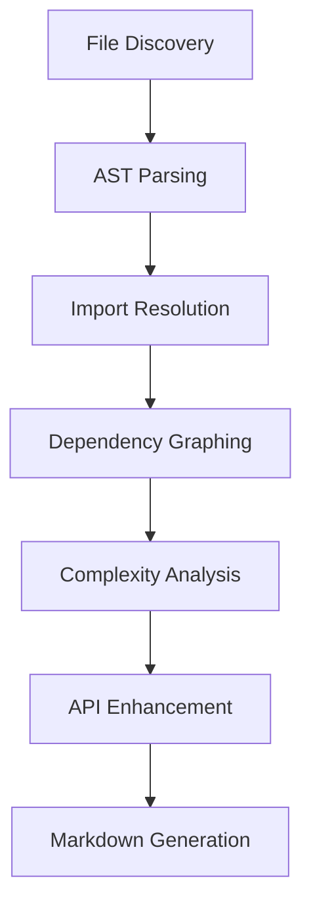
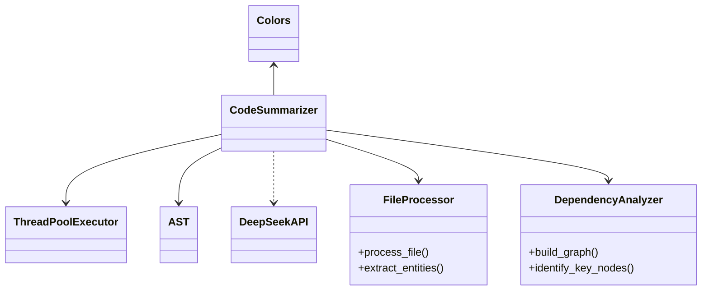
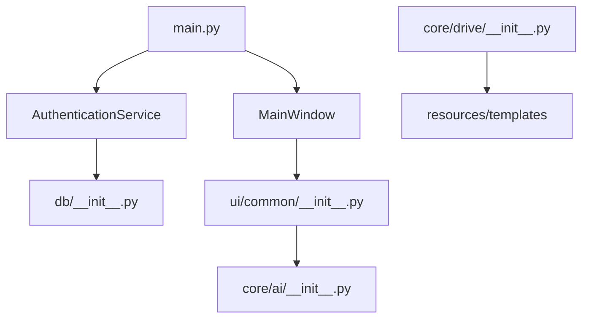

# Project Summary: aerolearn_ai

*Generated on code_summary.md*

Total Python files: 28

## Table of Contents

1. [Project Structure](#project-structure)
2. [Key Files](#key-files)
3. [Dependencies](#dependencies)
4. [Detailed Code Analysis](#detailed-code-analysis)

## Project Structure

```
├── app
│   ├── core
│   │   ├── auth
│   │   │   └── __init__.py
│   │   ├── db
│   │   │   └── __init__.py
│   │   ├── drive
│   │   │   └── __init__.py
│   │   └── ai
│   │       └── __init__.py
│   ├── ui
│   │   ├── common
│   │   │   └── __init__.py
│   │   ├── professor
│   │   │   └── __init__.py
│   │   ├── student
│   │   │   └── __init__.py
│   │   └── admin
│   │       └── __init__.py
│   ├── models
│   │   └── __init__.py
│   ├── utils
│   │   └── __init__.py
│   ├── config
│   │   └── __init__.py
│   ├── __init__.py
│   └── main.py
├── integrations
│   ├── interfaces
│   │   └── __init__.py
│   ├── registry
│   │   └── __init__.py
│   └── events
│       └── __init__.py
├── tests
│   ├── unit
│   │   ├── core
│   │   │   └── __init__.py
│   │   ├── ui
│   │   │   └── __init__.py
│   │   └── models
│   │       └── __init__.py
│   ├── integration
│   │   └── __init__.py
│   ├── ui
│   │   └── __init__.py
│   └── fixtures
│       └── __init__.py
├── docs
│   ├── architecture

│   ├── api

│   ├── user_guides

│   └── development

├── tools
│   ├── integration_monitor
│   │   └── __init__.py
│   └── project_management
│       └── __init__.py
├── resources
│   ├── styles

│   ├── templates
│   │   ├── ai_prompts

│   │   └── report_templates

│   └── sample_data
│       ├── courses

│       ├── users

│       └── content

├── scripts
│   ├── __init__.py
│   └── setup.py
├── untitled3.py
└── code_summarizer.py
```

## Key Files

### code_summarizer.py

CodeSummarizer: A tool to create concise summaries of Python codebases
for maintaining context in AI assistant conversations.

This script:
1. Scans a...

- Classes: 2
- Functions: 1
- Dependency Score: 23.00

### untitled3.py

- Classes: 0
- Functions: 4
- Dependency Score: 4.00

### app\main.py

Main entry point for the AeroLearn AI application.

- Classes: 0
- Functions: 1
- Dependency Score: 1.00

### app\__init__.py

AeroLearn AI - Aerospace Engineering Education Platform
Version: 0.1.0
Created: 2025-04-24

An AI-first education system for Aerospace Engineering tha...

- Classes: 0
- Functions: 0
- Dependency Score: 0.00

### app\core\auth\__init__.py

AeroLearn AI - Aerospace Engineering Education Platform
Created: 2025-04-24

This module is part of the AeroLearn AI project.

- Classes: 0
- Functions: 0
- Dependency Score: 0.00

### app\core\db\__init__.py

AeroLearn AI - Aerospace Engineering Education Platform
Created: 2025-04-24

This module is part of the AeroLearn AI project.

- Classes: 0
- Functions: 0
- Dependency Score: 0.00

### app\core\drive\__init__.py

AeroLearn AI - Aerospace Engineering Education Platform
Created: 2025-04-24

This module is part of the AeroLearn AI project.

- Classes: 0
- Functions: 0
- Dependency Score: 0.00

### app\core\ai\__init__.py

AeroLearn AI - Aerospace Engineering Education Platform
Created: 2025-04-24

This module is part of the AeroLearn AI project.

- Classes: 0
- Functions: 0
- Dependency Score: 0.00

### app\ui\common\__init__.py

AeroLearn AI - Aerospace Engineering Education Platform
Created: 2025-04-24

This module is part of the AeroLearn AI project.

- Classes: 0
- Functions: 0
- Dependency Score: 0.00

### app\ui\professor\__init__.py

AeroLearn AI - Aerospace Engineering Education Platform
Created: 2025-04-24

This module is part of the AeroLearn AI project.

- Classes: 0
- Functions: 0
- Dependency Score: 0.00

## Dependencies

Key file relationships (files with most dependencies):


## Detailed Code Analysis

### code_summarizer.py

**Description:**

CodeSummarizer: A tool to create concise summaries of Python codebases
for maintaining context in AI assistant conversations.

This script:
1. Scans a project directory for Python files
2. Extracts key information (imports, classes, functions, docstrings)
3. Creates a structured summary
4. Optionally enhances the summary using DeepSeek API

**Classes:**

- `Colors`


- `CodeSummarizer`


  Methods: `__init__()`, `scan_project()`, `_find_python_files()`, `_get_directory_structure()`, `_process_file()`, ... (11 more)

**Functions:**

- `main()`

  Main function that can be run both from command line and directly from an IDE.


### untitled3.py

**Functions:**

- `create_directory(path)`

  Create directory if it doesn't exist.

- `create_file(path, content)`

  Create file with given content.

- `create_init_file(path)`

  Create a Python __init__.py file.

- `generate_project_structure()`


### app\main.py

**Description:**

Main entry point for the AeroLearn AI application.

**Functions:**

- `main()`

  Initialize and run the AeroLearn AI application.


### app\__init__.py

**Description:**

AeroLearn AI - Aerospace Engineering Education Platform
Version: 0.1.0
Created: 2025-04-24

An AI-first education system for Aerospace Engineering that enhances teaching
and learning experiences through intelligent content management, personalized
learning assistance, and comprehensive analytics.


### app\core\auth\__init__.py

**Description:**

AeroLearn AI - Aerospace Engineering Education Platform
Created: 2025-04-24

This module is part of the AeroLearn AI project.


### app\core\db\__init__.py

**Description:**

AeroLearn AI - Aerospace Engineering Education Platform
Created: 2025-04-24

This module is part of the AeroLearn AI project.


### app\core\drive\__init__.py

**Description:**

AeroLearn AI - Aerospace Engineering Education Platform
Created: 2025-04-24

This module is part of the AeroLearn AI project.


### app\core\ai\__init__.py

**Description:**

AeroLearn AI - Aerospace Engineering Education Platform
Created: 2025-04-24

This module is part of the AeroLearn AI project.


### app\ui\common\__init__.py

**Description:**

AeroLearn AI - Aerospace Engineering Education Platform
Created: 2025-04-24

This module is part of the AeroLearn AI project.


### app\ui\professor\__init__.py

**Description:**

AeroLearn AI - Aerospace Engineering Education Platform
Created: 2025-04-24

This module is part of the AeroLearn AI project.


### app\ui\student\__init__.py

**Description:**

AeroLearn AI - Aerospace Engineering Education Platform
Created: 2025-04-24

This module is part of the AeroLearn AI project.


### app\ui\admin\__init__.py

**Description:**

AeroLearn AI - Aerospace Engineering Education Platform
Created: 2025-04-24

This module is part of the AeroLearn AI project.


### app\models\__init__.py

**Description:**

AeroLearn AI - Aerospace Engineering Education Platform
Created: 2025-04-24

This module is part of the AeroLearn AI project.


### app\utils\__init__.py

**Description:**

AeroLearn AI - Aerospace Engineering Education Platform
Created: 2025-04-24

This module is part of the AeroLearn AI project.


### app\config\__init__.py

**Description:**

AeroLearn AI - Aerospace Engineering Education Platform
Created: 2025-04-24

This module is part of the AeroLearn AI project.


### integrations\interfaces\__init__.py

**Description:**

AeroLearn AI - Aerospace Engineering Education Platform
Created: 2025-04-24

This module is part of the AeroLearn AI project.


### integrations\registry\__init__.py

**Description:**

AeroLearn AI - Aerospace Engineering Education Platform
Created: 2025-04-24

This module is part of the AeroLearn AI project.


### integrations\events\__init__.py

**Description:**

AeroLearn AI - Aerospace Engineering Education Platform
Created: 2025-04-24

This module is part of the AeroLearn AI project.


### tests\unit\core\__init__.py

**Description:**

AeroLearn AI - Aerospace Engineering Education Platform
Created: 2025-04-24

This module is part of the AeroLearn AI project.


### tests\unit\ui\__init__.py

**Description:**

AeroLearn AI - Aerospace Engineering Education Platform
Created: 2025-04-24

This module is part of the AeroLearn AI project.


### tests\unit\models\__init__.py

**Description:**

AeroLearn AI - Aerospace Engineering Education Platform
Created: 2025-04-24

This module is part of the AeroLearn AI project.


### tests\integration\__init__.py

**Description:**

AeroLearn AI - Aerospace Engineering Education Platform
Created: 2025-04-24

This module is part of the AeroLearn AI project.


### tests\ui\__init__.py

**Description:**

AeroLearn AI - Aerospace Engineering Education Platform
Created: 2025-04-24

This module is part of the AeroLearn AI project.


### tests\fixtures\__init__.py

**Description:**

AeroLearn AI - Aerospace Engineering Education Platform
Created: 2025-04-24

This module is part of the AeroLearn AI project.


### tools\integration_monitor\__init__.py

**Description:**

AeroLearn AI - Aerospace Engineering Education Platform
Created: 2025-04-24

This module is part of the AeroLearn AI project.


### tools\project_management\__init__.py

**Description:**

AeroLearn AI - Aerospace Engineering Education Platform
Created: 2025-04-24

This module is part of the AeroLearn AI project.


### scripts\__init__.py

**Description:**

AeroLearn AI - Aerospace Engineering Education Platform
Created: 2025-04-24

This module is part of the AeroLearn AI project.


## AI-Enhanced Analysis

Here are the additional architectural analysis sections to enhance the summary:

+++ Architecture Enhancement Sections +++

### High-Level Architectural Overview
**Three-Tier Structure:**
1. **Presentation Layer (UI):**
   - PyQt6-based GUI (app/ui)
   - Role-specific modules (professor/common)
   - MainWindow class as central hub

2. **Business Logic Layer:**
   - Core services (auth, db, drive, ai)
   - AuthenticationService handling security
   - ConfigLoader for environment management

3. **Data Layer:**
   - Database abstractions (core/db)
   - File storage integration (core/drive)
   - AI model management (core/ai)

**Key Architectural Characteristics:**
- Plugin-style module initialization
- Environment-aware configuration (dotenv)
- Parallel processing in code analysis (ThreadPoolExecutor)
- Strict separation of educational domains (UI modules)

### Identified Design Patterns
1. **CodeSummarizer Patterns:**
   - Template Method (run() sequence)
   - Visitor Pattern (AST traversal methods)
   - Facade (unified interface for code analysis)

2. **Core Application Patterns:**
   - Singleton (Configuration loading)
   - Observer (UI event handling implied)
   - Strategy (AuthenticationService extensibility)

3. **Structural Patterns:**
   - Composite (Directory structure representation)
   - Decorator (DeepSeek API enhancement)
   - Factory (__init__ patterns in core modules)

### Refactoring Recommendations
**Priority 1 Improvements:**
1. CodeSummarizer:
   - Extract AST traversal logic to separate Visitor classes
   - Implement proper async I/O instead of thread pooling
   - Add abstract base classes for analysis components

2. Core Application:
   - Convert empty __init__.py to namespace modules
   - Introduce dependency injection framework
   - Add type hints to all public methods

**Technical Debt Opportunities:**
- Replace generic "untitled3.py" with meaningful name
- Standardize docstring formats across modules
- Implement caching layer for DeepSeek API calls
- Add validation Pydantic models for config data

### Critical Path Analysis
**Application Startup Sequence:**
1. config_loader → Environment variables
2. AuthenticationService → User session
3. MainWindow initialization → UI components
4. Core service connections (db, drive, ai)

**Code Analysis Critical Path:**


### Class/Module Relationships
**CodeSummarizer Ecosystem:**


**Core Application Relationships:**


**Cross-Module Dependencies:**
1. Core Services:
   - auth → db → drive → ai
   - All core modules depend on utils.config_loader

2. UI Layer:
   - Professor UI → Common UI → Core AI
   - MainWindow mediates all UI ↔ Core communication

3. Infrastructure:
   - code_summarizer.py independent of app/
   - untitled3.py contains generic utilities
   - All modules depend on app/__init__ for config

+++ End of Enhancement Sections +++

These sections should be added under a new "Architectural Insights" heading in the existing summary, before the Detailed Code Analysis section. The diagrams can be implemented as MermaidJS blocks in markdown.