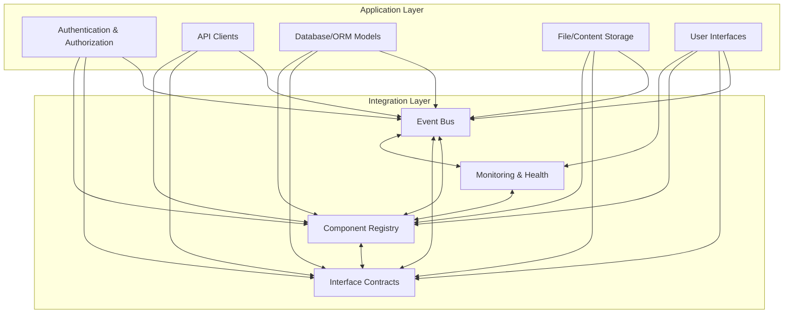

# AeroLearn AI System Architecture

## Overview

AeroLearn AI is architected as a **modular, event-driven, and interface-based platform** for robust, extensible, and testable aerospace education applications. The system follows a layered approach with clear separation of concerns, enabling independent development and testing of components.

## Design Goals

- **Loose Coupling:** Components interact through events and interfaces, not direct dependencies
- **Extensibility:** Plug-and-play architecture allows for easy addition of new features
- **Observability:** Built-in monitoring of component health, status, and transaction tracing
- **Security:** Foundation for secure authentication, credential management, and authorization
- **Testability:** Components can be tested in isolation with mock dependencies

## Architecture Layers

### 1. Integration Framework Layer

The foundation that enables all other components to work together:

- **Event Bus:** Type-safe publish/subscribe system for cross-component communication
- **Component Registry:** Dynamic registration, discovery, and lifecycle management
- **Interface Contracts:** Formal definitions of component interactions and capabilities
- **Monitoring & Health:** System-wide observability and diagnostics

### 2. Core Application Layer

Provides fundamental services and utilities:

- **Authentication & Authorization:** User authentication, role-based access control, secure credential storage
- **Database & ORM Models:** Cloud database connectivity, local cache synchronization, data models
- **Storage Providers:** Google Drive integration, file/content management, metadata handling
- **API Clients:** Standardized clients for external services (DeepSeek, etc.)

### 3. User Interface Layer

Multiple interfaces sharing common components:

- **Professor Interface:** Content management, student monitoring, analytics dashboards
- **Student Interface:** Content access, AI learning assistance, progress tracking
- **Administrator Interface:** System management, user administration, reporting tools
- **Shared Components:** Reusable UI elements, navigation, form controls

### 4. Data Model

Structured representation of system entities:

- **User Models:** Authentication, profile, permissions
- **Course Models:** Structure, metadata, relationships
- **Content Models:** Various content types, metadata, embeddings
- **Assessment Models:** Questions, answers, evaluations, analytics

## System Diagram

## Subsystem & Module Structure

| Subsystem                  | Core Modules / Directories                           | Responsibilities                                                                      |
|----------------------------|-----------------------------------------------------|---------------------------------------------------------------------------------------|
| **Integration Framework**  | `integrations/` (events, interfaces, monitoring, registry) | Event bus, type-safe events, interfaces, monitoring, registry/dependency management    |
| **Authentication & Authz** | `app/core/auth/`                                    | Credential management, authentication, session, permissions, RBAC                     |
| **Database & Models**      | `app/core/db/`, `app/models/`                       | ORM schema, client, migrations, content/user/assessment/course models                 |
| **API Clients**            | `app/core/api/`                                     | Standardized API clients for external integrations                                    |
| **Storage Providers**      | `app/core/drive/`                                   | File/folder/metadata storage, Google Drive/Cloud/Local                               |
| **User Interface**         | `app/ui/`                                           | Pure-Python base components, navigation, form controls, content browser, preview      |
| **Testing**                | `tests/`                                            | Unit and integration tests, UI/component harness, health monitoring                   |
| **Tools/Resources**        | `tools/`, `resources/`                              | Supporting scripts, templates, static files                                           |

## Key Integration Patterns

- **Event-Driven Communication:**  
  The EventBus and strongly-typed event model allow safe, extensible communication between subsystems without import-time coupling.

- **Discovery & Lifecycle Management:**  
  The Component Registry provides dynamic registration, versioning, dependency validation, and lifecycle hooks for all major platform parts.

- **Strict Interface Contracts:**  
  All major extensibility points (AI, storage, content, etc.) are defined as formal interfaces, with registration, method validation, and inheritance.

- **Continuous Monitoring:**  
  Integration status, health, and transaction logging layers ensure observability of cross-component operations.

## Security Architecture

- **Secure Credential Storage:** Encrypted storage of user credentials and API keys
- **Role-Based Access Control:** Fine-grained permissions based on user roles
- **Data Encryption:** Encryption of sensitive data at rest and in transit
- **API Authentication:** Secure token-based authentication for all API calls
- **Privacy Protection:** Data minimization and user consent management

## Future Evolution

- Pluggable data providers (beyond Google Drive)
- Multi-modal UI (Web, CLI, Desktop)
- Advanced analytics, adaptive learning flows
- Automated deployment & update system
