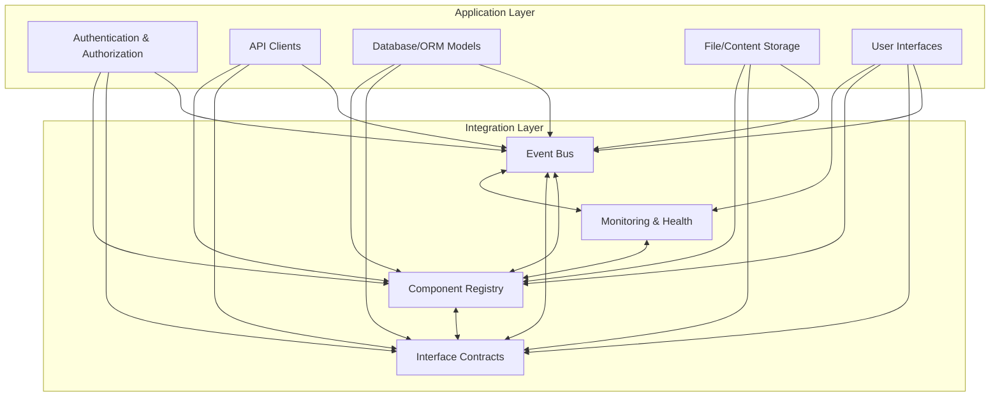

# AeroLearn AI System Architecture

## Overview [Updated: Post-Day 22]

AeroLearn AI is architected as a **modular, event-driven, and interface-based platform** for robust, extensible, and testable aerospace education applications. The system follows a layered approach with clear separation of concerns, enabling independent development and testing of components.

This overview has been updated to reflect all completed Day 22 tasks, with emphasis on protocol compliance, health monitoring, and dependency tracking improvements.

## Design Goals

- **Loose Coupling:** Components interact through events and interfaces, not direct dependencies
- **Extensibility:** Plug-and-play architecture allows for easy addition of new features
- **Observability:** Built-in monitoring of component health, status, and transaction tracing
- **Security:** Foundation for secure authentication, credential management, and authorization
- **Testability:** Components can be tested in isolation with mock dependencies

## Architecture Layers

### 1. Integration Framework Layer

The foundation that enables all other components to work together:

- **Event Bus:** Type-safe publish/subscribe system for cross-component communication
- **Component Registry:** Dynamic registration, discovery, and lifecycle management
- **Interface Contracts:** Formal definitions of component interactions and capabilities
- **Monitoring & Health:** System-wide observability and diagnostics

### 2. Core Application Layer

Provides fundamental services and utilities:

- **Authentication & Authorization:** User authentication, role-based access control, secure credential storage
- **Database & ORM Models:** Cloud database connectivity, local cache synchronization, data models
- **Storage Providers:** Google Drive integration, file/content management, metadata handling
- **API Clients:** Standardized clients for external services (DeepSeek, etc.)

### 3. User Interface Layer

Multiple interfaces sharing common components:

- **Professor Interface:** Content management, student monitoring, analytics dashboards
- **Student Interface:** Content access, AI learning assistance, progress tracking
- **Administrator Interface:** System management, user administration, reporting tools
- **Shared Components:** Reusable UI elements, navigation, form controls

### 4. Data Model

Structured representation of system entities:

- **User Models:** Authentication, profile, permissions
- **Course Models:** Structure, metadata, relationships
- **Content Models:** Various content types, metadata, embeddings
- **Assessment Models:** Questions, answers, evaluations, analytics

## System Diagram

## Subsystem & Module Structure

| Subsystem                  | Core Modules / Directories                           | Responsibilities                                                                      |
|----------------------------|-----------------------------------------------------|---------------------------------------------------------------------------------------|
| **Integration Framework**  | `integrations/` (events, interfaces, monitoring, registry) | Event bus, type-safe events, interfaces, monitoring, registry/dependency management    |
| **Registry & Dependencies**| `integrations/registry/` (component, component_state, dependency_graph, component_registry) | Component identity, dependency tracking, lifecycle management, graph operations |
| **Authentication & Authz** | `app/core/auth/`                                    | Credential management, authentication, session, permissions, RBAC                     |
| **Database & Models**      | `app/core/db/`, `app/models/`                       | ORM schema, client, migrations, content/user/assessment/course models                 |
| **API Clients**            | `app/core/api/`                                     | Standardized API clients for external integrations                                    |
| **Storage Providers**      | `app/core/drive/`                                   | File/folder/metadata storage, Google Drive/Cloud/Local                               |
| **User Interface**         | `app/ui/`                                           | Pure-Python base components, navigation, form controls, content browser, preview      |
| **Testing**                | `tests/`                                            | Unit and integration tests (including modular registry tests), UI/component harness, health monitoring |
| **Tools/Resources**        | `tools/`, `resources/`                              | Supporting scripts, templates, static files                                           |

## Key Integration Patterns

- **Event-Driven Communication:**  
  The EventBus and strongly-typed event model allow safe, extensible communication between subsystems without import-time coupling.

- **Discovery & Lifecycle Management:**  
  The Component Registry provides dynamic registration, versioning, dependency validation, and lifecycle hooks for all major platform parts.

- **Strict Interface Contracts:**  
  All major extensibility points (AI, storage, content, etc.) are defined as formal interfaces, with registration, method validation, and inheritance.

- **Continuous Monitoring:**  
  Integration status, health, and transaction logging layers ensure observability of cross-component operations.

- **Canonical cross-module enums**:  
  All registry, adapter, and dashboard logic uses enums defined in `/integrations/registry/component_state.py`.

- **Test modularity**:  
  Monolithic registry/integration tests are deprecated; all surfaces use `/tests/integration/registry/` split.

## Security Architecture

- **Secure Credential Storage:** Encrypted storage of user credentials and API keys
- **Role-Based Access Control:** Fine-grained permissions based on user roles
- **Data Encryption:** Encryption of sensitive data at rest and in transit
- **API Authentication:** Secure token-based authentication for all API calls
- **Privacy Protection:** Data minimization and user consent management

## Monitoring and Status Dashboards

- The `ServiceHealthDashboard` now supports explicit registry injection for full protocol compliance.
- It exposes the method `supports_cascading_status()` as a protocol check surface in accordance with current service health and dependency tracking documentation.
- For details of required interface and protocols, see [service_health_protocol.md](./service_health_protocol.md) and [dependency_tracking_protocol.md](./dependency_tracking_protocol.md).

### Service Health & Monitoring Implementation

- All health and monitoring mechanisms now comply with `/docs/architecture/service_health_protocol.md` and `/docs/architecture/health_monitoring_protocol.md`.
- Centralized status and health reporting for all major system components use standardized protocols.
- Key implementations:
  - `/integrations/monitoring/integration_health.py`: Cross-component health tracking
  - `/app/core/monitoring/metrics.py`: Core metrics collection and reporting

## Registry & Dependency Management

**Motivation:**  
Complex component/service systems require robust, testable, and modular state and dependency tracking. The registry layer is split into four modules for clarity, maintainability, and to enforce separation of health/monitoring and registry state:

- `component.py`: Pure "Component" entity, protocol-driven, holds identity, description, version, and state.
- `component_state.py`: Canonical source for `ComponentState` enum. Used by all registry, monitoring, and dashboard logic; prevents cross-import/circularity.
- `dependency_graph.py`: Standalone dependency edge management, insertion order doctrine, and analytics.
- `component_registry.py`: Orchestrates protocol API (register, unregister, declare_dependency), delegates state and dependency logic.

**Protocol Enforcement:**
- **ComponentRegistration, lifecycle, and dependency tracking fully modularized and enforced by protocol.**
- **All protocol features are enforced and proven by:**
    - `/tests/integration/registry/test_component_registry_registration.py`
    - `/tests/integration/registry/test_component_registry_lifecycle.py`
    - `/tests/integration/registry/test_component_registry_dependency.py`
    - `/tests/integration/monitoring/test_dependency_tracking.py` (Day 22 addition)

**Integration:**  
- All cross-component state enums are imported from `component_state.py`.
- All health monitoring, dashboard, and adapter modules interact with the registry solely through this focused protocol API.
- Downstream modules and tests should create or query components and dependencies via these APIs for full protocol compliance.

**Test-Driven Approach:**  
- Modular, TDD-first integration and protocol tests are now placed under `/tests/integration/registry/`.
- Each registry/protocol surface is verified by a dedicated test module before implementation.
- Protocol compliance is now enforced at structure and API surface levels.

**Ordered Dependency Lists:**  
- All dependency lists, outbound or inbound, are guaranteed to preserve insertion order.
- Whether querying direct dependencies (`get_dependency_graph()`) or dependents (`analyze_dependency_impact`, `get_dependents()`), lists are presented in runtime registration order—never as unordered sets.
- This ordering guarantee is essential for deterministic analytics, visualizations, and exact test repeatability.

**Dependency Tracking Implementation:**
- Dependency tracking implemented in `/integrations/registry/dependency_graph.py` with insertion-order guarantee.
- All registry components call this protocol module; coverage is enforced by modular tests per plan and TDD.
- Day 22 update: All component and service dependency relationships have been synchronized and verified against `/docs/architecture/dependency_tracking_protocol.md`.

Refer to `/integrations/registry` for implementation details.

## Protocol Reference Table

| Protocol                           | Documented in                                            | Implemented in                                |
|-------------------------------------|----------------------------------------------------------|-----------------------------------------------|
| Service Health Protocol             | `/docs/architecture/service_health_protocol.md`          | `/app/core/monitoring/metrics.py`, `/integrations/monitoring/integration_health.py` |
| Health Monitoring Protocol          | `/docs/architecture/health_monitoring_protocol.md`       | `/app/core/monitoring`, `/integrations/monitoring` |
| Dependency Tracking Protocol        | `/docs/architecture/dependency_tracking_protocol.md`     | `/integrations/registry/component_registry.py` |

## Testing and Verification

All Day 22 delivered components, services, and protocols are supported with comprehensive automated tests:

- **Health Monitoring Tests**: Verify protocol compliance for all monitoring interfaces
- **Dependency Tracking Tests**: Ensure proper dependency relationship management
- **Integration Tests**: Validate cross-component interactions and state management
- **Protocol Compliance Tests**: Confirm adherence to documented protocol specifications

For detailed test coverage, see `/tests/integration/monitoring/` and `/tests/integration/registry/`.

## Future Evolution

- Pluggable data providers (beyond Google Drive)
- Multi-modal UI (Web, CLI, Desktop)
- Advanced analytics, adaptive learning flows
- Automated deployment & update system

## Further Reference

For detailed protocol requirements and implementation specifics, always crosscheck:
- [Day 22 Plan and Completion](/docs/development/day22_plan.md)
- [Protocol Specification Documents](/docs/architecture/)
- [Service Health Protocol (API)](/docs/api/service_health_protocol.md)
