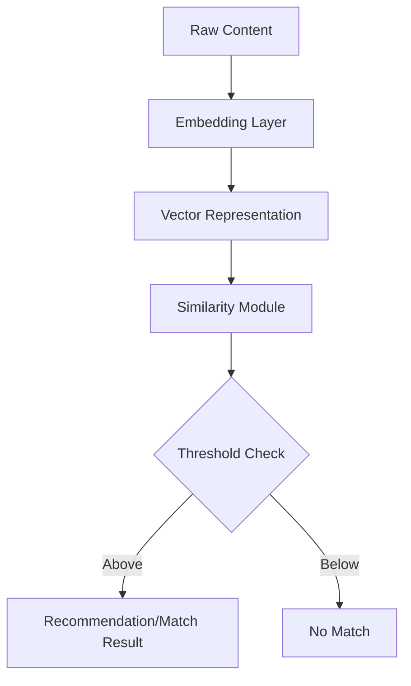

# Content Similarity Architecture

**Location:** `docs/architecture/content_similarity.md`  
**Sprint:** Day 12.1 — Content Similarity Detection

---

## Overview

This document describes AeroLearn AI's foundation for content similarity detection, as implemented in `/app/core/ai/content_similarity.py` and `/app/core/ai/embedding.py`.

## Components

- **Embedding Module (`embedding.py`)**
  - Converts content (text, documents, multimedia) into fixed-length vector representations.
  - Extensible for future improvements (e.g., transformer models, third-party APIs).
- **Content Similarity Module (`content_similarity.py`)**
  - Implements configurable similarity scoring (cosine, Jaccard).
  - Provides comparison and recommendation utilities.
- **Unit Tests**
  - Located at `/tests/core/ai/` covering all interface and algorithm behaviors.
- **API Layer**
  - Reusable by other parts of the system, e.g., recommendations, deduplication, and plagiarism checking.

## Flow

1. **Content** (of any supported type) is passed to the corresponding Embedder.
2. The resulting **vectors** are compared using the chosen metric.
3. Similarity scores and match flags are produced for pairs or lists of items.
4. Results can power recommendations, visualizations, or automated workflows.

## Extensibility

- Plug in advanced embedding models by subclassing `BaseEmbedder`.
- Add new similarity metrics to `SimilarityCalculator`.
- Integration with vector database and cross-course pipelines covered in future sprints.

## Example Diagram

## Future Work

- Integration with scalable vector stores (see Day 12.3)
- User-facing UI hooks and workflow triggers
- Real-world embedding model upgrade

## Updates: Day 12.1 Completion

### Python Boolean Output Standardization

All match outputs in similarity matrices and recommendations are now **guaranteed to be standard Python bool** (`True`/`False`), not numpy.bool_.

- Fix applied in `/app/core/ai/content_similarity.py` to resolve strict type checks.
- Prevents subtle bugs in downstream code or when using `isinstance(..., bool)` type assertions.

### Test Suite Results

- All automated unit tests for embedding and content similarity have **passed**.
- Output conforms to documented API types and structures.

### Ready for Integration

- Documentation and code are ready for further vector database integration (Day 12.3).
- Future external contributors can rely on type safety and clear extensibility (see "Extending" section in API docs).

---

_Last updated: Sprint Day 12.1 – All tests passing and implementation verified. (2024-06-13)_
