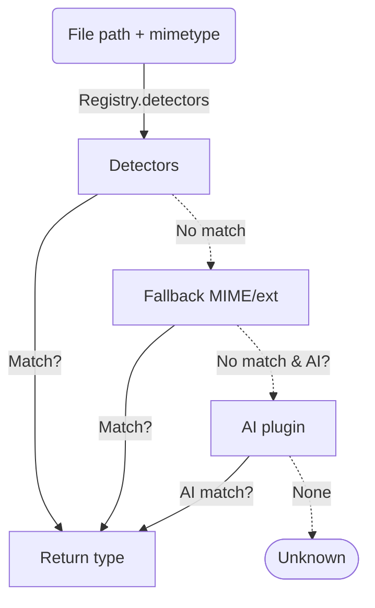

# AeroLearn AI Content Type Registry

## Overview

The Content Type Registry provides a **pluggable, extensible framework** for content type detection, categorization, and metadata extraction. It supports:

- Multi-level detection (MIME, extension, heuristic, AI/content analysis)
- Standardized taxonomy for content classification
- Easy extension via plugin modules
- Metadata extraction specific to each type

## Architecture

- **Registry**
  - Catalogs type definitions, detection plugins, and taxonomy.
  - Detection strategy: sequentially tries plugin detectors, then MIME/extension, then AI plugin fallback.

- **Plugins**
  - Each type can provide:
      - `detector(path, mimetype, context)` — custom detection logic
      - `metadata_extractor(path, context)` — extract enriched metadata
      - `ai_detector(path, mimetype, context)` — plug AI/ML/content service for detection

- **Taxonomy**
  - Standardized `category` for each type, e.g. "Document/LectureSlides", "Media/Video", "Engineering/CAD".

## Detection Workflow



## Example: Registering a Content Type Plugin

```python
class CADFilePlugin:
    @staticmethod
    def cad_detector(path, mimetype, context):
        if path and path.lower().endswith('.step'):
            return "cad_step"
        return None
    @staticmethod
    def register_with_registry(registry):
        registry.register(
            name="cad_step",
            category="Engineering/CAD",
            mimetypes=["application/step"],
            extensions=[".step"],
            detector=CADFilePlugin.cad_detector
        )

from app.models.content_type_registry import register_plugin
register_plugin(CADFilePlugin)
```

## Adding AI-Powered Detection

- Implement `ai_detector(path, mimetype, context)`
- Recommended: call LLM/embedding service with preview/fingerprint
- Register via `registry.register(...)`

## Metadata Extraction

- Each type can provide a `metadata_extractor`.
- E.g. for PDF, extract title/authors/page_count.
- Registry returns extracted metadata when requested.

## Extending Taxonomy

- Use tree categories: e.g. "Document/PDF", "Media/Audio", "Engineering/CAD"
- New types must provide a taxonomy path/category.

## References

- See `app/models/content_type_registry.py` for API and built-in types.
- Unit tests: `tests/unit/models/test_content_type_registry.py`