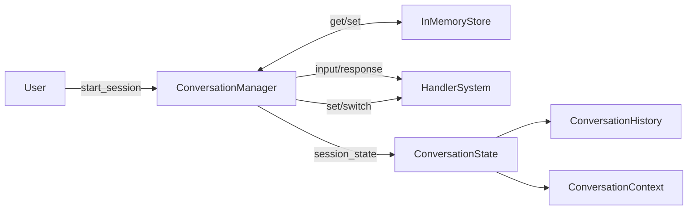

# Location: /docs/architecture/conversation_architecture.md
# Conversational AI Architecture – AeroLearn AI

## Overview

This document describes the architecture, flow management, and extensibility points of the Conversational AI system, as implemented in `/app/core/ai/conversation.py` for Task 14.1.

## Architectural Components

- **ConversationManager:** Orchestrates all user chatbot sessions, handles session lifecycle, input routing, context, and privacy controls.
- **ConversationState:** Represents all per-session user state, including session ID, user ID, active handler, conversation context, and history.
- **ConversationContext:** Simple key–value memory for session-local dynamic info.
- **ConversationHistory:** Full conversation turn/response log per session, with privacy-level controls and extensible metadata.
- **Handler-System:** Custom input routing via pluggable handlers for component- or domain-specific logic.
- **InMemoryConversationStore:** Pluggable persistence for sessions (in-memory by default).

## Main Flows

### 1. Session Creation

- Validates user (`user_validator`).
- Instantiates new ConversationState.
- Persists to store.
- Returns session ID.

### 2. Input Handling

- Looks up session by ID.
- Logs user turn.
- Routes input to current/default handler.
- Stores bot response as new turn.
- Updates timestamps.

### 3. Privacy & History

- Each session has a `privacy_level` (standard, locked, etc).
- Wiping or ending session deletes or clears all privacy-sensitive state/history via `clear_privacy_sensitive`.

### 4. Handler Routing

- Handlers registered to ConversationManager (with label).
- Sessions can switch active handlers at any time (`switch_handler`).

## Extension Points

- Plug in persistent stores (replace or layer on top of InMemoryConversationStore).
- Register new handlers for specialized domains (e.g., tutoring, content lookup, admin).
- Customize privacy and history policies per integration needs.

## Integration

- The module exposes only interoperable, dependency-injected, pure Python classes.
- Unit tested via `/tests/core/ai/test_conversation.py` (see user and developer guides for workflows).

## Diagram

## File Mapping

| Component                   | Save Location                                  |
|-----------------------------|------------------------------------------------|
| ConversationManager, State  | /app/core/ai/conversation.py                   |
| User/Component Handlers     | /app/core/ai/conversation.py (register)        |
| Unit Tests                  | /tests/core/ai/test_conversation.py            |
| User Guide                  | /docs/user_guides/conversation_usage.md        |
| Architecture (this file)    | /docs/architecture/conversation_architecture.md|